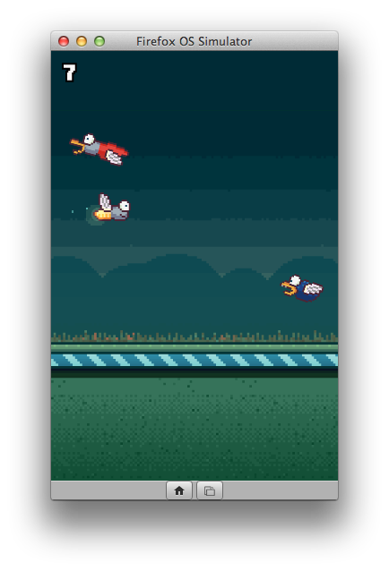
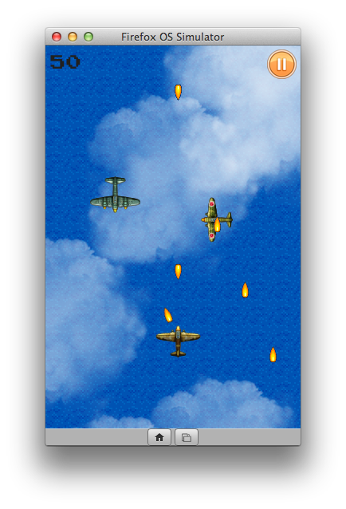

[Flambe](https://github.com/aduros/flambe) 即以 [Haxe](https://haxe.org/) 程式語言為基礎所開發的跨平台開放源碼遊戲引擎。相關遊戲均編譯為 [HTML5](https://developer.mozilla.org/en/html/html5) 或 Flash，並可針對桌面版或行動版瀏覽器進行最佳化。HTML5 Renderer 雖預設使用 [WebGL](https://developer.mozilla.org/en-US/docs/Web/WebGL)，但在較初階的手機上仍可改用 [Canvas](https://developer.mozilla.org/en-US/docs/HTML/Canvas) 標籤並正常作業。Flash Rendering 則使用 [Stage 3D](https://www.adobe.com/devnet/flashplayer/stage3d.html)，以及 [Adobe AIR](https://get.adobe.com/air/) 所封裝的原生 Android 與 iOS App。

Flambe 另提供多項功能：

- 可輕鬆載入資源

- 場景管理

- 支援觸控功能

- 完整的物理函式庫

- 可存取加速規 (Accelermeter)

Flambe 已開發出 [nick.com/games](https://nick.com/games) 與 [m.nick.com/games](https://m.nick.com/games) 上的多款 Nickelodeon 遊戲。要想了解其他遊戲大廠以此引擎開發的遊戲範例，可至 [Flambe Showcase](https://github.com/aduros/flambe/wiki/Showcase)。

最近幾週以來，開發者努力讓 Flambe 引擎能支援 [Firefox OS](https://developer.mozilla.org/en-US/Firefox_OS)。而從 Flambe 4.0.0 版開始，只要有完整的 manifest 檔案，即可封裝 Flambe 遊戲為可發佈的 Firefox OS App。

#### Firefox Marketplace 上的遊戲

如果想知道 Flambe 引擎在 Firefox OS 平台上的能耐，則可參考最近提交到 Firefox [Marketplace](https://marketplace.firefox.com/) 上的二款遊戲。第一款是由 Mark Knol 所撰寫的《[The Firefly Game](https://marketplace.firefox.com/app/the-firefly)》。遊戲裡的螢火蟲必須躲開飢餓的小鳥。此遊戲有效使用了物理、聲音、觸控等特性。

另一款則是《[Shoot’em Down](https://marketplace.firefox.com/app/shootem-down)》空戰遊戲。玩家必須儘量擊落敵機同時躲避敵機砲火。此遊戲作者 Bruno Garcia 也是 Flambe 引擎的主要開發者。另可取得此引擎展示 App 之一的[原始碼](https://github.com/aduros/flambe-demos/tree/master/shmup)。

#### 以 Flambe 開發 Firefox OS App

在以 Flambe 引擎開發遊戲之前，請先安裝並設定以下軟體：

- Haxe ─ 可至下載頁面取得 OSX、Windows、Linux 版本的自動安裝程式。

- Node.js ─ 用以建構專案。需 Version 0.8 或更高版本。

- Java runtime

在完成上述必要條件之後，即可執行下列指令以安裝 Flambe：

# Linux and Mac may require sudo
npm install -g flambe
flambe update

					123

						# Linux and Mac may require sudonpm install -g flambe flambe update

如此就會安裝 Flambe 引擎並能開始撰寫 App 了！

看到這裡，你體內的遊戲熱血又沸騰起來了嗎？請繼續觀看原文更精采的內容，進一步了解更深入的程式碼吧！

原文連結：[Flambe Provides Support For Firefox OS](https://hacks.mozilla.org/2014/03/flambe-provides-support-for-firefox-os/)
