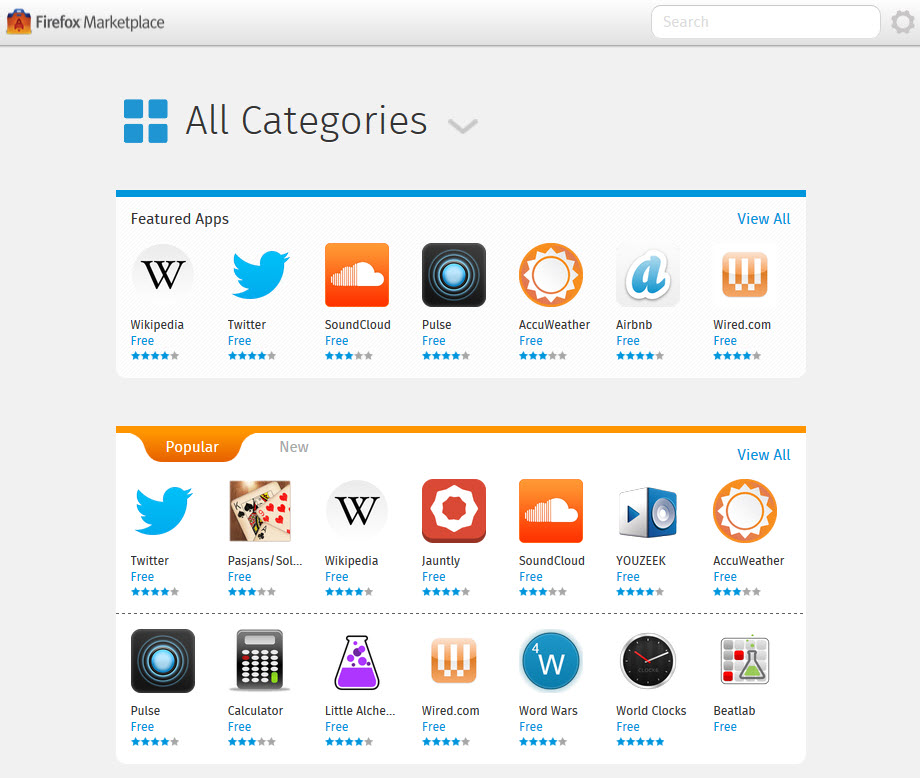

你是熱血的 Firefox OS 開發者，而且早已設計了許多 App 準備大展身手嗎？在將自己的 App 提交到 Firefox Marketplace 之後，如果要更新自己的作品又該怎麼辦呢？先來這裡看看該如何更新 Marketplace 中的 App，讓自己的開發作業更順利。

#### 更新托管式 (Hosted) App

托管式 App 本質就是網頁，因此同樣依 Web 快取的常規而運作。但開發者亦可選用如 [HTML5 AppCache](https://developer.mozilla.org/en-US/docs/HTML/Using_the_application_cache) 的進階機制以加快啟動速度。先了解這二點之後，更新 App 所使用的一般資源大概就沒有需要特別注意的地方了。

但 Open Web App 在處理 manifest 檔案時就不太一樣了。某些 manifest 的變動必須經過使用者許可。但根據 Web runtime 實作的不同，較難以確定是否會啟動更新作業。

如果要能確實解決此問題，開發者可於 manifest 檔案中添加「version」欄位。只要檢查 [navigator.mozApps.getInstalled()](https://developer.mozilla.org/en-US/docs/Web/API/Apps.getInstalled) 函式所回傳的值，即可了解目前的版本。如果消費者並未安裝最新版本，則可透過 [navigator.mozApps.install()](https://developer.mozilla.org/en-US/docs/Web/API/Apps.install) 觸發更新作業。

Web runtime 並不會使用 version 的值，所以開發者可使用任何喜歡的版號設定格式。

另請注意，如果因更改 manifest 檔案而發生錯誤或毀損，則一旦將 manifest 檔案提交到 Firefox Marketplace 就會發現。嚴重錯誤將導致 App 無法出現在 Marketplace 之中。若是較不嚴重的錯誤，就可能會自動標定該 App 需要重新審查。

#### 更新封裝式 (Packaged) App

[封裝式 App](https://developer.mozilla.org/zh-TW/docs/Web/Apps/Developing/Packaged_apps/Packaged_apps) 與托管式 App 的更新程序有所不同。在更新封裝式 App 時，開發者必須將 App 的新版 zip 檔案上傳至 Firefox Marketplace。更新過的 App 同樣要先通過審查，才能再發佈至 Marketplace 之上。如此將於 Firefox OS 手機上觸發更新作業。消費者亦可透過「Settings」App 要求進行更新。

若想進一步了解封裝式 App 的更新程序，可參閱下一章節。

#### 更新封裝式 App 相關細節

接著提供封裝式 App 更新時的相關細節。如果你打算建構 App 商城，就可能必須特別注意。

- 將更新過的封裝式 App 發佈之後，亦應更新 [mini-manifest](https://developer.mozilla.org/en-US/docs/Web/Apps/Packaged_apps#Packaged_apps_and_the_Firefox_OS_Marketplace) 以指向更新過的 ZIP 檔案 (請注意 mini-manifest 並非 App 的主要 manifest 檔案)。 ETag 標頭亦將變更，且將觸發 Firefox OS 手機上的更新作業。

- 搭載於手機上的 Firefox OS 將每天一次，檢查 App 是否更新。Firefox OS 將檢查 mini-manifest 的網址，再檢查 mini-manifest 之內 package_path 的網址。只要使用 [App 物件](https://developer.mozilla.org/en-US/docs/Web/API/App)上的 checkForUpdate() 函式即可進行此作業。一旦 ETag 標頭改變，該函式隨即得知 App 更新過，並將檢查 ZIP 檔案是否變更。

- Firefox OS 將批次檢查 App 的更新檔案。

Mozilla 開發者社群網站 (MDN) 原文連結：[Updating apps](https://developer.mozilla.org/en-US/Marketplace/Publishing/Updating_apps)

你也可參閱中文版《[更新 App](https://developer.mozilla.org/zh-TW/docs/Mozilla/Marketplace/Publishing/Updating_apps)》；並參閱 MDN 上的更多 Firefox OS 或 Marketplace 相關文章。
