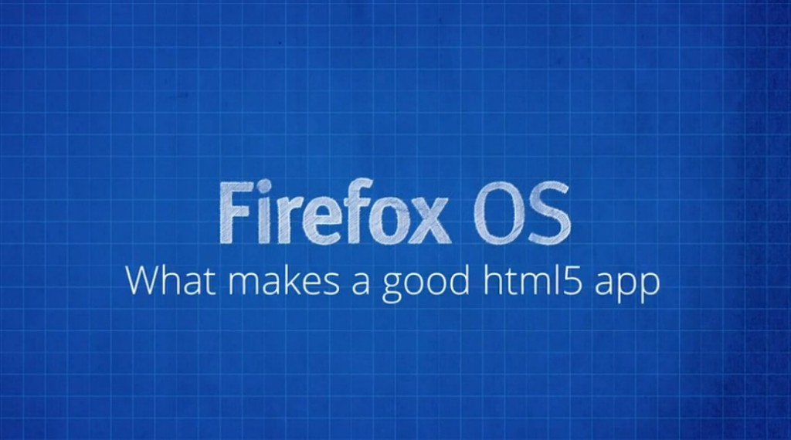

你是熱血的開發者，而且早就想開發自己的 Firefox OS App 嗎？在《[Firefox OS App 開發入門 ─ 引言](https://blog.mozilla.com.tw/posts/5185/)》之後，這裡正式為大家帶來 Firefox OS App 系列影片之一：打造絕佳 HTML5 App 的要素 (中文字幕)。快來觀賞影片並讓自己儘快熟悉 Firefox OS，進而順利開發 App 吧！

#### 不只是網站

Firefox OS App 就是 HTML5 App；其所使用的技術本質上也與網站技術相同。你可以先寫個網站，再提供 manifest 檔案 (你也會在「應用程式管理員 App Manager」看到中文翻譯為「安裝資訊檔」；可參閱《[App manifest](https://developer.mozilla.org/zh-TW/docs/%E6%87%89%E7%94%A8%E7%A8%8B%E5%BC%8F/Manifest-840092-dup#csp)》進一步了解) 即可將網站轉為 App。這個動作就等於告知 Firefox OS 你在撰寫 App，並可讓你：

- 能把 App 發佈到 Marketplace 上

- 可存取裝置的硬體，蒐集如[地理位置資訊 (Geolocation)](https://developer.mozilla.org/en-US/docs/Web/API/Geolocation) 與[裝置方向 (Device Orientation)](https://developer.mozilla.org/en-US/Apps/Build/gather_and_modify_data/Keep_it_level_responding_to_device_orientation_changes) 等資訊

- 還有更多功能！

HTML5 App 其實是透過網站強化其功能，也同樣遵循相同的規則，如：

- 「Progressive enhancement」，亦即先撰寫可用的配置，再視情況套用適合的版面。

- 因應當前的執行裝置環境。如透過 [media queries](https://developer.mozilla.org/en-US/docs/Web/Guide/CSS/Media_queries) 與 [responsive images](https://developer.mozilla.org/en-US/Apps/app_layout/responsive_design_building_blocks#Responsive_images.2Fvideo) 而最佳化 App，已配合不同的螢幕尺寸、解析度、可用網路的速度等。

- 採用 [HTML](https://developer.mozilla.org/en-US/docs/Web/HTML)、[CSS](https://developer.mozilla.org/en-US/docs/Web/CSS)、[JavaScript](https://developer.mozilla.org/en-US/docs/Web/JavaScript) 作為其核心技術。

若要將網頁轉為絕佳的 App，其中的差異就在於開發者就必須考量到行動裝置使用者。也代表 App 首先必須要能：

- [離線作業](https://developer.mozilla.org/en-US/Apps/Build/Offline)

- 在讓使用者進行某個作業之餘，也要提供可輕鬆使用的介面

- 妥善利用有限的電池容量、處理器的速度、可用的螢幕空間而能盡情把玩 App

在大多數的情況下，開發者必須稍微讓網頁「瘦身」並簡化介面。而使用者也確實能因此獲得更好的經驗。

若要進一步設計出絕佳的 HTML5 App，可參閱 [MDN 上的《應用程式中心》](https://developer.mozilla.org/zh-TW/docs/%E6%87%89%E7%94%A8%E7%A8%8B%E5%BC%8F-840092-dup/Publishing/In-app_payments)相關文章。

看完影片，你是否對 Firefox OS App 有更深入的了解呢？請別錯過即將陸續發佈且完成中文化的系列影片。

你也可以直接觀賞 MDN 上的原文系列影片《[Screencast series: App Basics for Firefox OS](https://developer.mozilla.org/en-US/Firefox_OS/Screencast_series:_App_Basics_for_Firefox_OS)》。

亦可欣賞中文版的《[系列影片：Firefox OS App 開發入門](https://developer.mozilla.org/zh-TW/docs/Mozilla/Firefox_OS/Screencast_series:_App_Basics_for_Firefox_OS)》。我們將逐一完成影片的中文化，並隨時更新各影片所對應的文章內容。
