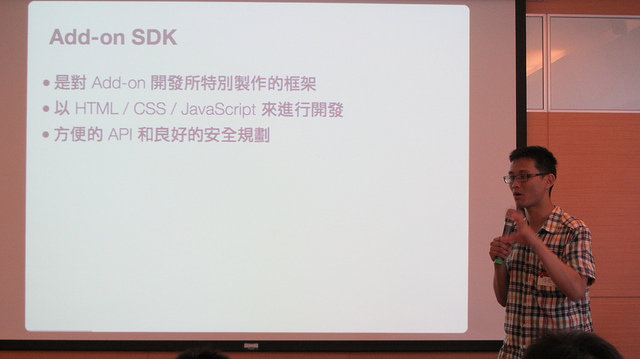
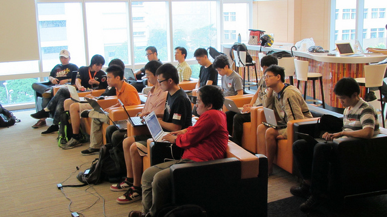
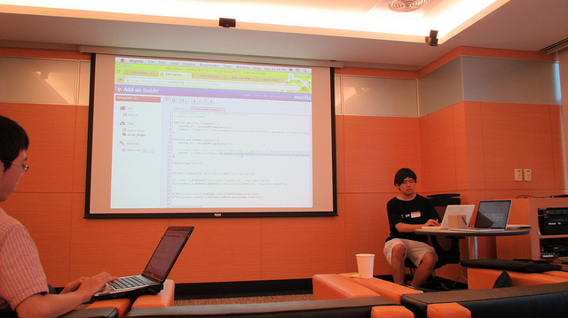

5/20 的「Firefox 附加元件開發入門班」圓滿結束，講師小 B 有條有理地介紹了 Firefox 附加元件開發的利器「Add-on SDK」，並且也分享了許多開發小技巧。[課程的投影片在網路上可以直接閱讀](https://littleb.tc/slides/2012/mozilla-tw/addon-sdk.html)，下面我們來看看現場的狀況：

小 B 正在介紹 Add-on SDK

認真上課的參加者們

大家很努力地用 SDK 開發套件中，也討論彼此遇到的問題

參加者小Q 發表他所做的「政大專用套件」，最後也獲得實作紀念獎！
這次參與的學員都非常認真，而對課程內容也給予平均高達 9.36 的高分（滿分為 10），真是感謝各位的參與！其中小 Q 的套件已經通過初步審核，[在附加元件網站上架了](https://addons.mozilla.org/zh-TW/firefox/addon/social-nccu/)，政大的學生可以玩玩看。

錯過了這次的附加元件開發入門班嗎？別擔心，只要緊盯 Mozilla Taiwan 的 [Facebook 粉絲頁](https://fb.me/MozillaTaiwan)或 [G+ 專頁](https://plus.google.com/u/0/114653167240123163859/posts)，下次就不會再錯過這種好康訊息啦！
