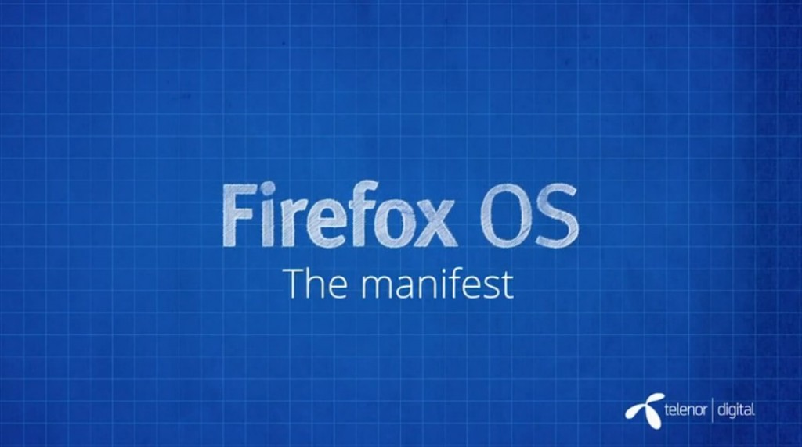

你是熱血的開發者，而且早就想開發自己的 Firefox OS App 嗎？在

- 《[Firefox OS App 開發入門 (1)：打造絕佳 HTML5 App 的要素](https://blog.mozilla.com.tw/posts/5275/)》

之後，緊接著要讓大家了解 Firefox OS App 的 manifest 檔案 (中文字幕)。快來觀賞影片並讓自己儘快熟悉 Firefox OS，進而順利開發 App 吧！

### Manifest 檔案

[Firefox OS App 的 manifest 檔案](https://developer.mozilla.org/en-US/Apps/Developing/Manifest) (你會在「應用程式管理員 App Manager」看到中文翻譯為「安裝資訊檔」)，屬於簡易的 JSON 檔案，將告知作業系統該 App 的相關訊息；另外也可將網頁轉為 [Open Web App](https://developer.mozilla.org/en-US/Apps/Quickstart/Build/Intro_to_open_web_apps)。開發者可於 manifest 定義 App 不同語系的名稱，也可要求作業系統存取不同的服務與硬體。當然亦可定義該 App 適合的方向 (直幅或橫幅)，亦能依需要而鎖定畫面。

進一步了解 manifest 檔案與相關工具：

- [Open Web Apps Manifest Validator](https://marketplace.firefox.com/developers/validator) ─ 亦可作為 [API](https://firefox-marketplace-api.readthedocs.org/en/latest/)

- [Open Web App 的 Manifest 檔案相關 MDN 文章](https://developer.mozilla.org/zh-TW/docs/Web/Apps/Developing/Manifest/Manifest-840092-dup) ─ 另說明該如何從自己的伺服器提供 manifest 檔案

看完影片，你是否對 Firefox OS App 有更深入的了解呢？請別錯過即將陸續發佈且完成中文化的系列影片。

你也可以直接觀賞 MDN 上的原文系列影片《[Screencast series: App Basics for Firefox OS](https://developer.mozilla.org/en-US/Firefox_OS/Screencast_series:_App_Basics_for_Firefox_OS)》。

亦可欣賞中文版的《[系列影片：Firefox OS App](https://developer.mozilla.org/zh-TW/docs/Mozilla/Firefox_OS/Screencast_series:_App_Basics_for_Firefox_OS)[開發入門](https://developer.mozilla.org/zh-TW/docs/Mozilla/Firefox_OS/Screencast_series:_App_Basics_for_Firefox_OS)》。我們將逐一完成影片的中文化，並隨時更新各影片所對應的文章內容。
