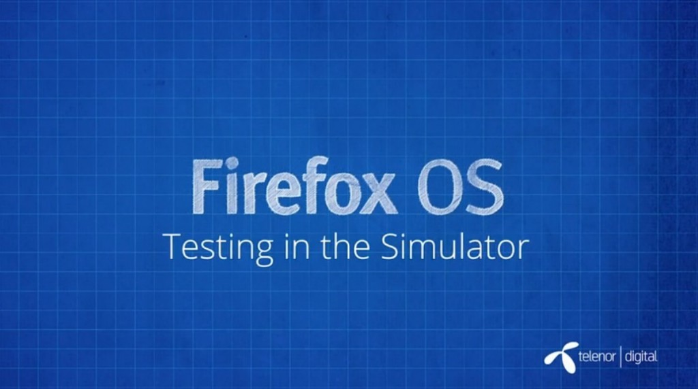

你是熱血的開發者，而且早就想開發自己的 Firefox OS App 嗎？在完成

- 《[Firefox OS App 開發入門 (1)：打造絕佳 HTML5 App 的要素](https://blog.mozilla.com.tw/posts/5275/)》

- 《[Firefox OS App 開發入門 (2)：Manifest 檔案](https://blog.mozilla.com.tw/posts/5283)》

之後，就該測試自己的 App 作品在 Firefox OS 中的作業情形了。其實 Firefox 桌面版就已經提供「應用程式管理員 (App Manager)」這個強大的工具 (中文字幕)。快來觀賞影片並透過 Firefox OS 模擬環境測試 App 吧！

#### 應用程式管理員 (App Manager)

要想開始入門 Firefox OS，最簡單的方法就是使用「[應用程式管理員 (App Manager)](https://developer.mozilla.org/zh-TW/docs/Mozilla/Firefox_OS/Using_the_App_Manager)」。應用程式管理員也是[桌面版 Firefox 的開發者工具之一](https://developer.mozilla.org/en-US/docs/Tools/)，可在電腦上模擬 Firefox OS 裝置。開發者可盡情把玩 Firefox OS，也可像在實際裝置上安裝並測試 App。此外，你也能離線或上線編輯 App，進而體驗 App 並進行除錯，在模擬裝置中即時看到修改之後的結果。

若要進一步了解應用程式管理員：

- [MDN 上的《](https://developer.mozilla.org/en-US/Firefox_OS/Using_the_App_Manager)[App Manager](https://developer.mozilla.org/en-US/Firefox_OS/Using_the_App_Manager)[》說明文章](https://developer.mozilla.org/zh-TW/docs/Mozilla/Firefox_OS/Using_the_App_Manager)

- [介紹「應用程式管理員」的部落格文章](https://blog.mozilla.com.tw/posts/3965/)

看完影片，你是否對 Firefox OS App 有更深入的了解呢？請別錯過即將陸續發佈且完成中文化的系列影片。

你也可以直接觀賞 MDN 上的原文系列影片《[Screencast series: App Basics for Firefox OS](https://developer.mozilla.org/en-US/Firefox_OS/Screencast_series:_App_Basics_for_Firefox_OS)》。

亦可欣賞中文版的《[系列影片：Firefox OS App 開發入門](https://developer.mozilla.org/zh-TW/docs/Mozilla/Firefox_OS/Screencast_series:_App_Basics_for_Firefox_OS)》。我們將逐一完成影片的中文化，並隨時更新各影片所對應的文章內容。
