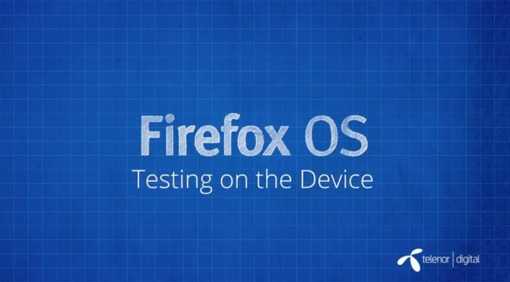

你是熱血的開發者，而且早就想開發自己的 Firefox OS App 嗎？在完成

- 《[Firefox OS App 開發入門 (1)：打造絕佳 HTML5 App 的要素](https://blog.mozilla.com.tw/posts/5275/)》

- 《[Firefox OS App 開發入門 (2)：Manifest 檔案](https://blog.mozilla.com.tw/posts/5283)》

- 《[Firefox OS App 開發入門 (3)：在模擬器中測試](https://blog.mozilla.com.tw/posts/5290/)》

之後，你應該已經用 Firefox OS 模擬器 (Firefox Os Simulator) 中測試過自己的 App 作品了。但畢竟模擬器仍有其侷限性。如果手上有 Firefox 實機能確實測試 App 當然更好！快來觀賞影片 (中文字幕) 並透過 Firefox OS 實體裝置測試 App 吧！

#### 在實體裝置上測試

在模擬器上測試 App 當然不錯，但畢竟會受限於模擬的環境。如果想測試 App 互動時的效能或畫面呈現方向，就需要實體裝置。實機同樣可搭配既有的開發者工具，以及「應用程式管理員 (App Manager)」。在實機上使用 App 時，可透過上述二種工具進一步了解 App 所發生的作業。而且 App 不必更新，也不必解除安裝，即可即時看到 App 的變化。

看完影片，你是否對 Firefox OS App 有更深入的了解呢？請別錯過即將陸續發佈且完成中文化的系列影片。

你也可以直接觀賞 MDN 上的原文系列影片《[Screencast series: App Basics for Firefox OS](https://developer.mozilla.org/en-US/Firefox_OS/Screencast_series:_App_Basics_for_Firefox_OS)》。

亦可欣賞中文版的《[系列影片：Firefox OS App 開發入門](https://developer.mozilla.org/zh-TW/docs/Mozilla/Firefox_OS/Screencast_series:_App_Basics_for_Firefox_OS)》。我們將逐一完成影片的中文化，並隨時更新各影片所對應的文章內容。
