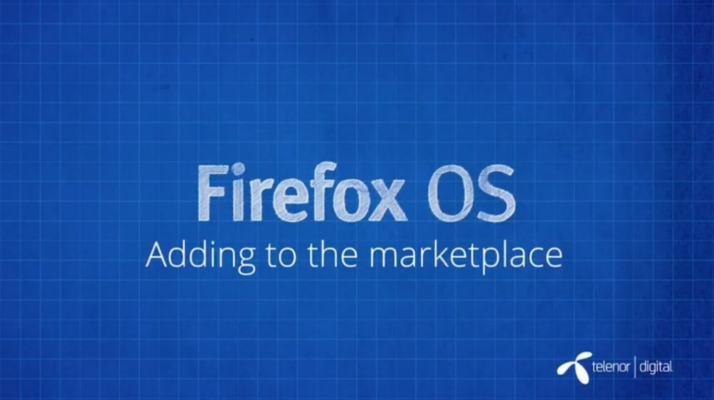

你是熱血的開發者，而且早就想開發自己的 Firefox OS App 嗎？在完成

- 《[Firefox OS App 開發入門 (1)：打造絕佳 HTML5 App 的要素](https://blog.mozilla.com.tw/posts/5275/)》

- 《[Firefox OS App 開發入門 (2)：Manifest 檔案](https://blog.mozilla.com.tw/posts/5283)》

- 《[Firefox OS App 開發入門 (3)：在模擬器中測試](https://blog.mozilla.com.tw/posts/5290/)》

- 《[Firefox OS App 開發入門 (4)：在實機中測試](https://blog.mozilla.com.tw/posts/5328/)》

之後，就應該要把自己的 App 作品提交到 Marketplace 了。除了要能提升自己心血的能見度之外，還有其他小技巧讓自己的 App 更脫穎而出！快來觀賞影片 (中文字幕) 並儘早將自己 App 送進 Marketplace 吧！

### 發佈至 Marketplace

[Firefox Marketplace](https://marketplace.firefox.com/) 可供開發者提交 App，並讓消費者能夠接觸到自己的作品。Marketplace 亦可發佈如 Firefox 桌面版與行動版所適用的 App。而消費者只需要簡單的幾個步驟，就能對 App 評分、提出反饋意見、購買自己所需的 App。要發佈自己的 App 真的很簡單：

- 為 manifest 檔案 (你可能會在「應用程式管理員 App Manager」看到中文翻譯為「安裝資訊檔」) 設定網址

- 為 App 填寫必要敘述說明 (可讓消費者更快找到自己需要的 App)

- 提供 App 的截圖或影片

- 為 App 挑選適合的分類

- 填寫自己的電子郵件，讓 Mozilla 能聯絡你

- 如果開發者有自己的隱私權政策與支援服務網站，也應提供給消費者知道

- 為自己的 App 設定內容分級

App 在提交到 Marketplace 之後，均會由 Mozilla 審查團隊進行審閱，並在幾天內就會通知審查結果。如果 App 有任何問題，在提交期間就會收到相關的檢驗訊息。開發者也有可能收到詳細的問題說明，並獲得修復問題的方法。

看完影片，你是否對 Firefox OS App 有更深入的了解呢？請別錯過即將陸續發佈且完成中文化的系列影片。

你也可以直接觀賞 MDN 上的原文系列影片《[Screencast series: App Basics for Firefox OS](https://developer.mozilla.org/en-US/Firefox_OS/Screencast_series:_App_Basics_for_Firefox_OS)》。

亦可欣賞中文版的《[系列影片：Firefox OS App](https://developer.mozilla.org/zh-TW/docs/Mozilla/Firefox_OS/Screencast_series:_App_Basics_for_Firefox_OS)[開發入門](https://developer.mozilla.org/zh-TW/docs/Mozilla/Firefox_OS/Screencast_series:_App_Basics_for_Firefox_OS)》。我們將逐一完成影片的中文化，並隨時更新各影片所對應的文章內容。
