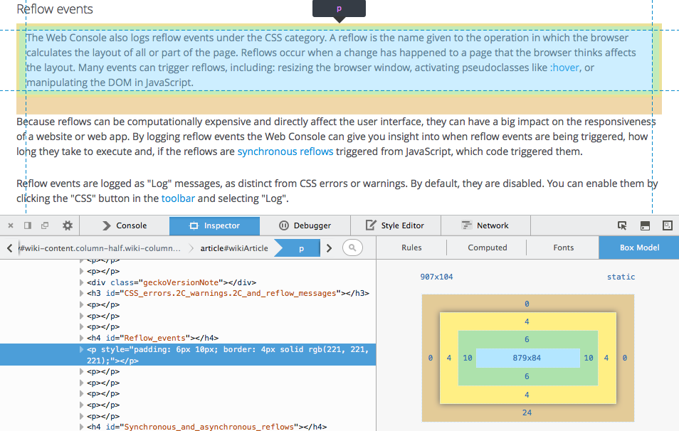
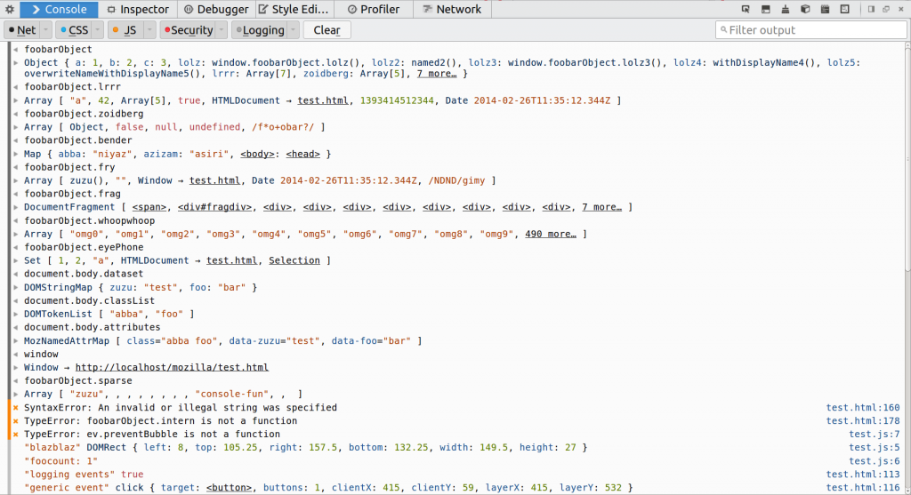
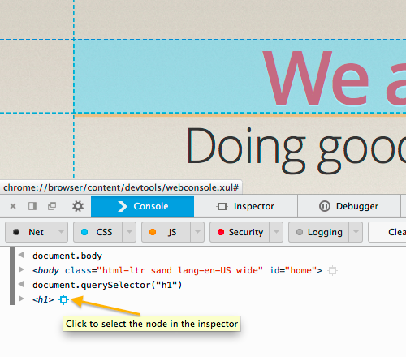
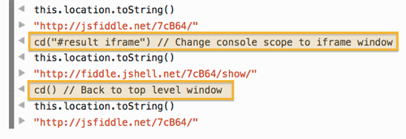
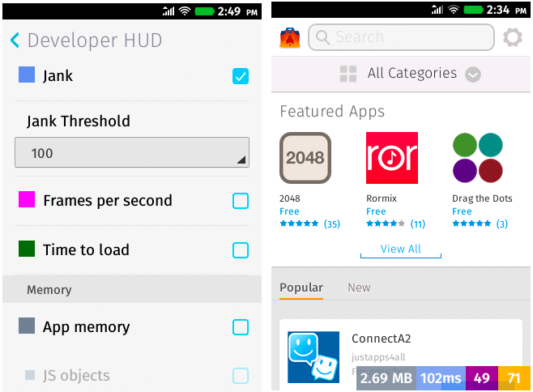
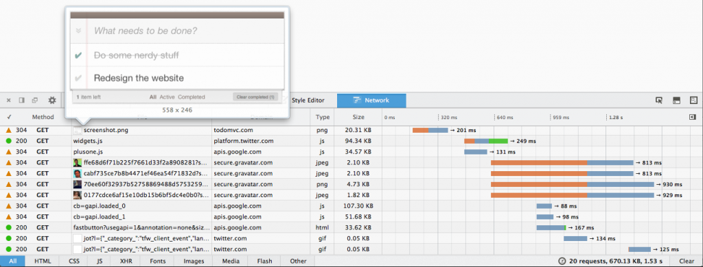
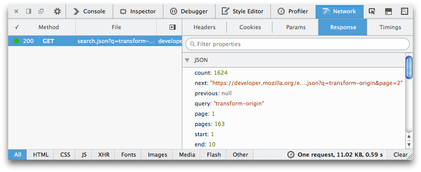
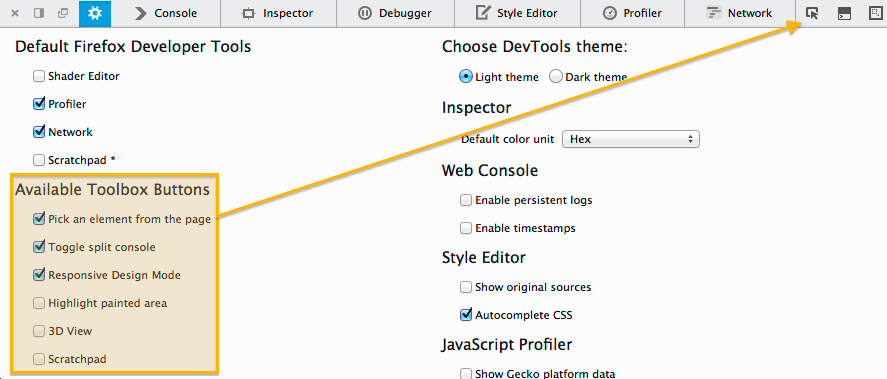

### Box Model 強調功能、強化網頁主控台、Firefox OS HUD， 還有更多

Firefox 30 現在進入[曙光版 (Aurora) 釋出頻道](https://www.mozilla.org/en-US/firefox/aurora/)了。照慣例來看看此版本的開發者工具有哪些重要功能。

#### 檢測器 (Inspector)

大家期待的諸多開發功能之一，就是要能強調頁面元素的「Box Model」區塊。我們很高興能宣佈 Firefox 30 已正式具備這個功能。而且 Box Model 現可用不同的顏色區塊區分不同 CSS 的設定值 (如 margin、padding、border 等)，達到更清晰的效果。

可參閱[「檢測器」說明文章](https://developer.mozilla.org/en-US/docs/Tools/Page_Inspector#Box_model_view)以進一步了解新功能，或可觀看下方短片：

而 CSS 規則檢視中，有了新的字型 (font family) 提示功能。只要將滑鼠游標置於 font-family 值之上，即可預覽該字型。([可參閱此開發討論記錄](https://bugzilla.mozilla.org/show_bug.cgi?id=702577))

#### 網頁主控台 (Web Console)

網頁主控台有多項重大更新，可檢視並引導輸出效果。

- 主控台輸出對話框可對所有 JS 物件與函式達到更好的強調效果 ([可參閱此開發討論記錄](https://bugzilla.mozilla.org/show_bug.cgi?id=584733))

- 強調其對應的節點，點擊之後即可從主控台跳至該節點 ([可參閱此開發討論記錄](https://bugzilla.mozilla.org/show_bug.cgi?id=757866))

- 新支援 console.count() ([可參閱此開發討論記錄](https://bugzilla.mozilla.org/show_bug.cgi?id=922208))

在主控台中執行 cd() 指令，即可在 iframes 之間切換所屬範圍 (Scope)。可參閱 [cd 指令說明文件](https://developer.mozilla.org/en-US/docs/Tools/Web_Console#Working_with_iframes)。([可參閱此開發討論記錄](https://bugzilla.mozilla.org/show_bug.cgi?id=609872))

另可參閱由 Mihai 撰文說明[網頁主控台即將發生的變化](https://www.robodesign.ro/mihai/blog/web-console-improvements-episode-30#firefox30)。他也曾撰文說明 [web console API 的擴充套件](https://developer.mozilla.org/en-US/docs/Tools/Web_Console/Custom_output)。

#### Firefox OS

網路監測器 (Network monitor) 現可搭配 Firefox OS 運作。([可參閱此開發討論記錄](https://bugzilla.mozilla.org/show_bug.cgi?id=917227))

目前 Firefox OS Developer HUD 提供記憶體追蹤 ([可參閱此開發討論記錄](https://bugzilla.mozilla.org/show_bug.cgi?id=963498)) 與 jank 追蹤 ([可參閱此開發討論記錄](https://bugzilla.mozilla.org/show_bug.cgi?id=963499)) 功能。另可參閱 Paul 撰文的 《[Firefox OS: tracking reflows and event loop lags](https://paulrouget.com/e/fxoshud/)》以進一步了解「jank (即所謂的 event loop lag)」。

####

#### 網路監測器 (Network Monitor)

網路監測器現具備新外觀與數項新功能：

- 新設計的網頁時間軸，真正提升了面板上的捲動效果。([可參閱此開發討論記錄](https://bugzilla.mozilla.org/show_bug.cgi?id=909251))

- 只要將滑鼠游標置於某圖片網址之上，即可出現該圖片的預覽對話框。([可參閱此開發討論記錄](https://bugzilla.mozilla.org/show_bug.cgi?id=859135))

- 只要是圖片類型的網路請求，則檔案名稱附近亦將顯示縮圖。([可參閱此開發討論記錄](https://bugzilla.mozilla.org/show_bug.cgi?id=859136))

只要是類似 JSON 格式的網路請求，即使是純文字檔案亦將顯示物件預覽對話框。([可參閱此開發討論記錄](https://bugzilla.mozilla.org/show_bug.cgi?id=964977))

####

#### 工具箱 (Toolbox)

主控台的快捷鍵 (cmd+alt+k 或 ctrl+shift+k) 有新動作了。此快捷鍵將隨時注意網頁主控台中的輸入行，並視需要而開啟工具箱且不會關閉工具箱。可參閱 [robcee 的部落格以進一步了解](https://robcee.net/2014/updated-console-keyboard-shortcuts-in-firefox/)。([可參閱此開發討論記錄](https://bugzilla.mozilla.org/show_bug.cgi?id=612253))

如果想為頂端的工具列省下一點空間，則可隱藏如程式碼速記本 (Scratchpad) 的指令按鈕。現在預設開啟的按鈕只有檢測元素 (Inspect Element)、分割主控台 (Split Console)、適應性模式 (Responsive Mode)。[可透過 devtools 郵件群組進一步了解這項變更](https://groups.google.com/d/msg/mozilla.dev.developer-tools/zhFZRLnlmVw/qFalqQTUUOMJ) ([可參閱此開發討論記錄](https://bugzilla.mozilla.org/show_bug.cgi?id=974947))。若要啟動程式碼速記本(Scratchpad)、閃爍繪圖區 (Paint Flashing)、並排顯示 (Tilt)，則勾選選項面板中的方塊即可。

最後要感謝此版開發者工具共 46 位貢獻者！[為 Firefox 30 開發者工具解錯人員名單在此](https://mzl.la/1p7uKJ2)。

如果你有任何問題、想提出意見與功能需求，或發現任何錯誤，還是一樣可透過 [@FirefoxDevTools](https://twitter.com/firefoxdevtools) 聯絡我們。

原文連結：[Box model highlighter, Web Console improvements, Firefox OS HUD + more – Firefox Developer Tools Episode 30](https://hacks.mozilla.org/2014/03/box-model-highlighter-web-console-improvements-firefox-os-hud-more-firefox-developer-tools-episode-30/)
