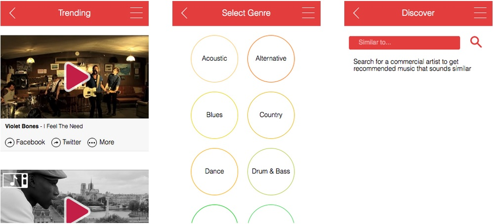
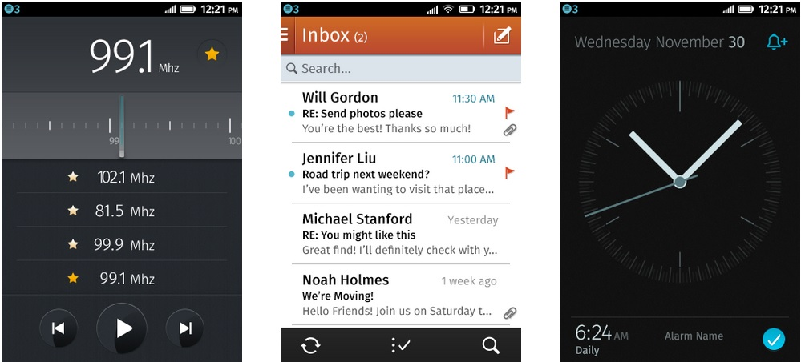

[Rormix](https://rormix.com/) 平台可發掘目前正夯的音樂影片。這些影片都已依照各音樂類型或類似風格的暢銷歌手而分類，讓消費者能更輕鬆發現新的音樂影片。

而「Rormix」應用程式即以 PhoneGap 所開發，目前已提供 [iOS](https://ror.mx/ios) 與 [Android](https://ror.mx/android) 版本。從寫下第一行程式碼直到讓 App 在商城上架，整個開發過程大概花了一個月。結果移植到 [Firefox OS](https://marketplace.firefox.com/app/rormix/) 只要一天！

接著來說說我們學到的幾個秘訣：

#### 到底該針對哪個螢幕尺寸來開發？

在開發 Open Web 的應用程式之後，即可安裝到實際的桌面版和行動版 Firefox 瀏覽器，亦可安裝於 Firefox OS 裝置之上。

如果單一 App 就要支援上述的所有 Firefox 系統，就必須採用「適應性設計 (Responsive design)」模式；開發者當然也可以限定想要支援的平台。[目前的 Firefox OS 智慧型手機](https://www.mozilla.org/en-US/firefox/os/devices/)具備 320×480 解析度，另可達「1」像素密度 (Pixel density)；所以不需另外產生特殊尺寸的圖片。

#### 「上一頁 (Back)」按鈕呢？

iOS 裝置並沒有「上一頁」按鈕；Android 裝置則提供硬體的「上一頁」按鈕。那 Firefox OS 又該怎麼做？Firefox OS 具備軟體的「上一頁」按鈕。開發者在建構 [App 的 manifest 檔案](https://developer.mozilla.org/en-US/Apps/Build/Manifest#chrome) (你會在「應用程式管理員 (App Manager)」看到中文翻譯為「安裝資訊檔」) 時，就能選擇是否隱藏按鈕。按鈕可藏在畫面底部，但使用上可能有點難度。

我建議開發者仍可為自己的 App 設計按鈕，並預設隱藏起來，讓消費者能輕鬆使用 App。

//jQuery example
$('.backbutton').click(function(){
    history.go(-1);
});

					1234

						//jQuery example$('.backbutton').click(function(){    history.go(-1);});

##

#### 「Stateful」的設計

由於 Firefox OS 仍有「上一頁」按鈕，因此開發者所設計的 App 必須能儲存畫面狀態 (stateful)，讓使用者在點擊「上一頁」按鈕時，可回到先前儲存的畫面狀態。

現有許多 JS 框架均透過段落識別碼 (Fragment identifier) 而載入不同的畫面狀態 (如 [Sammy JS](https://sammyjs.org/))。只要使用這類框架就能輕鬆建構此功能。

//jQuery example

//Sammy app
var app;

$(function(){

    app = Sammy(function() {
        this.get('#/', function() {
            //Load default content
        });
        this.get('#/trending', function() {
            //Get trending content
        });
        this.get('#/fresh', function() {
            //Get fresh content
        });
    });
});

//Load the default content on app load
app.run('#/');

//Go to fresh content
$('.freshbutton').click(function(){
    app.setLocation('#/fresh');
});

					123456789101112131415161718192021222324252627

						//jQuery example //Sammy appvar app; $(function(){     app = Sammy(function() {        this.get('#/', function() {            //Load default content        });        this.get('#/trending', function() {            //Get trending content        });        this.get('#/fresh', function() {            //Get fresh content        });    });}); //Load the default content on app loadapp.run('#/'); //Go to fresh content$('.freshbutton').click(function(){    app.setLocation('#/fresh');});

#### 建立選單

使用 CSS3 Transforms 不僅能快速為 Firefox OS 設計選單，而且也能儘量簡化選單，讓顯示選單時的重繪 (Redraw) 作業不致佔用過多資源。截至本文發表為止，Firefox OS 手機參考像素的寬度均與所有 iPhone 相同；而高度則與 iPhone 5 之前的型號相同。所以你的設計只要能用於 iOS 之上，就應該沒有問題。

#### 加入 Firefox OS 的風格

其實已經有一系列的[設計指南](https://www.mozilla.org/en-US/styleguide/products/firefox-os/)，可供開發者了解 Firefox OS 平台的色彩搭配等規則。另外也說明如 App 的圖示與字型等細節。

#### 提交 App

在完成自己的 App 作品之後，可選擇 App 提交管道。開發者可將 App [封裝](https://developer.mozilla.org/en-US/Apps/Publishing/Packaged_Apps)成 zip 壓縮檔：

###### zip -r package.zip *

接著把 zip 檔提交到 [Marketplace](https://marketplace.firefox.com/developers/submit/)，或[自行架設/托管該 App](https://developer.mozilla.org/zh-TW/docs/Mozilla/Marketplace/Publishing/Publish_options)。

其實也可以簡單[將程式碼架設/托管為](https://developer.mozilla.org/en-US/Marketplace/Publishing/Publish_options#Hosted_apps)網頁 (而不用壓縮)。透過[額外的小型 JS](https://developer.mozilla.org/en-US/Apps/Build/JavaScript_API#Installation_API) 即可提示消費者將 App下載到自己的手機上。

#### 同場加映：使用 PhoneGap / Cordova 搭配 HTML5

只要開發 Web App，也就能迅速且輕鬆的建構跨平台 App。好處還不只如此。只要透過適應性設計 (Responsive design) 的特性，甚至只要單一專案即可適用不同的尺寸或平台。而進階工具與工作流程 (如 [Sass](https://sass-lang.com/) 與 [Yeoman](https://yeoman.io/) 為例) 都能更輕鬆開發 App。

PhoneGap / Cordova [3.4 版](https://phonegap.com/blog/2014/03/04/phonegap-3-4-release/)起開始支援 Firefox OS。可參閱《[Building Cordova apps for Firefox OS](https://hacks.mozilla.org/2014/02/building-cordova-apps-for-firefox-os/)》進一步了解。使用 PhoneGap 的最大優點在於，開發者只需支援單一的 Codebase 即可用於自己的全部 App。我們都知道瀏覽器之間均有些微的差異，而 PhoneGap 亦內建了整合 (Merge) 機制，可讓開發者從主程式碼中區隔出各平台專屬的程式碼，並在建構 App 時再次整合即可。

PhoneGap 另具備[函式庫](https://plugins.cordova.io/)，可存取[手機的原生屬性](https://docs.phonegap.com/en/3.4.0/cordova_plugins_pluginapis.md.html#Plugin%20APIs) (例如原生的對話框)。此程式碼亦可跨平台所用，以儘量避免重複的程式碼。

PhoneGap 最讚的地方，就是能讓開發者建立自己的外掛程式、以簡單的方式發揮行動裝置的功能，並能輕鬆轉換 JS 與原生碼。

原文連結：[Rormix – Discover Emerging Music Videos with Firefox OS](https://hacks.mozilla.org/2014/04/rormix-discover-emerging-music-videos-with-firefox-os/)
