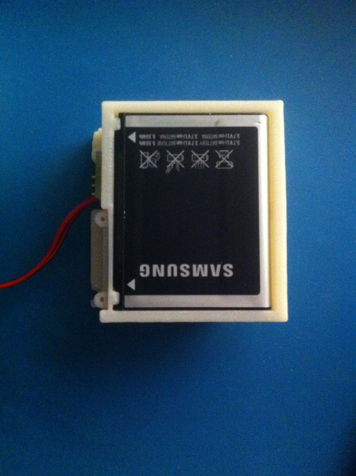
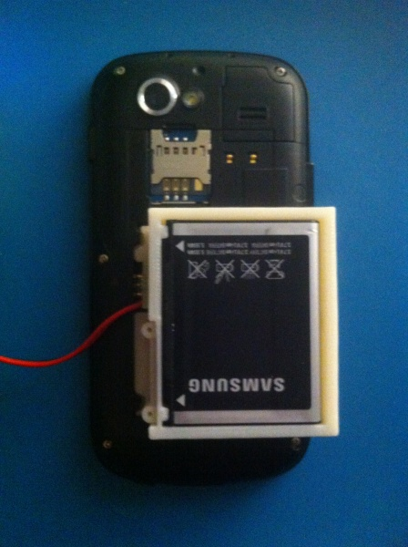
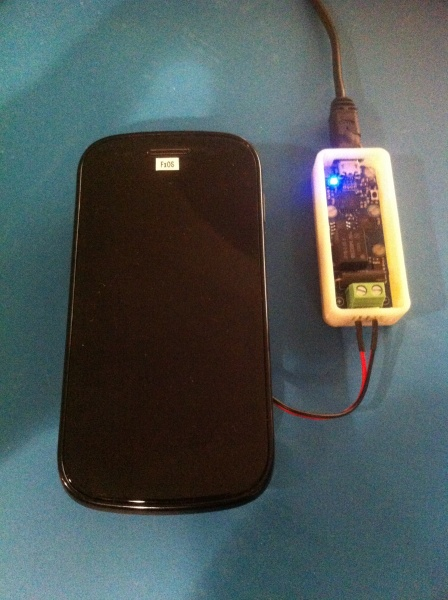
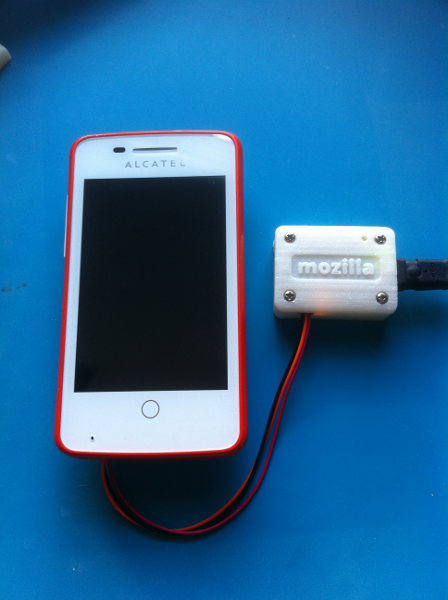
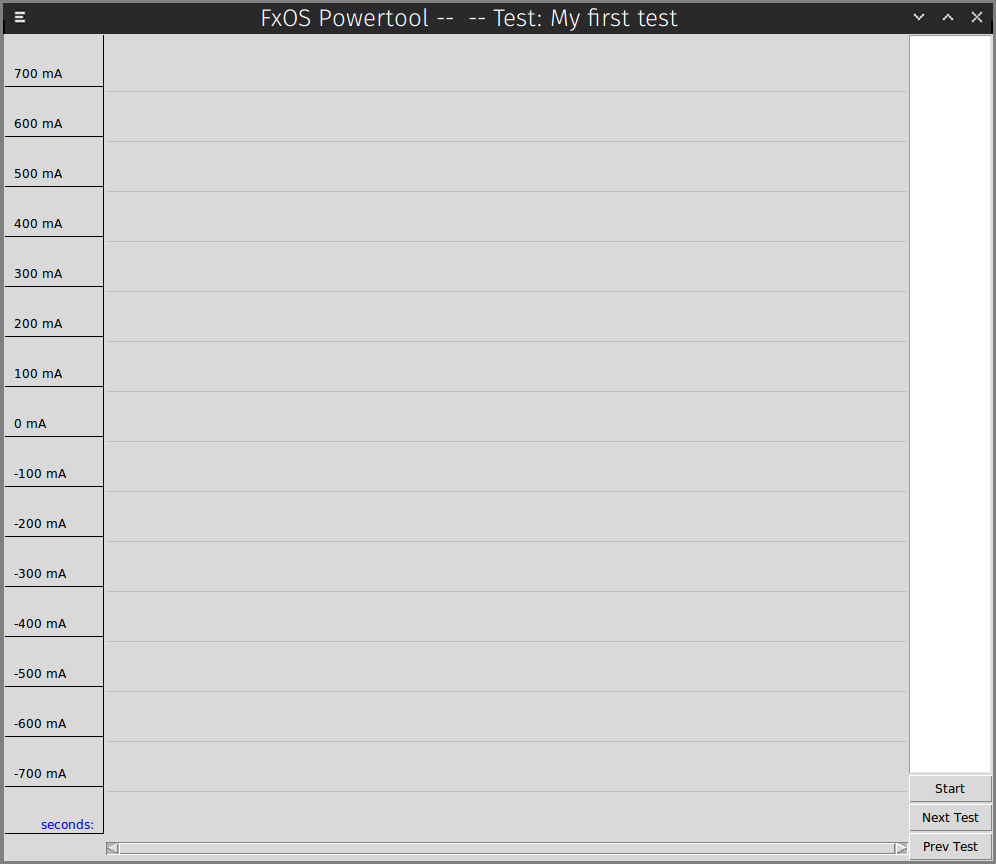
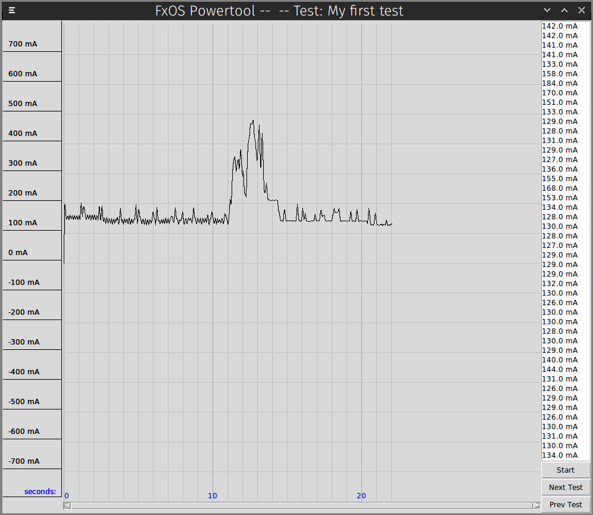
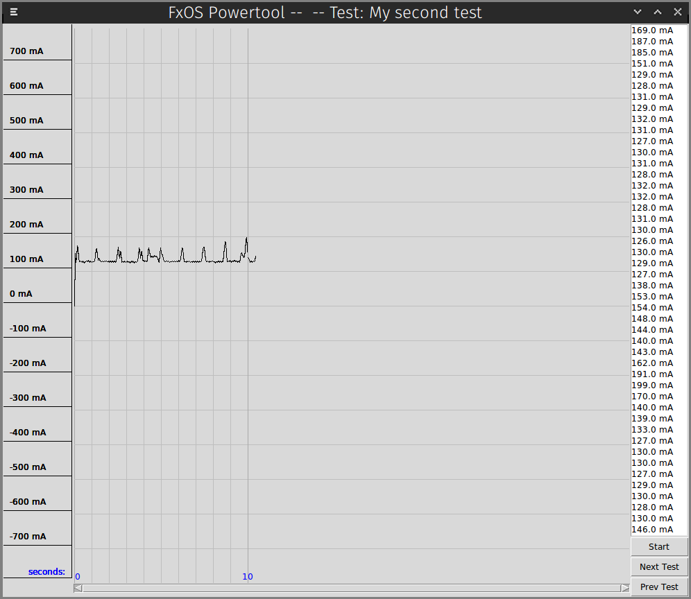
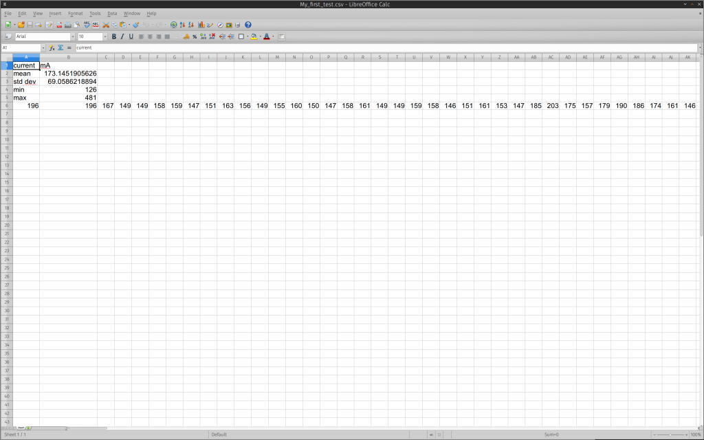

在了解並測量手機的相關運作參數時，我們接觸到許多有關耗電量的資訊。接著向大家分享使用《[FxOS Powertool!](https://developer.mozilla.org/en-US/Apps/Build/Performance/Performance_fundamentals/Power)》所學到的技巧。

#### 介紹《FxOS Powertool! 》

FxOS Powertool! 可讓我們針對耗電量的部份，進行 App 的最佳化。但目前仍有錯誤等待修正。另外 FxOS Powertool! 也是命令提示字元工具的另項選擇：

usage: powertool [-h] -d {yocto,mozilla} [-p PATH] -u {tk,cli} [-f FILE]
                 [-o OUT] [-s SHOW]

Mozilla Powertool

optional arguments:
  -h, --help            show this help message and exit
  -d {yocto,mozilla}, --device {yocto,mozilla}
                        specify ammeter device to use
  -p PATH, --path PATH  specify path to ammeter device (e.g. /dev/ttyACM0)
  -u {tk,cli}, --ui {tk,cli}
                        specify which UI to use
  -f FILE, --file FILE  test run config file
  -o OUT, --out OUT     output data file
  -s SHOW, --show SHOW  name of the sample source to display

					123456789101112131415

						usage: powertool [-h] -d {yocto,mozilla} [-p PATH] -u {tk,cli} [-f FILE]                 [-o OUT] [-s SHOW] Mozilla Powertool optional arguments:  -h, --help            show this help message and exit  -d {yocto,mozilla}, --device {yocto,mozilla}                        specify ammeter device to use  -p PATH, --path PATH  specify path to ammeter device (e.g. /dev/ttyACM0)  -u {tk,cli}, --ui {tk,cli}                        specify which UI to use  -f FILE, --file FILE  test run config file  -o OUT, --out OUT     output data file  -s SHOW, --show SHOW  name of the sample source to display

你可複製以下 repository 取得程式碼：

$ git clone git://github.com/JonHylands/fxos-powertool

					1

						$ git clone git://github.com/JonHylands/fxos-powertool

FxOS Powertool! 是以 Python 撰寫而成，並搭配 Tkinter UI 套裝軟體，應該可跨平台使用。接著就安裝應用程式與其他有相依性的套裝工具：

$ cd fxos-powertool
$ sudo python ./setup.py install

					12

						$ cd fxos-powertool$ sudo python ./setup.py install

再來建立測試程序 (Test suite) 的敘述檔案。FxOS Powertool! 將透過敘述檔案而得知你所規劃的測試作業，並整理各次測試作業所蒐集的資料。測試程序敘述檔案就像：

{
  "title": "My Tests",
  "tests": [
    "My first test",
    "My second test",
    "My third test"
  ]
}

					12345678

						{  "title": "My Tests",  "tests": [    "My first test",    "My second test",    "My third test"  ]}

#### 設計電池外接盒

你會需要：

- 一組 USB 數位電流表/安培計，像 [Yocto-Amp](https://www.yoctopuce.com/EN/products/usb-sensors/yocto-amp) 或[自己做一個](https://github.com/JonHylands/fxos-battery-harness)

- 一組開放式硬體設計的電池外接盒，包含 3D 列印的零件，還有可插接電流表的小型電路板。你也可以使用所需的 3D 列印機與電路板檔案，[自行打造電池外接盒](https://github.com/JonHylands/fxos-battery-harness)。目前我們所設計的外接盒： [Alcatel OneTouch Fire](https://www.alcatelonetouch.com/global-en/products/smartphones/one_touch_fire.html)

- [Samsung Nexus S](https://en.wikipedia.org/wiki/Nexus_S)

- [LG Nexus 4](https://www.lg.com/uk/mobile-phones/lg-E960-nexus-4-by-lg) – [組裝電池外接盒的特殊說明](https://developer.mozilla.org/en-US/Apps/Build/Performance/Performance_fundamentals/Power/Nexus_4_Harness)

- [Geeksphone Keon](https://en.wikipedia.org/wiki/GeeksPhone_Keon)

- Huawei Ascend Y3000II

- [ZTE Open](https://www.ztedevices.com/product/smart_phone/2bcf2d56-0c9a-4129-a25c-acce58c8e502.html)

- 「一定要設計出酷炫東西」的堅強意志

下一步就是設定自己的硬體：

1. 抽出 Firefox OS 裝置的電池，放入電池外接盒

2. 將電池外接盒接回裝置

3. 接上電流表

#### 執行 FxOS Powertool!

現在你已經可以啟動 FxOS Powertool! 並蒐集資料了。

FxOS Powertool! 可將所蒐集的資料儲存為 1). JSON 與 2). 用逗號分隔的數值。另外可在「--out」選項中指定檔案的附檔名，即可儲存為所需的格式。舉下列條件為例：

- 我的測試程序敘述檔案取名為 mytests.json

- 我使用 Yoctopuce 電流表

- 我要用 Tk GUI 顯示耗電量圖表

- 我要把蒐集來的資料儲存為 .csv 檔案

那我的指令列看起來如下：

$ powertool -d yocto -p /dev/ttyUSB0 -u tk -s current -f mytests.json -

					1

						$ powertool -d yocto -p /dev/ttyUSB0 -u tk -s current -f mytests.json -

如果我要用 Mozilla 電流表，而且不改變測試參數的情況下：

$ powertool -d mozilla -p /dev/ttyACM0 -u tk -s current -f mytests.json

					1

						$ powertool -d mozilla -p /dev/ttyACM0 -u tk -s current -f mytests.json

接著就會啟動 Tk 圖形使用者介面 (GUI)，且第一次測試作業的名稱會顯示在 App 的標題列上：

如果想控制資料蒐集作業並瀏覽測試結果，則可使用 FxOS Powertool! 的快捷鍵。在 GUI 開啟的狀態下，只要點擊空白鍵即可開始/停止目前所選擇的測試作業。第一次按下空白鍵隨即開始蒐集資料，同樣再按下空白鍵就停止蒐集資料。每一次蒐集作業所得的資料，均會在輸出檔案中呈現為一列資料：

針對現有的測試作業，你可重複執行資料直到滿意為止，亦可瀏覽其他測試作業並同樣執行資料。最後也能回到上一筆測試作業繼續執行資料。FxOS Powertool! 不會遺漏任何資料，且能針對各次測試作業的資料執行結果，一併統整到正確的資料檔案中。可透過「L」與「H」鍵瀏覽所有測試作業。「L」會進入下一筆測試資料；「H」則回到上一筆。

在搜集到自己所需的測試資料後，只要退出應用程式，資料檔案隨即寫入至磁碟。點擊標題列上的關閉視窗鈕，或是直接按下鍵盤的「Q」均可退出應用程式。而此範例即根據「--out」參數值，將資料輸出為 CSV 格式並命名為「mytests.csv」。應用程式另將建立「mytests」目錄，並將各次測試所蒐集而來的資料分別輸出為 CSV 檔案。

如同本文所提及的效果，FxOS Powertool! 也將自動執行基礎的統計作業。在取得原始資料後，隨即可計算出各次測試資料的最小值、最大值、平均值、標準差等數據。

原文連結：[Measuring power consumption on phones](https://hacks.mozilla.org/2014/04/measuring-power-consumption-on-phones/)
