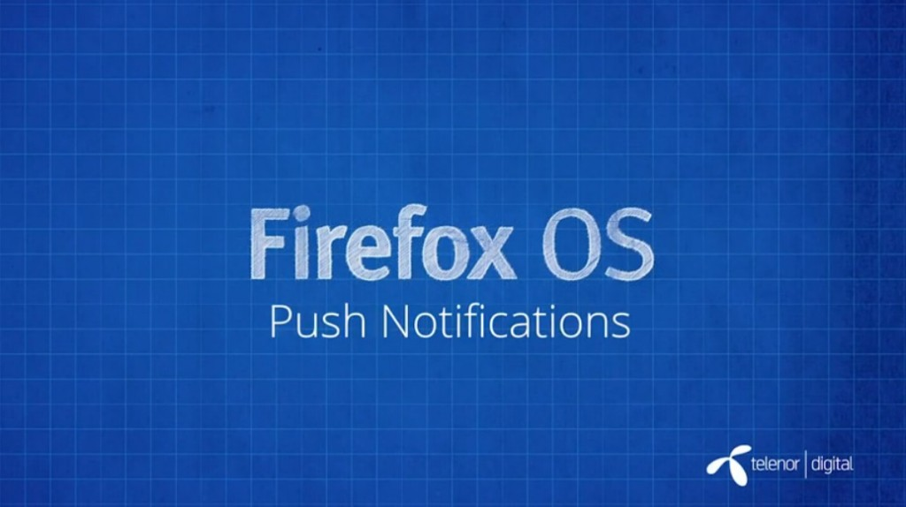

你是熱血的開發者，而且早就想開發自己的 Firefox OS App 嗎？在完成

- 《[Firefox OS App 開發入門 (1)：打造絕佳 HTML5 App 的要素](https://blog.mozilla.com.tw/posts/5275/)》

- 《[Firefox OS App 開發入門 (2)：Manifest 檔案](https://blog.mozilla.com.tw/posts/5283)》

- 《[Firefox OS App 開發入門 (3)：在模擬器中測試](https://blog.mozilla.com.tw/posts/5290/)》

- 《[Firefox OS App 開發入門 (4)：在實機中測試](https://blog.mozilla.com.tw/posts/5328/)》

- 《[Firefox OS App 開發入門 (5)：將 App 提交到 Marketplace](https://blog.mozilla.com.tw/posts/5334/)》

之後，你應該已經讓自己的 App 順利登上 Marketplace 了吧？是不是很有成就感呢？

除了以上 Firefox OS App 的基礎概念之外，你應該也看過了進一步的介紹影片了：

- 《[Firefox OS App 開發入門 (6)：Web API](https://blog.mozilla.com.tw/posts/5339/)》

- 《[Firefox OS App 開發入門 (7)：Web Activities](https://blog.mozilla.com.tw/posts/5388/)》

接著再跟大家說明手機常見的另一項重要功能：推播通知 (中文字幕)。

#### 推播通知

使用 [SimplePush WebAPI](https://wiki.mozilla.org/WebAPI/SimplePush) 的推播通知 (Push notification) 功能，可在裝置接收到特定訊息時喚醒 App。如此可在省電狀態下讓 App 保持待機，再隨時根據需求喚醒 App；此功能對行動裝置 App 格外重要。用這種方式所傳送的通知也有其優點：這種通知不會攜帶任何資料，Mozilla 不會取得 App 的資訊，而惡意攻擊者也無法監聽。

若要進一步了解 SimplePush 所推播的通知：

- [SimplePush 的 Wiki 頁面](https://wiki.mozilla.org/WebAPI/SimplePush)

- Mozilla Hacks 對 [SimplePush 的介紹](https://hacks.mozilla.org/2013/07/dont-miss-out-on-the-real-time-fun-use-firefox-os-push-notifications/)

看完影片，你是否對 Firefox OS App 有更深入的了解呢？請別錯過即將陸續發佈且完成中文化的系列影片。

你也可以直接觀賞 MDN 上的原文系列影片《[Screencast series: App Basics for Firefox OS](https://developer.mozilla.org/en-US/Firefox_OS/Screencast_series:_App_Basics_for_Firefox_OS)》。

亦可欣賞中文版的《[系列影片：Firefox OS App 開發入門](https://developer.mozilla.org/zh-TW/docs/Mozilla/Firefox_OS/Screencast_series:_App_Basics_for_Firefox_OS)》。我們將逐一完成影片的中文化，並隨時更新各影片所對應的文章內容。
