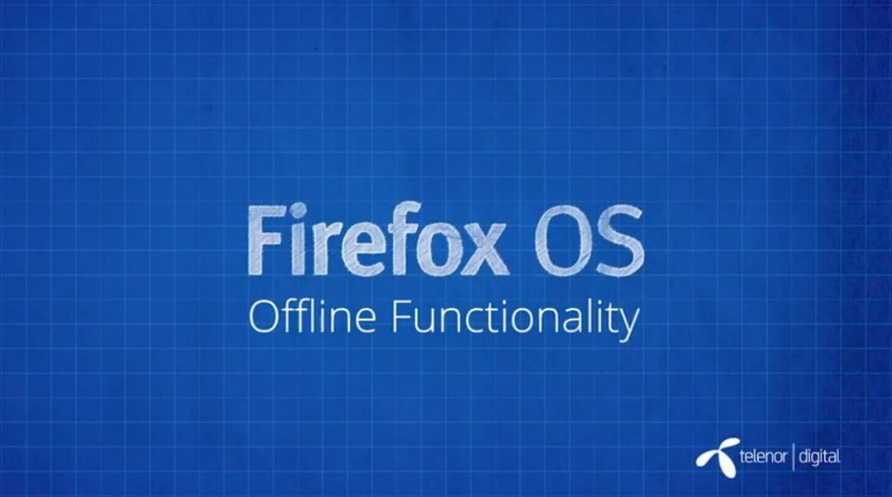

你是熱血的開發者，而且早就想開發自己的 Firefox OS App 嗎？在完成

- 《[Firefox OS App 開發入門 (1)：打造絕佳 HTML5 App 的要素](https://blog.mozilla.com.tw/posts/5275/)》

- 《[Firefox OS App 開發入門 (2)：Manifest 檔案](https://blog.mozilla.com.tw/posts/5283)》

- 《[Firefox OS App 開發入門 (3)：在模擬器中測試](https://blog.mozilla.com.tw/posts/5290/)》

- 《[Firefox OS App 開發入門 (4)：在實機中測試](https://blog.mozilla.com.tw/posts/5328/)》

- 《[Firefox OS App 開發入門 (5)：將 App 提交到 Marketplace](https://blog.mozilla.com.tw/posts/5334/)》

之後，你應該已經讓自己的 App 順利登上 Marketplace 了吧？是不是很有成就感呢？

除了以上 Firefox OS App 的基礎概念之外，你應該也看過了進一步的介紹影片了：

- 《[Firefox OS App 開發入門 (6)：Web API](https://blog.mozilla.com.tw/posts/5339/)》

- 《[Firefox OS App 開發入門 (7)：Web Activities](https://blog.mozilla.com.tw/posts/5388/)》

- 《[Firefox OS App 開發入門 (8)：推播通知](https://blog.mozilla.com.tw/posts/5435/)》

由於在很多狀況下，我們並無法控制手機能否保持上網，所以接著要說明 Web App 所應注意的特點之一：離線功能 (中文字幕)。

#### 離線功能

如果 App 無法離線作業，那可用性就會大大降低。有部分使用者也因為這個理由，比較喜歡安裝 App 之後只要開啟瀏覽器，就能在裝置的瀏覽器上查看所需的內容。其實「Web App」這個詞看起來會有「需要網路連線才能運作」的感覺。但使用者總是有無法上網的時候：飛機上必須關機、地底下收不到訊號，甚或手機內部沒留任何資料。開發者應該要確保自己的 App 能離線運作。而 HTML5 即具備幾項離線作業的技術，主要就是 [AppCache](https://developer.mozilla.org/en-US/docs/HTML/Using_the_application_cache) 與 [DOMStorage](https://developer.mozilla.org/en-US/docs/Web/Guide/API/DOM/Storage)。

進一步了解離線功能：

- [DOMStorage 的 Wiki 頁面](https://developer.mozilla.org/en-US/docs/Web/Guide/API/DOM/Storage)

- [AppCache 的 Wiki 頁面](https://developer.mozilla.org/en-US/docs/HTML/Using_the_application_cache)

- [使用 IndexedDB](https://developer.mozilla.org/en-US/docs/IndexedDB/Using_IndexedDB) – 用戶端的進階儲存方式

- [LocalForage](https://github.com/mozilla/localForage) 是 Firefox OS 中所使用的 wrapper，可兼顧 DOMStorage 的簡單易用，與 IndexedDB 的強大功能 ([本篇 Mozilla Hacks 文章](https://hacks.mozilla.org/2014/02/localforage-offline-storage-improved/) 另外詳細說明)

看完影片，你是否對 Firefox OS App 有更深入的了解呢？請別錯過即將陸續發佈且完成中文化的系列影片。

你也可以直接觀賞 MDN 上的原文系列影片《[Screencast series: App Basics for Firefox OS](https://developer.mozilla.org/en-US/Firefox_OS/Screencast_series:_App_Basics_for_Firefox_OS)》。

亦可欣賞中文版的《[系列影片：Firefox OS App 開發入門](https://developer.mozilla.org/zh-TW/docs/Mozilla/Firefox_OS/Screencast_series:_App_Basics_for_Firefox_OS)》。我們將逐一完成影片的中文化，並隨時更新各影片所對應的文章內容。
