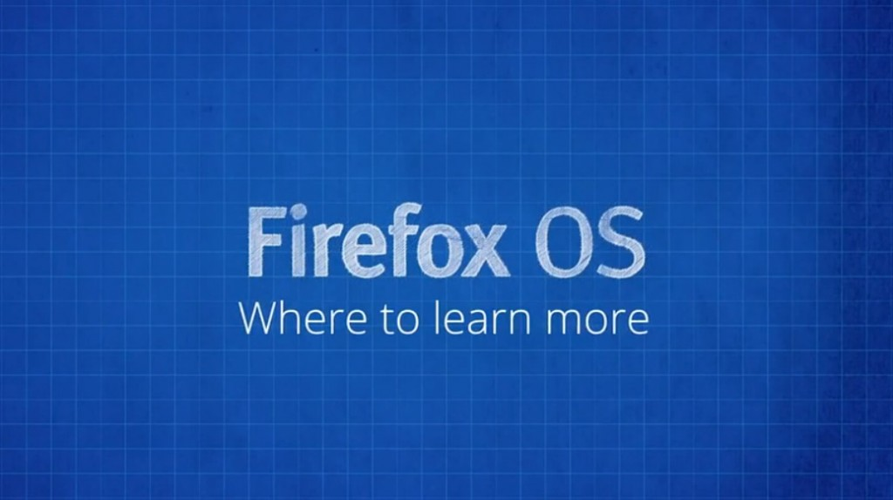

你是熱血的開發者，而且早就想開發自己的 Firefox OS App 嗎？在完成

- 《[Firefox OS App 開發入門 (1)：打造絕佳 HTML5 App 的要素](https://blog.mozilla.com.tw/posts/5275/)》

- 《[Firefox OS App 開發入門 (2)：Manifest 檔案](https://blog.mozilla.com.tw/posts/5283)》

- 《[Firefox OS App 開發入門 (3)：在模擬器中測試](https://blog.mozilla.com.tw/posts/5290/)》

- 《[Firefox OS App 開發入門 (4)：在實機中測試](https://blog.mozilla.com.tw/posts/5328/)》

- 《[Firefox OS App 開發入門 (5)：將 App 提交到 Marketplace](https://blog.mozilla.com.tw/posts/5334/)》

之後，你應該已經讓自己的 App 順利登上 Marketplace 了吧？是不是很有成就感呢？

除了以上 Firefox OS App 的基礎概念之外，你應該也看過了進一步的介紹影片了：

- 《[Firefox OS App 開發入門 (6)：Web API](https://blog.mozilla.com.tw/posts/5339/)》

- 《[Firefox OS App 開發入門 (7)：Web Activities](https://blog.mozilla.com.tw/posts/5388/)》

- 《[Firefox OS App 開發入門 (8)：推播通知](https://blog.mozilla.com.tw/posts/5435/)》

- 《[Firefox OS App 開發入門 (9)：離線功能](https://blog.mozilla.com.tw/posts/5441/)》

本系列到此要告一段落了。希望開發者能透過這一系列的影片，都已經深入了解 Firefox OS App。接著要和大家分享更多相關資訊 (中文字幕)。

#### 深入了解

我們希望這一系列的影片，能夠順利帶領開發者建構出自己的第一款 Open Web App。如果你很感興趣也想了解更多細節，還有許多其他資源與管道可供你利用：

- [MDN 上的「應用程式中心」](https://developer.mozilla.org/en-US/docs/Apps/)另提供有關絕佳 Open Web App 的設計訣竅、可供下載的範例程式碼，另有將自己 App 提交到 Marketplace 的詳細說明

- [Hacks 部落格](https://hacks.mozilla.org/)將持續提供 Firefox OS App 的文章 (當然也有像你的第三方開發者所撰寫的心得文)，並有說明 WebAPI 等不同技術的進階文章，讓你能提早了解下一版 Firefox 與 Firefox OS 所將具備的特色功能

- [MDN 的 Firefox OS 區塊](https://developer.mozilla.org/en-US/Firefox_OS)以及 [B2G 的 Wiki 頁面](https://wiki.mozilla.org/B2G)，均有 Firefox OS 的深入資訊

- 我們很多人都掛在 IRC 上；只要到 [irc.mozilla.org](https://irc.mozilla.org/) 並透過 #devrel、#b2g、#openwebapps、#marketplace 都能找到我們

歡迎大家多多交流

─ 影片錄製人：Chris、Sergi、Jan

看完影片，你是否對 Firefox OS App 有更深入的了解呢？請別錯過其他已經中文化的系列影片。

你也可以直接觀賞 MDN 上的原文系列影片《[Screencast series: App Basics for Firefox OS](https://developer.mozilla.org/en-US/Firefox_OS/Screencast_series:_App_Basics_for_Firefox_OS)》。

亦可欣賞中文版的《[系列影片：Firefox OS App 開發入門](https://developer.mozilla.org/zh-TW/docs/Mozilla/Firefox_OS/Screencast_series:_App_Basics_for_Firefox_OS)》。我們已經完成影片的中文化，希望你真的喜歡且獲益良多。
