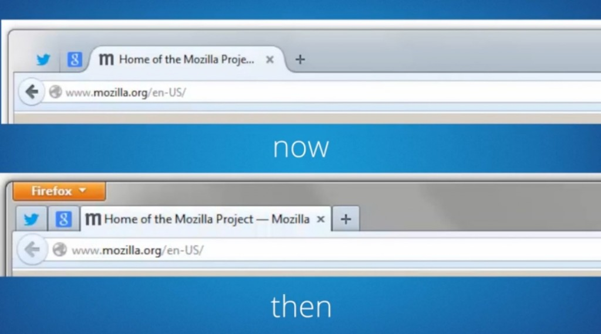

### 具備新自訂模式與極簡 Sync 同步功能 讓你打造真正屬於自己的瀏覽器

Mozilla 今日正式發表 3 年以來全新改版的 Firefox (Firefox 29)！此一新版包含流暢且有趣的新設計、新選單，與其他瀏覽器所不能及的 Firefox 新自訂功能，並同時首度內建 Firefox Accounts，使用者將能自由打造自我風格Firefox，並將 Firefox 帳號隨身帶著走。

全球性非營利組織 Mozilla 致力打造 Web 的美好未來，以推動 Web 的創新、機會、開放性為使命。Mozilla 與全球社群通力合作，打造如 Mozilla Firefox 的開放源碼產品，為個人與 Web 的福祉持續引領創新，將熱心人士所建構的絕佳產品提供予所有人。Firefox 在近 10 年前首次釋出之後，就成為全球 5 億人所信任、最高度自訂的瀏覽器。

Mozilla 這次對 Firefox 的重新設計，反應出目前的網路使用方式。全新版本介紹多項新功能，包含流暢且有趣的設計、新的選單、自訂模式，以及透過 Firefox Accounts 所強化的「Sync」同步服務。

首先，最新版 Firefox 擁有更優美的新設計，使用者更能專注於網頁內容之上，且流暢的分頁可達到更快的瀏覽速度。使用者能輕鬆看出目前正在瀏覽的分頁；非使用中的分頁將退居背景而不致分散使用者的注意力。

新 Firefox 選單現搬移至工具列的右上角，將瀏覽器的所有控制功能集中在同一處。選單內更提供「自訂」工具，可讓 Firefox 進入強大的自訂模式，隨使用者的喜好而增添或移動任何功能、服務、附加元件。其他瀏覽器所不能及的 Firefox 新自訂功能，可讓大家全面掌握自己的 Web 經驗。

新的 Firefox Sync 同步服務現在更安全，讓使用者能帶著 Firefox 隨處走。Sync 將跨使用者的桌機與 Android 行動裝置，進而存取智慧位址列 (Awesome Bar) 的瀏覽記錄、已儲存的密碼、已開啟的網頁與表單資料。而透過 Firefox Accounts 強化 Sync 同步功能之後，也將簡化裝置的同步流程與設定。

我們考慮到 Firefox 的每一個角落，要讓「書籤」在內的所有功能更有趣、更簡單易用。現在只要輕鬆點擊一下就能建立書籤，並在同一地方管理所有書籤。

下列只是諸多新功能的其中幾項，祝你開心打造自己的 Firefox！

#### Firefox 新功能：

- 優雅的新設計： 流暢的新分頁與前衛的整體外觀，讓你能依照自己的喜好而輕鬆體驗 Web。

- 自訂模式： 讓你隨時存取自己最常用的功能，迅速打造個人化的網路體驗。使用者可在選單或工具列中輕鬆拖曳最愛用的功能、工具、附加元件。

- Firefox 選單： 集中常用的瀏覽器控制功能與附加元件，能更快、更簡易的存取所需功能。可完全自訂的選單，讓使用者能隨時編輯或添增常用功能。

- 有趣且易用的書籤： 輕鬆點擊一下就能建立書籤，並於同一地方管理所有書籤。

- 輕鬆進入附加元件管理員 (Add-ons Manager) ： 現可直接在選單中找到附加元件管理員，輕鬆找到喜愛的附加元件並安裝使用。

- 以 Firefox Accounts 所強化的「 Sync 」同步功能： 建立 Firefox Account 之後，即可透過端點對端點 (End-to-end) 加密功能，輕鬆設定並添增多款共通裝置。Firefox Sync 可跨個人電腦與 Android 行動裝置，進一步存取智慧位址列的瀏覽記錄、已儲存的密碼、已開啟的分頁與表單資料。

#### Web 平台與開發者工具：

- WebRTC ： Firefox 現支援 WebRTC，讓瀏覽器之間可直接撥打視訊電話並分享檔案。

- WebAPI ： 現有超過 30 種 Mozilla 率先使用的 [WebAPI](https://wiki.mozilla.org/WebAPI)，將讓 Web 平台解放更多功能與特色。

- asm.js 與 Emscripten ： [asm.js](https://blog.mozilla.org/luke/2013/03/21/asm-js-in-firefox-nightly/) 是 Mozilla 率先開發的 JavaScript 子集，如遊戲或高效能需求的應用程式，均能達到近乎原生應用程式的執行速度。而 Firefox 瀏覽器中的 asm.js 更特別經過最佳化，在執行 asm.js 類型的程式碼時，其速度遠超過其他瀏覽器。透過 asm.js 與 Emscripten，更讓 Web 成為新的遊戲平台，且不須外掛程式即可執行 Epic Games 與 Unity 所廣為人知的遊戲引擎。

- Web Audio API ： 開發者可使用 [Web Audio API](https://blog.mozilla.org/blog/2013/10/29/listen-up-web-audio-api-now-in-firefox-completes-web-as-a-platform-for-gaming/) 建構完整的音訊引擎，提供如定位音訊 (Positional audio) 新功能，並支援如空間效果 (Reverb) 的音效，在 Web 上打造更身歷其境的音效體驗；在在都是遊戲開發者需要特別重視的一環。

- CSS Flexbox ： 在整合 CSS Flexbox 之後，將可輕鬆建立適合瀏覽器視窗尺寸的使用者介面 (UI)，或建立可適應字型大小的靈活配置。如果開發者想跨桌機與行動裝置，為自己的網站或 Web App 建立通用的 UI，則 CSS Flexbox 必有所助益。

- 應用程式管理員 (App Manager) ： 行動 App 開發者亦可使用 Firefox 的開發者工具，直接透過桌機在 Firefox OS phones 手機上即時開發 App 原型並除錯，進而簡化行動 Web App 的開發作業。

- Extension API ： 開發者現在只要使用 Add-on SDK，即可透過新的按鈕與工具列 API，輕鬆整合自己的附加元件與 Firefox 的新自訂工具列。

#### 同場加映：

- [下載全新 Windows、Mac、Linux 版 Firefox](https://mozilla.com.tw/firefox/download/)

- [Windows、Mac、Linux 版 Firefox 版本說明](https://www.mozilla.org/mobile/29.0/releasenotes/)

- [進一步了解 Firefox for Android](https://blog.mozilla.com.tw/posts/5493/)

- [「我們想要的 Web」活動網站](https://webwewant.mozilla.org/zh-tw/)

- Firefox 新功能簡介影片 [介面新體驗](https://myfirefox.com.tw/videos/22684)

- [同步功能](https://myfirefox.com.tw/videos/22758)

- [隱私瀏覽](https://myfirefox.com.tw/videos/22756)

- [自訂功能與附加元件](https://myfirefox.com.tw/videos/22757)

原文連結：[Mozilla Introduces the Most Customizable Firefox Ever with an Elegant New Design](https://blog.mozilla.org/blog/2014/04/29/mozilla-introduces-the-most-customizable-firefox-ever-with-an-elegant-new-design/)
