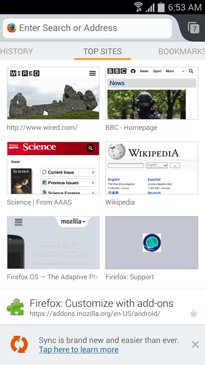

Mozilla 今日正式發表全新改版 Firefox (Firefox 29)，也同步發表 Firefox 行動版 (Firefox for Android)。Firefox for Android 現具備新的首頁與分享功能，除了能更快、更迅速的前往你最愛的網站之外，也達到前所未有的高度自訂功能。

Mozilla 也另外推出 Firefox Accounts，藉以強化 Firefox Sync 同步功能，讓使用者能帶著 Firefox 到處走。簡單易用的 Firefox Sync，將跨越使用者的桌機與 Android 行動電話/平板電腦，迅速且安全的同步所有資料，包含書籤、密碼、表單資料、歷史紀錄、已開啟的分頁等。

使用者可自訂首頁畫面上的書籤、閱讀清單、歷史記錄、最常瀏覽等選單，並選擇自己要預設顯示的選單。只要開啟新的分頁或啟動新的瀏覽作業，就會顯示自訂的首頁畫面，讓使用者能更快瀏覽最愛的網站。另可隱藏不常使用的網頁，或隱藏所有網頁而隨時取用全新分頁。

Firefox for Android 除了能輕鬆自訂之外，亦可針對使用者最常瀏覽的社交網站，訂定如文章、影片、圖片等內容的分享順序。選單列現更提供最常用兩大分享服務 (包含 Facebook 與 Twitter) 的彩色圖示，以及使用者的電子郵件，能更快向親友分享你喜歡的內容。

Firefox for Android 現提供超過 30 種語言版本，另即將加入新的語言。

更多資訊：

- [下載全新](https://mozilla.com.tw/firefox/download/)[Windows、Mac、Linux 版](https://mozilla.com.tw/firefox/download/)[Firefox](https://mozilla.com.tw/firefox/download/)

- [下載全新 Firefox for Android](https://play.google.com/store/apps/details?id=org.mozilla.firefox&hl=zh_TW)

- [Firefox for Android 版本說明](https://www.mozilla.org/mobile/29.0beta/releasenotes/)

- [進一步了解](https://blog.mozilla.org/blog/2014/04/29/mozilla-introduces-the-most-customizable-firefox-ever-with-an-elegant-new-design) Windows、Mac、Linux 版 Firefox

- [「我們想要的 Web」活動網站](https://webwewant.mozilla.org/zh-tw/)

原文連結：[Firefox for Android is More Customizable Than Ever](https://blog.mozilla.org/blog/2014/04/29/firefox-for-android-is-more-customizable-than-ever/)
