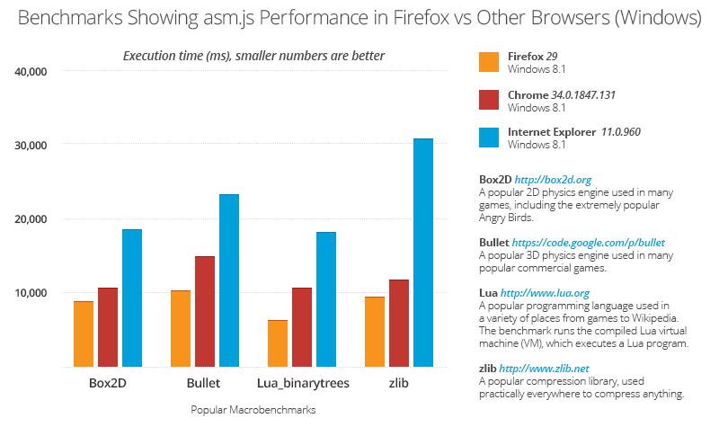

[甫發佈的最新版 Firefox](https://blog.mozilla.org/blog/2014/04/29/mozilla-introduces-the-most-customizable-firefox-ever-with-an-elegant-new-design/) 除了更新使用者介面 (UI) 之外，也強化了如 Sync 同步的多項功能。此版本同樣提升了其他效能，最明顯的莫過於 asm.js 的最佳化。以下就是讓 Firefox 與其他現行版本瀏覽器執行 asm.js 程式碼所得的最新測量。

#### asm.js 加速的程度

[asm.js](https://asmjs.org/) 就是 JavaScript 的子集，可輕鬆最佳化並特別適合將 C/C++ 程式碼移植到 Web 之中。我們已經有相關文章說明 Firefox 是如何[最佳化 float32 以拉近 asm.js 與原生碼之間的效能差異](https://blog.mozilla.com.tw/posts/4735/)。若搭配其他 asm.js 最佳化的成果，可使其拉近到僅 C/C++ 原生編譯時的 1.5 倍慢。雖然還達不到原生 App 的速度，但已經越來越逼近。在發佈上述文章時，這些最佳化作業原限於「每夜更新 (Nightly)」版本才能體驗，而現在已正式進入 Firefox 29 (也就是Firefox 的現行版本) 以供諸多使用者享受。

另一項 asm.js 最佳化的重要特性，就是啟動速度。如同 [Luke 數個月前的撰文所述](https://blog.mozilla.org/luke/2014/01/14/asm-js-aot-compilation-and-startup-performance/)，Firefox 可執行 Ahead of time (AOT) 編譯作業並對結果進行快取，因此可大幅加快遊戲的啟動速度。這些最佳化也已經透過 Firefox 29 呈現給使用者享受。

#### 瀏覽器比較結果

在 Firefox 29 都載入這些最佳化功能之後，就應該來看看各款最新版瀏覽器執行 asm.js 程式碼的結果了。上圖就是在 Windows 8.1 作業系統中，分別以最新版 Google Chrome、Internet Explorer、Firefox 執行 [Emscripten](https://emscripten.org/) [測試基準套件](https://kripken.github.io/embenchen/)的結果。數字越小代表效能越好，而且都是將實際 Codebases 編譯為 asm.js (可參閱圖表中的說明) 的結果。如同你所看到的數據，Firefox 中的 asm.js 執行效能高於其他瀏覽器。

#### Unity、Emscripten、asm.js

上面說過 asm.js 就是 JavaScript 的子集，也就是許多 JavaScript 的樣式之一。但 asm.js 卻代表更重要的使用條件。如同我們[在遊戲者開發大會 (GDC) 所發表](https://blog.mozilla.com.tw/posts/5200/)的《[Unity](https://unity3d.com/)》，就是目前市場上最受歡迎的遊戲開發工具之一，也將[使用 Emscripten 將本身引擎編譯為 asm.js 而支援 Web](https://blogs.unity3d.com/2014/04/29/on-the-future-of-web-publishing-in-unity/)。

但是光看影片又怎麼能滿足呢？你現在就能在自己的瀏覽器中體驗 Unity 最近釋出的《[Dead Trigger 2](https://beta.unity3d.com/jonas/DT2/)》與《[Angry Bots](https://beta.unity3d.com/jonas/AngryBots/)》展示遊戲。如果你用最新版 [Firefox](https://www.mozilla.org/firefox) 執行遊戲，就會看到上述的許多 asm.js 最佳化效果。舉例來說，如果你多次進入上面兩個遊戲，asm.js 的快取功能可避免重複編譯，而達到較快的啟動速度。

如果能有效執行 asm.js 樣式的程式碼，可讓類似的遊戲同樣在 Web 上運作無虞，且不需其他專屬的、非標準的外掛程式。也因為如此，我們很高興能看到 Firefox 29 讓更多使用者能享受 asm.js 最佳化的效果。雖然有時測試結果看來只是一堆數字，但對特別著重效能的應用程式 (如遊戲) 來說，asm.js 卻能直接提升相關測試結果。

(感謝 Marc Schifer 協助完成效能基準測試。)

原文連結：[asm.js performance improvements in the latest version of Firefox make games fly!](https://hacks.mozilla.org/2014/05/asm-js-performance-improvements-in-the-latest-version-of-firefox-make-games-fly/)
