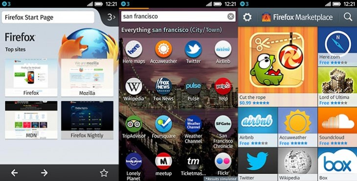

你是熱血的 Firefox OS 開發者，而且早已設計了許多 App 準備大展身手嗎？在完成自己的 App 作品之後，當然要進行某些測試並解決各種疑難雜症了。先來這裡看看有哪些方法可協助自己順利完成測試並排解疑難，讓自己的開發作業更順利。

本文將說明 App 測試與疑難排解時的注意事項。

#### 設定自己的測試環境

開發者可安裝多種工具，針對 Firefox OS/Open Web App 執行真正有效的測試。我們建議至少安裝下列工具：

- Firefox 桌面版。建議使用如 [Aurora](https://aurora.mozilla.org/) 或 [Nightly](https://nightly.mozilla.org/) 的預先發行版進行相關測試。

- Firefox 行動版，即 Firefox for Android。同樣建議使用如 [Aurora](https://aurora.mozilla.org/) 或 [Nightly](https://nightly.mozilla.org/) 的預先發行版進行相關測試。如果開發者手上沒有實體的 Android 裝置，亦可使用 [Android emulator](https://developer.android.com/sdk/)。

- [Firefox OS 應用程式管理員 (App Manager)](https://developer.mozilla.org/en-US/Firefox_OS/Using_the_App_Manager)。此工具已內建於桌面版 Firefox 26 或更高版本中，提供多項有用工具 (如 App 除錯)，並可將 App 安裝至模擬器與實體裝置上。

- [Firefox OS 模擬器 (Firefox OS Simulator)](https://developer.mozilla.org/en-US/docs/Tools/Firefox_OS_Simulator)。如果開發者特別想在舊版 Firefox OS 上測試 App，即可使用此模擬器。針對 1.2 或更高版本，請使用「應用程式管理員 (App Manager)」。另可透過模擬器的控制面板，將 App 安裝至模擬器之中。

最理想的情況，當然是能用實際裝置測試自己的 App。可參閱[開發者手機指南](https://developer.mozilla.org/en-US/docs/Mozilla/Firefox_OS/Developer_phone_guide)。

#### 測試

雖然 Open Web App 與網頁，均使用相同的技術和發佈方式，但因為 App 環境並不具備如 Chrome 瀏覽器的網址列或返回按鈕；且 Firefox OS 裝置也不像 Android 有實體的退回按鈕，所以使用者經驗是截然不同。以下步驟可讓開發者確保 App 達到絕佳的使用者經驗。

- 安裝 App。確認 App 的圖示出現在主畫面上，且 App 的名稱完整未遭截斷。

- 啟動 App。確認能正確偵測、顯示螢幕尺寸與方向。

- 確認消費者可馬上看到你的 App，而不是看到你的首頁。請記住，若消費者是從 Firefox Marketplace 上安裝你的 App，也就是購買了 App 的功能。不需再次傳送 App 功能的登錄頁面給消費者才對。理想的 App 應該讓消費者能第一眼就看到「Getting Started」或「Login」頁面。

- 從頭到尾執行過 App 的主要功能。特別注意瀏覽作業的最末端，還有內容縮放時的問題。

- 確認內容連結將導向 App 之外 (如連至其他網頁或 Twitter)。若要開啟新的視窗或框架，也要讓消費者能順利返回你的 App。

- 在桌面版瀏覽器中，可使用[適應性設計 (Responsive Design) 檢視](https://developer.mozilla.org/en-US/docs/Tools/Responsive_Design_View)模式檢查 App 在不同螢幕尺寸中的情況。建議檢查 320×480 ~ 1260×800 的解析度。

#### 疑難排解

- 如果需要 App 開發方面的協助，則可參閱[應用程式中心](https://developer.mozilla.org/zh-TW/docs/%E6%87%89%E7%94%A8%E7%A8%8B%E5%BC%8F-840092-dup)上的豐富資訊，其中囊括了設計與開發技術、App 安裝作業、已支援的 API，還有更多。

- [Firefox OS 專區](https://developer.mozilla.org/en-US/Firefox_OS)提供 Firefox OS 平台的豐富資訊，包含 Firefox OS 的建構、開發其內預設的 App 等。

- 若要了解提交作業，可參閱下個章節。

- [Marketplace 常見問題](https://developer.mozilla.org/en-US/docs/Mozilla/Marketplace/FAQ)，將針對 Firefox Marketplace 上的多樣 App 發佈問題，提供相關答案。

- 若有特殊問題需要解答，另可前往許多[相關討論區](https://www.mozilla.org/about/forums/)，包含新聞群組、郵件群組、IRC 聊天室等等。另可參閱[應用程式中心](https://developer.mozilla.org/en-US/Apps)、[Firefox OS 專區](https://developer.mozilla.org/en-US/Firefox_OS)、[Marketplace 專區](https://developer.mozilla.org/en-US/Marketplace)等頁面，找到最高度相關的區塊！

Mozilla 開發者社群網站 (MDN) 原文連結：[App testing and troubleshooting](https://developer.mozilla.org/en-US/Marketplace/Submission/Testing_and_troubleshooting)

你也可參閱中文版《[App 測試與疑難排解](https://developer.mozilla.org/zh-TW/docs/Mozilla/Marketplace/Submission/Pre-submission_checklist)》；並參閱 MDN 的更多 Firefox OS 或 Marketplace 相關文章。
