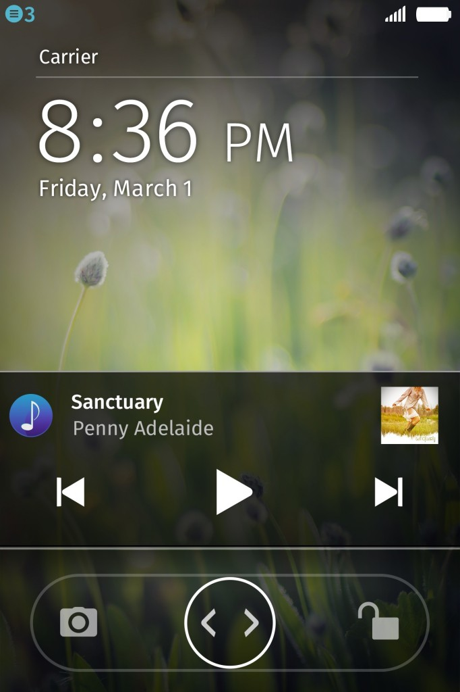

#### 新版本並強化相機、音樂、遊戲等功能

Mozilla 日前發表最新 Firefox OS 版本，已可供合作夥伴建置入智慧型手機之中。新版本功能包含了雙卡雙待 (DSDS；Dual-SIM dual-standby)，可靈活搭配兩張 SIM 卡；另外也增添了更多相機功能，並能直接簡單存取音樂播放器。此外，更新版本也針對遊戲提供多項最佳化支援。

在今年全球行動通訊大會 (MWC 2014) 中，Mozilla發表多款行動裝置，成功吸引巿場目光。現在，App 開發者一定很高興能見到 [WebGL](https://developer.mozilla.org/en-US/docs/Web/WebGL)、[asm.js](https://blog.mozilla.com.tw/posts/4484/first-3d-commercial-web-game-powered-by-asm-js-unveiled)、[WebAudio](https://developer.mozilla.org/en-US/docs/Web_Audio_API) 等新平台技術加入 Firefox OS，這些新技術將可協助建構更具臨場感的 3D 遊戲，並達到更好的音效。

新版 Firefox OS 重點如下：

#### 針對 Firefox OS 使用者

雙卡雙待 (DSDS) 能靈活運用兩組不同門號：這個廣受大家期待的 DSDS 功能，讓單一裝置能支援兩張 SIM 卡門號，且透過簡單的「SIM 卡管理員 (SIM Manager)」設定，即可分別管理 SIM 卡的電話撥打、文字/資料傳遞等作業。如此可讓使用者輕鬆區隔工作用門號與家庭/私人用門號；當然亦可區隔居住地門號與出差地門號，避免昂貴的漫遊費用。且可將 SIM 卡中的聯絡人資訊匯入至手機儲存。

拍攝更清晰的照片或影片，並能更迅速找到所須檔案：現在支援連續自動對焦 (須視裝置的相容性而定) 與閃光燈，讓使用者拍攝更漂亮的照片與影片。而「圖片庫 (Gallery)」App 現亦提升了多項功能，包含可依照月份與檔案拍攝資訊而排列內容，並顯示如拍攝日期、檔案類型、檔案大小等有用資料。

直接存取音樂：此版本的媒體 App 也更新了多項功能。可在通知訊息匣或鎖定的畫面中存取音樂控制功能。現在「FM 收音機 (FM Radio)」App 亦可直接透過手機揚聲器播放。

鎖定的畫面仍可顯示音樂控制功能

強化「適應性 App 搜尋 (Adaptive App Search)」功能：透過此可隨使用者情境調適的 App 搜尋功能，現在不僅是 Web 上的 App，也能搜尋 Firefox Marketplace 上的 App，讓使用者更輕鬆找到最愛的內容。

智慧收藏集 (Smart Collection) 功能：Firefox OS 可根據特定的分類方式，自動在主畫面上將 App 分門別類，如社交、遊戲、音樂、娛樂等分類。只要點擊其中如「遊戲」的類別，就會看到你所安裝的所有遊戲 App 已整齊排列；另外也會提供清單，建議使用者可能會想試玩的新遊戲。這些建議可試玩的 App，同樣是由上述適應性 App 搜尋功能所提供。只要按著背景不放，就可從預先設定的大型清單中，將聰明清單放到主畫面中；使用者亦可自訂所須的聰明清單。

更多訊息傳遞方式：

─ 文字簡訊 (SMS)/多媒體簡訊 (MMS)：現在可將文字簡訊傳送至電子郵件位址，並添增訊息主旨。如果你的文字簡訊要夾帶影片或圖片，Firefox OS 會自動將 SMS 轉換為 MMS。除了可將訊息儲存為草稿之外，使用者亦可選擇是否要在收件人閱讀訊息之後，另外再收取送達通知。

─ 電子郵件：現支援郵件通知 (email notifications) 與 POP3 協定。目前連線至電子郵件帳戶的最常用方式之一。

進階藍牙 (Bluetooth) 功能：現可支援多筆藍芽檔案傳輸作業，可同時與其他裝置分享多張相片或 MP3 檔案。

效能提升：透過不同的系統 App (如相機、行事曆、通訊錄等)，強化捲動時的效能並加速 App 啟動時間。使用者可更快取得所須的資料。

新支援語言：包含正體中文在內，共支援 20 種語言。

#### 針對 Firefox OS 開發者

Ÿ進一步支援 3D 繪圖與遊戲功能：本次更新版本也針對遊戲提供多項最佳化支援。在支援 WebGL、asm.js、WebAudio 之後，可為 Firefox OS 手機帶來更卓越的 3D 遊戲經驗。

可著手實驗近場通訊 (NFC)：本次更新版本亦透過 [WebNFC API](https://wiki.mozilla.org/WebAPI/WebNFC) 導入了 NFC 功能。開發者可開始在 App 中嘗試 NFC 的配對與標籤讀取功能。未來更新版本將提供更多 NFC 功能。

新 Web API 將強化 Gecko 平台的功能：本次更新版本是以 [Gecko 28](https://developer.mozilla.org/Firefox/Releases/28) 為基礎，並納入多個新 [Web API](https://wiki.mozilla.org/WebAPI)。Shared workers 將提供更好的資料處理與資源分享功能，讓開發者撰寫出更快速的 App。此外，SpeakerManager 可讓開發者存取手機的揚聲器，不須耳機即可讓 App (如 FM 收音機) 直接播放音樂；WebIccManager API 亦完成更新並可支援多組 SIM 卡。這些新 API 亦將針對 Web App 的開發作業，持續建構出更多功能。

以 RTSP 進行音訊串流：我們建構了即時串流協定 (RTSP；Real Time Streaming Protocol) 的串流架構，可完整支援音訊串流作業，讓開發者可利用現有的音樂技術，為 Firefox OS 使用者提供更完善的音樂功能。

此 Firefox OS 更新版本將提供給裝置製造商，以利佈署至目前已上市的手機之中。另外也提供給開發者手機之用。若要進一步了解開發者裝置的購買細節，可參閱[MDN 上的相關文章](https://developer.mozilla.org/en-US/Firefox_OS/Developer_phone_guide/ZTE_OPEN)。

若要進一步了解此 Firefox OS 更新版本，請參閱[版本說明](https://www.mozilla.org/en-US/firefox/os/notes/1.3/)。

原文連結：[Firefox OS Update Adds New Features including Dual-SIM Support and Enhancements for Music Lovers and Gamers](https://blog.mozilla.org/futurereleases/2014/05/08/firefox-os-update-adds-new-features-including-dual-sim-support-and-enhancements-for-music-lovers-and-gamers/)
