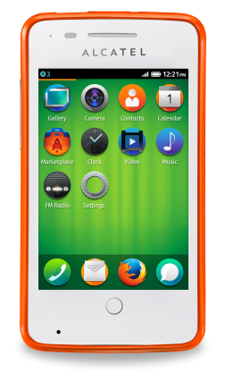

#### 墨西哥電信營運商 América Móvil 開始發售 Alcatel ONETOUCH Fire

Mozilla 很高興宣佈 América Móvil 成為第五家發售 Firefox OS 智慧型手機的主要營運商。位於墨西哥境內的 Telcel 現已開始提供 América Móvil 營運商的 Alcatel ONETOUCH FIRE 手機。而墨西哥也成為 América Móvil 發售 Firefox OS 裝置的第一個國家。

América Móvil – Telcel 加值服務總監 Marco Quatorze 表示：「透過 Firefox OS 的絕佳使用經驗與平易價格，我們將為客戶帶來智慧型手機的嶄新體驗。我們也相信，藉由這次 Mozilla 與 ALCATEL ONETOUCH的合作關係，勢必能讓全國使用者享有更多元的選擇。」

Mozilla 技術長 Andreas Gal 也表示：「很高興有 América Móvil 加入 Firefox OS 的生態系統。這個合作關係又將大幅拓展 Firefox OS 的能見度，讓我們能將絕妙的使用經驗帶給初次接觸智慧型手機的眾多使用者。」

Firefox OS 目前已現身於全球共十五個市場中，僅搭配入門與中階款的智慧型手機，即兼顧到效能、價格、個人化等所有考量。Firefox OS 除了具備智慧型手機的基本功能之外，另內建 Facebook 與 Twitter 社交功能、可離線使用的 Nokia HERE 地圖，當然也少不了高人氣的 Firefox 瀏覽器、Firefox Marketplace，以及更多特色，可滿足消費者的多樣需求。

Firefox OS 對智慧型手機作出全新詮釋 ─ 隨使用者情境調適的 App 搜尋功能 (Adaptive App Search) 就是要跟著你轉變而隨時滿足你的需求。你可選擇一次性使用或永久下載的 App。且此創新方式亦將妥善利用相關資料與儲存空間。讓你隨時擁有所需內容並自訂使用經驗。

使用者也可到 Firefox Marketplace 尋找更多 App。Marketplace 內即提供全球熱門的 App，如《Cut the Rope》遊戲與《Pinterest y YouTube》；亦有極富當地特色的 App，如 Chilango、CNN Expansión、CNN Mexico、[Despegar.com](https://despegar.com/)、Easytaxi、El Universal、M3、Media Tiempo、Quien 等等。

更多資訊：

- [Firefox OS 相關新聞](https://blog.mozilla.org/press/kits/firefox-os/)

- [Firefox OS 多家合作夥伴全力支援 Firefox OS 陣營](https://blog.mozilla.com.tw/posts/5003/)

原文連結：[América Móvil Launches Firefox OS Smartphones](https://blog.mozilla.org/blog/2014/05/13/america-movil-launches-firefox-os-smartphones/)
