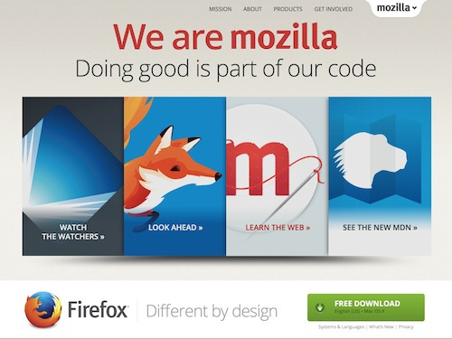

人生不會有完美的選擇，而 Mozilla 今天也正面臨這樣的兩難。我們必須考量到使用者想要的功能，又必須顧慮使用者的控制與隱私性。這就是我們目前的必須抉擇。

許多人都愛看如電影或電視劇的線上影音內容。為此，瀏覽器也必須具備影片播放功能，否則瀏覽器能迎合使用者的工具只會越來越少。許多內容版權所有者 (特別是電影與電視劇工作室) 會要求搭配特殊技術，以限制他人利用影片內容 (如防拷就是最常見的功能)。這種特殊機制即所謂的「數位著作權管理 (Digital Rights Management，DRM)」。瀏覽器往往必須跟著建置 DRM 機制，避免引起版權所有者的不快。否則版權所有者可限制該瀏覽器不得顯示相關影音內容。

目前影音產業正積極佈署新的 DRM 機制。截至目前為止，瀏覽器均是透過 Adobe 的《Flash》，以及 Microsoft 的《Silverlight》而間接啟動 DRM。新版 DRM 則是使用所謂「EME」與「CDM」的機制。與舊系統相較，Mozilla 認為新機制其實仍有存在已久的相同瑕疵。新機制並不會影響目前「保護個人用戶」與「保護數位內容」之間的平衡態勢，但版權所有者必須封閉該系統的部分關鍵原始碼；這也就與 Mozilla 的基礎原則背道而馳。

Mozilla 很渴望能使用不同的系統。可惜，單是 Mozilla 並無法改變影音產業目前對 DRM 的態度。Firefox 之前曾改變過產業，也希望能再次發揮本身的影響力。但我們今天並無法改變 DRM。如 Google、Microsoft、Apple 等的主要瀏覽器供應商，均已經納入了新系統。此外，舊版 DRM 亦即將退役。如果瀏覽器想要存取 DRM 控制的影音內容，新版 DRM 很快就會成為唯一的存取方式。

基於這既有的瑕疵，Mozilla 曾苦思是否能不要採用新版 DRM。但是影音內容一直是網路生活極重要的部分。如果瀏覽器無法播放影片，勢必成為具有嚴重缺陷的消費性產品。Firefox 使用者不能每次想欣賞受控制的影片時，就必須改用其他瀏覽器才行；如此也會讓大家質疑 Firefox 產品的可用性。

先不論 Mozilla 是否排斥 DRM。我們必須讓 Firefox 能先滿足使用者觀看 DRM 影片的需求。Mozilla 會儘量保護個人欣賞影片的權利，接著才會考量影音產業所實行的措施。Mozilla 將與 Adobe 合作開發關鍵功能。Adobe 透過 Flash 提供相關影音功能已經行之有年，而且 Adobe 早與版權所有者之間建立了密切的關係。

Mozilla 是在盡可能保護使用者的前提之下，設計出必要機制；而不是要修復 DRM 的核心問題。我們也將這次設計視為往後能夠脫離 DRM 的步驟之一。舉例來說：

- 每個人都能決定是否啟動 DRM 機制；否則就離開該頁面而不要觀看 DRM 控制的影音內容。

- 我們在封閉源碼程式的外部裹上開放源碼程式。這讓我們能監控並進一步了解封閉源碼的活動範圍。

若需要詳細資訊，請參閱 [Andreas Gal 的技術說明文章](https://hacks.mozilla.org/2014/05/reconciling-mozillas-mission-and-w3c-eme/)。

Mozilla 將繼續研究 DRM 的替代解決方案。我們深切希望能夠引導影音產業使用不同的解決方案，讓每一位使用者都能掌握自己的電腦與生活。我們將兼顧內容端與技術端而開發新的技術，並歡迎任何人加入替代方案的開發行列。

以下是相關常見問題：

Mozilla 現正規劃什麼？

我們正逐步確認使用者能夠在 Firefox 上觀看熱門影片。版權所有者是透過 DRM 而控制影片的使用與發佈方式。在允許如 Firefox 的軟體能夠串流影片之前，都是由權限持有者要求 DRM。而為了讓 Firefox 能夠串流這些影音內容，Mozilla 將透過所謂「加密媒體擴展 (Encrypted Media Extensions，EME)」的常見規格，針對音訊與視訊新增 Adobe Access DRM 技術的整合方式。

Mozilla 又為何要這樣做？

Firefox 使用者一般只要下載如 Silverlight 與 Flash 的外掛程式，就能觀看 DRM 控制的影片。但這種方法很快就要遭到淘汰。主要瀏覽器供應商都已經建構了 EME 並逐漸成為標準機制。Mozilla 要避免使用者無法存取重要的網路內容 (如透過 Firefox 串流好萊塢的電影)。我們也不希望看到 Firefox 使用者必須轉用其他瀏覽器，才能進行重要的網路活動。

對 Firefox 使用者會有什麼影響？

對 Firefox 使用者來說，因為不再需要先下載 Flash 或 Silverlight ，所以能更輕鬆的播放 DRM 控制的影片。在存取影片之前，Firefox 使用者能選擇是否啟用新版 DRM 機制。

何時會佈署到 Firefox 呢？

Firefox 的整合作業細節目前尚未定案。每次在釋出新功能之前，都必須在 Firefox 開發者版本中測試數個月，才會正式提供給所有使用者。

預計哪個版本的 Firefox 會佈署新的機制？

我們規劃先佈署於 Windows、Mac、Linux 版的 Firefox 瀏覽器。

DRM 不是正與 Mozilla 捍衛的網路開放原則背道而馳嗎？

DRM 目前需要封閉系統才能運作，而且是為了收回使用者的控制權所設計。Mozilla 也正在尋找 DRM 的替代方案。在替代方案到位之前，Firefox 使用者仍可選擇是否啟用 DRM 以欣賞串流影片。

Mozilla 為何選擇和 Adobe 合作？

我們與 Adobe 合作設計的新機制，將保有使用者的控制性與作業透明度，同時也會提供多樣功能 (如支援多樣的平台與視訊編碼格式)。

Firefox for Android 或 Firefox OS 也將佈署 DRM 嗎？

目前我們只會佈署於 Firefox 桌面版瀏覽器。

原文連結：[DRM and the Challenge of Serving Users](https://blog.mozilla.org/blog/2014/05/14/drm-and-the-challenge-of-serving-users/)
