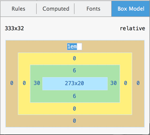
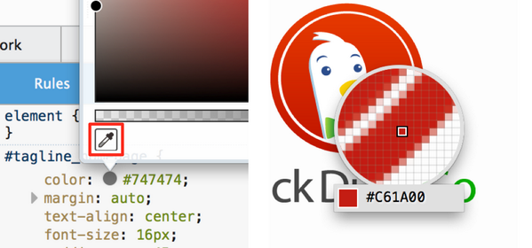
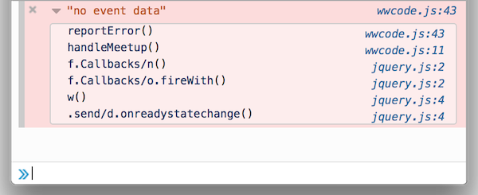
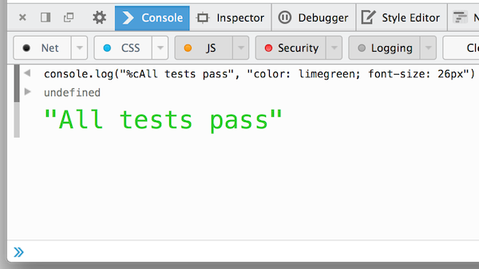
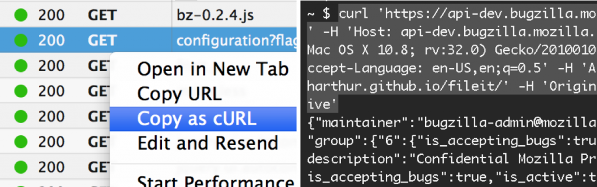
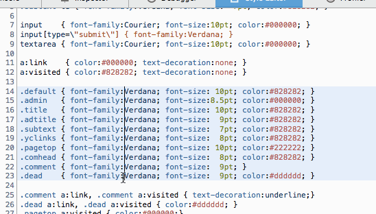
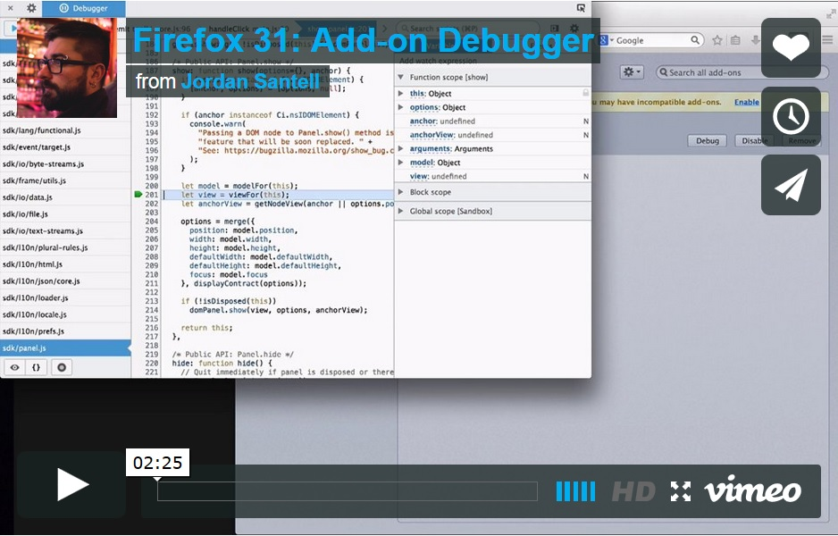

#### 可編輯的 Box Model 、多重選擇、設定 Sublime Text ，還有更多

新的 [Firefox 開發者工具](https://developer.mozilla.org/docs/Tools)現在已經進入[曙光版 (Aurora) 釋出頻道](https://www.mozilla.org/firefox/aurora/)。也就是說，將於 7 月正式上線的Firefox 31 就會提供這些新工具，包含強化過的編輯器、主控台、檢測器等等。

#### 可編輯的 Box Model

在「[檢測器 (Inspector)](https://developer.mozilla.org/docs/Tools/Page_Inspector)」中的「Box Model」分頁，現在已可編輯以進行簡單的試驗。只要對任何「margin」、「border」、「padding」值連點滑鼠兩次，就能針對目前選取的元素更改其值。輸入任何有效 CSS 的  值並搭配上/下鍵，就能以「1」的幅度增/減該值。另外若按下「Alt-Up」則可一次增加「0.1」；按下「Shift-Up」則一次增加「10」。([可參閱此開發討論記錄](https://bugzilla.mozilla.org/show_bug.cgi?id=850336))

#### 滴管 (Eyedropper)

檢測器現在新增「[滴管 (Eyedropper)](https://developer.mozilla.org/en-US/docs/Tools/Eyedropper)」色彩選擇器，可擷取頁面上任何像素的色彩。只要用滑鼠點擊現有色彩並按下「Enter」即可進入該模式；按下「Esc」即可退出。同樣使用鍵盤的上/下鍵可分別增/減像素「1」；「Shift-Up」或「Shift-Down」分別增/減像素「10」。

如果要開啟「滴管」功能，則可 1). 進入 Firefox 的「網頁開發者 (Web Developer)」選單，即可發現滴管；或是 2). 進入開發面板中的「[工具箱選項](https://developer.mozilla.org/docs/Tools_Toolbox#Settings)」(即齒輪圖示)，找到「可用的工具箱按鈕 (Available Toolbox Buttons)」，勾選「從頁面中挑選色彩 (Grab a color from the page)」。接著就能直接將色彩複製到剪貼簿。([可參閱此開發討論記錄](https://bugzilla.mozilla.org/show_bug.cgi?id=939040))

#### 主控台 (Console) 堆疊追蹤

在主控台 (Console) 中的 console.error、console.exception、console.assert 等記錄，現在均包含完整的呼叫堆疊 (Call stack)。([可參閱此開發討論記錄](https://bugzilla.mozilla.org/show_bug.cgi?id=920116))

#### 具風格的主控台記錄

跟上其他瀏覽器開發工具的腳步，Firefox 開發者工具現在也能透過「%c」指示元 (Directive)，修改主控台記錄的風格。

([可參閱此開發討論記錄](https://bugzilla.mozilla.org/show_bug.cgi?id=823097))

#### 以 cURL 指令格式複製 (Copy as cURL)

使用者現在可在自己慣用的命令列 (終端機) 上，透過[網路監測器 (Network Monitor)](https://developer.mozilla.org/docs/Tools/Network_Monitor) 重播任何網路請求。只要對請求按下滑鼠右鍵，點選「以 cURL 指令格式複製 (copy as cURL)」，即可將 [cURL](https://en.wikipedia.org/wiki/CURL) 指令複製到剪貼簿，包含標頭與資料的參數。([可參閱此開發討論記錄](https://bugzilla.mozilla.org/show_bug.cgi?id=859059))

#### 編輯器 (Editor) – 多重選擇、設定 Sublime Text

開發者工具中的原始碼編輯器，現在已升級至 Codemirror 4 並包含下列特色：

- 多重選擇。 按住 Ctrl / Cmd 即可選擇多個目標。

- 區塊拖曳選擇。 按住 Alt 即可選擇縮排對齊的文字區塊。

- 取消選擇。 按下 Ctrl-U / Cmd-U 即可取消最近一次的選擇； Alt-U / Shift-Cmd-U 則可恢復。

- Sublime Text keybindings 。若要啟動此功能，請於網址列中鍵入 about:confi g ，將「 devtools.editor.keymap 」設定為「 sublime 」。

圖為多重選擇的效果：

[可參閱此開發討論記錄](https://bugzilla.mozilla.org/show_bug.cgi?id=985924)

#### Canvas 除錯器 (Debugger)

透過新的 Canvas 除錯器 (debugger)，即可針對 [WebGL](https://developer.mozilla.org/en/WebGL) 與 2D canvas 內容中的動畫幀像進行除錯。Canvas 除錯器目前仍屬實驗功能，必須進入開發面板中的「[工具箱選項](https://developer.mozilla.org/docs/Tools_Toolbox#Settings)」(即齒輪圖示) 中啟動。目前尚未支援多重 Canvas ([bug](https://hacks.mozilla.org/2014/05/editable-box-model-multiple-selection-sublime-text-keys-much-more-firefox-developer-tools-episode-31/978948))，以及「setInterval」函式所產生的動畫 ([bug](https://bugzilla.mozilla.org/show_bug.cgi?id=978948))。可參閱[本篇文章](https://hacks.mozilla.org/2014/03/introducing-the-canvas-debugger-in-firefox-developer-tools/)以進一步了解 Canvas 除錯器。

([可參閱此開發討論記錄](https://bugzilla.mozilla.org/show_bug.cgi?id=917226))

#### 附加元件除錯器 (Add-on Debugger)

如果你是用 [Add-on SDK](https://developer.mozilla.org/Add-ons/SDK) 開發 Firefox 的附加元件，現在能更輕鬆對附加元件的 JavaScript 模組除錯。可參閱[本篇文章](https://blog.mozilla.org/addons/2014/04/08/add-on-debugger-now-in-firefox-nightly/)以進一步了解。([可參閱此開發討論記錄](https://bugzilla.mozilla.org/show_bug.cgi?id=899054))

由 [Jordan Santell](https://vimeo.com/user7515802) 在 [Vimeo](https://vimeo.com/) 上所呈現的 [Firefox 31: Add-on Debugger](https://vimeo.com/90886107)

#### 其他功能

- 展開子元素。 按住 Alt 並對檢測器中的節點連續點擊兩次，即可展開所有的子元素。([可參閱此開發討論記錄](https://bugzilla.mozilla.org/show_bug.cgi?id=997622))

- 保持網路記錄。 進入開發面板中的「[工具箱選項](https://developer.mozilla.org/docs/Tools_Toolbox#Settings)」(即齒輪圖示)，勾選「啟用保持記錄 (Enable persistent logs)」，即可保留「網路 (Network)」面板的重載與瀏覽記錄。([可參閱此開發討論記錄](https://bugzilla.mozilla.org/show_bug.cgi?id=925275))

- 預設開啟 JS 警示功能。 JavaScript 警示現在預設顯示於主控台中。([可參閱此開發討論記錄](https://bugzilla.mozilla.org/show_bug.cgi?id=991734))

- 程式碼速記本 (Scratchpad) 的「檢視」選單。 程式碼速記本 (Scratchpad) 現在添增了「檢視 (View)」功能，可更改字型大小、隱藏行號、換行文字 (Wrap text)、強調顯示行尾空白 (Highlight trailing space)。([可參閱此開發討論記錄](https://bugzilla.mozilla.org/show_bug.cgi?id=953206))

特別感謝 38 名貢獻者為此版本所費心的[所有功能與檔案修復](https://mzl.la/Ri1gOT)。

有任何問題或建議？可到 Twitter 上的[@FirefoxDevTools](https://twitter.com/firefoxdevtools)填寫建議；或可到全新的[Firefox 開發者工具意見反饋頻道](https://ffdevtools.uservoice.com/)。如果你也想加入貢獻行列，可參閱[成為貢獻者的相關說明](https://wiki.mozilla.org/DevTools/GetInvolved)。

原文連結：[Editable box model, multiple selection, Sublime Text keys + much more – Firefox Developer Tools Episode 31](https://hacks.mozilla.org/2014/05/editable-box-model-multiple-selection-sublime-text-keys-much-more-firefox-developer-tools-episode-31/)
