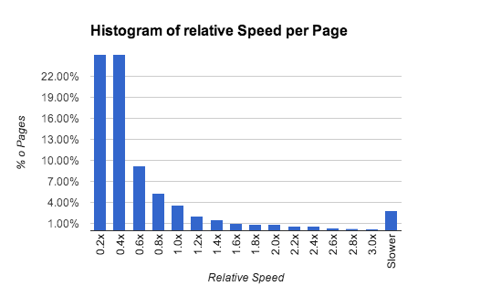
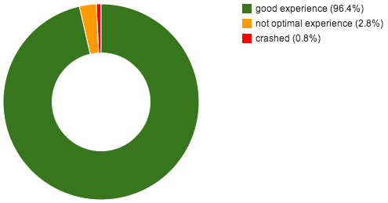

大家好，我是 Thorben。目前是挪威首都奧斯陸 (Oslo) 的「Opera Software」員工。我不在 Mozilla 上班，又為何今天在 Mozilla Hacks 上撰文呢？你可能知道《Opera》瀏覽器並沒有預設的 PDF 檢視器，而我們也想改變這一點。所以幫 Opera 加個預設的檢視器怎麼樣？再跟 Adobe 或 Foxit 買個檢視器？或是自己動手做呢？

#### 介紹 PDF.js

在下決定之前，先簡單了解一下 [PDF.js](https://mozilla.github.io/pdf.js/)。這個專案是想透過 JavaScript 與 Canvas，在瀏覽器中建構全功能的 PDF 檢視器。這聽起來有點誇張，但卻合情合理。瀏覽器應該要能順利處理文字、圖片、字型、向量圖素等等；而這些也是 PDF 檢視器能妥善進行的作業。PDF 中的繪圖指令都屬於 Postscript 的子集，其實跟 Canvas 功能的差異不大。另外就是安全性也沒有什麼問題。使用 PDF.js 就像開啟其他網站一樣安全。

#### 開始打造 PDF.js

所以我找了 Christian Krebs 和 Mathieu Henri 一同開始研究 PDF.js，也確實留下深刻印象：PDF.js 設計妥善且執行速度不差，程式碼的大部分看來也已經可用無虞。

但我們還是發現了一些問題，主要是具備大量圖片的 PDF 檔案會發生效能問題。為了要能進一步了解 PDF.js 並深入開發專案，就應該先解決我們發現的主要問題。我們因此更了解整個專案，也發現其所具備的絕佳潛能。幾番努力之後，我們更訝異於 PDF.js 所提升的效能。

#### 測試 PDF.js 的效能基準

當然，我們自己的測試作業可能導致錯誤的效能印象分數。我們試著找到檔案超大、大到詭異，甚至難以描繪的 PDF 檔案，大多數人幾乎不會接觸到的 PDF 檔案。你實際用 PDF.js 觀看大部分 PDF 檔案時都能運作無虞，但這又要怎麼進行測試呢？

你可以在網路上找找最常見的 PDF，就是你一般最常接觸到的 PDF 檔案，再測試其效能基準。各個 PDF 檔案截出一幅大概 5 ~ 10k 大小的截圖就夠了。接著就該考量 PDF 檔案來源問題。

這時搜尋引擎就很有用了。只要限定搜尋 PDF 檔案，即可取得與關鍵字最高度相關的檔案，其次就是高瀏覽次數的 PDF 檔案。如果你要使用最常見的搜尋關鍵字，那最後別忘了加上適合的近似 (Approximation) 演算法。

要測試這麼多 PDF 檔案的效能基準是項大工程。我找了幾台舊電腦再搭配不錯的伺服應用程式，用以支援這些電腦的相關作業。目前的 Repository 中約有七千筆 PDF 檔案，而最後約花了八個小時測得第一版的 PDF.js 效能基準。

#### 測試結果

略過這些 PDF 到底有哪些漂亮的圖片不談。先看看下圖：

這張圖幾乎可一眼看完我們最感興趣的結果。該直方圖顯示了平均頁面處理時間的相對關係。在檢視 Tracemonkey Paper (啟動 PDF.js 時所看到的預設 PDF 檔案) 時的使用者經驗還不錯，即使我的測試作業速度慢上 3 ~ 4 倍都還能接受。也就是說，超過 96% (去掉當機的 PDF 檔案) 的受測頁面都能達到好的使用者經驗。這效果真的不錯！如果改成比較簡單的圓餅圖 (以百分比計)：

你可能注意到一個小地方：在我們測試期間，約有 0.8% 的 PDF 檔案讓 PDF.js 當掉了。我們仔細檢查這些檔案，裡面至少有三分之一毀損嚴重，可能任何 PDF 檢視軟體都無法再將之開啟。

我們必須另外記得一點：這些都是沒有其他對照組的獨立結果。網路上還是有一些很複雜的 PDF 檔案，甚至連原生的 PDF 檢視軟體都沒辦法妥善並迅速開啟這些檔案。我們測得速度最慢的 PDF 檔案，是葡萄牙首都里斯本 (Lisbon) 超級詳盡的公眾運輸系統向量地圖。最後就算用《Adobe Reader》開啟這個檔案也真的有夠慢！

#### 結論

從這些結果來看，我們可說 PDF.js 很適合作為《Opera》瀏覽器所預設的 PDF 檢視器。但目前若要能將 PDF.js 妥善整合到 Opera 中，還有很多事等著我們完成。不過我們也正嘗試相關整合。另外順帶一提：[這個附加元件](https://addons.opera.com/en/extensions/details/pdf-viewer/)可搭配預設的 Mozilla 檢視器，進而添增 PDF.js。而我說的「妥善整合」也可能是開發另一個全新的檢視器。感謝 Mozilla！很期待能和你們一同研究 PDF.js！

附註：現在已經釋出[計算系統的程式碼](https://github.com/bthorben/pdfRepo)與[相關結果](https://bthorben.github.io/pdfRepo/)。請大家看看並告訴我們你的想法！

再附註：如果有任何人任職於大型搜尋引擎的公司，如果願意提供實際達 10k 的常用 PDF 檔案，那就太好了！

#### 接下來呢？

我上面所提到的計算框架，也能用在其他許多有趣的程式中。我們下一步會嘗試根據字型格式、圖片格式，或其他類似方式，進而分類 PDF 檔案。你可以先隨意取得 PDF 檔案並測試新的功能。我們也想了解 Postscript 中較常用的繪圖指令，讓我們能針對最常見的指令進行最佳化；就如我們對瀏覽器中的 HTML 所做的相同。看看我們實際還能做什麼吧。

原文連結：[How fast is PDF.js?](https://hacks.mozilla.org/2014/05/how-fast-is-pdf-js/)
