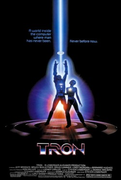
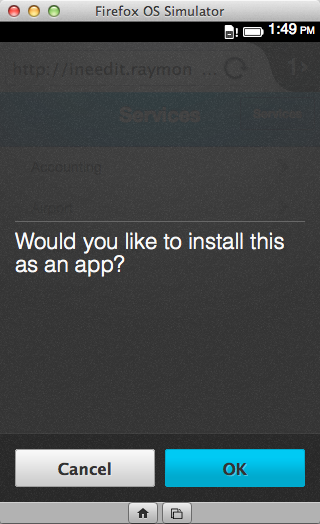

我的朋友幾乎都知道我是《星際大戰 (Star Wars)》的重度阿宅粉絲。我長期使用的網路代號是「cfjedimaster」；也就是「cf」與「絕地大師 (Jedi master)」的組合。是的，我熱愛的另一樣東西就是「ColdFusion」。我工作的房間堆滿了星際大戰玩具，還在身上弄了兩個有關星際大戰的刺青。而目前對我職涯影響最深的電影，就必須提到《創：光速戰記 (Tron)》。

我之前就對電腦很有興趣，但要到《創》這部電影才真正讓我的想法具體化。我突然幻想著自己是個程式設計師，建立智慧型程式並開始控制整個網格。對啦！我知道你看到這心裡會想著：「又在講宅言宅語了」。

我大學時代主修電腦科學 (Comp Sci) 時，就發現自己心中的夢想撞上了「現實」這面牆。首先，一開始修《微積分 (三)》時，本來以為自己數學程度有多好根本都是假相。其次，我發現自己其實對「哪個的效能比較好」沒那麼感興趣，結果我雖然改主修英文 (往往是很好的策略)，但沒完全放掉電腦的相關課程。我也正好在這段期間遇上「Mosaic」瀏覽器和早期剛萌芽的 Web。

我很快的又一頭栽進網路。說得直接一點，我發現寫程式比之前要簡單許多。我還對「LiveScript」有印象，也記得我的第一組 Perl CGI 指令碼。這當然不是在寫《創》中的光輪，但在當時來說已經比較簡單、有趣，而且走在時代尖端了。我當 Web 開發者的時間還不算短，而且我還抱著「Web 屬於原始環境」的錯覺，但對我 (還有其他許多人) 來說已經是不錯的環境了。我更期待能看到 Web 能持續進化到哪種地步。

說到最有趣的現象之一，就是 Web 技術都在網路以外的地方發展茁壯。透過這篇文章，我要談談可在非網路環境中重新使用的網路技術 (如 HTML、JavaScript、CSS)。如果要說一個人完全不用再學其他技術，或說網路標準可用在任何情境或任何條件下，其實都有點荒謬。我自己認為：網路背後的技術，其實就是要開放給許多不同領域的人所用 ─ 就算你沒唸到電腦科學博士應該也能運用自如！

#### 行動裝置

一般文章到這裡應該要先討論行動裝置的重要性，但現在都已經 2014 年了，重要性應該不需要我多提。目前行動裝置主要在 Java (Android) 或 Objective-C (iOS) 上發展。當然，開發者也能用 Web 標準建立原生 App，而其中一個解決方案就是 [Apache Cordova](https://cordova.apache.org/)；也就是 PhoneGap。

Cordova 是以原生 App 來包裝一個 Web view，讓開發者能建構出所謂的「混合式 (hybrid)」應用程式。而Cordova 除了可輕鬆將 HTML 轉為 App 之外，也具備多樣的外掛程式。讓你能執行一般網頁在行動裝置上所達不到的功能。以下範例就能讓你輕鬆存取相機：

navigator.camera.getPicture(onSuccess, onFail, { quality: 50,
    destinationType: Camera.DestinationType.DATA_URL
});
 
function onSuccess(imageData) {
    var image = document.getElementById('myImage');
    image.src = "data:image/jpeg;base64," + imageData;
}
 
function onFail(message) {
    alert('Failed because: ' + message);
}

					123456789101112

						navigator.camera.getPicture(onSuccess, onFail, { quality: 50,    destinationType: Camera.DestinationType.DATA_URL}); function onSuccess(imageData) {    var image = document.getElementById('myImage');    image.src = "data:image/jpeg;base64," + imageData;} function onFail(message) {    alert('Failed because: ' + message);}

你當然也能搭配 GPS、加速規、檔案系統、聯絡人資訊，還有更多功能。Cordova 另提供一組 JavaScript API，可於後端和原生程式碼溝通。另外最棒的一點，就是相同一組程式碼就能建構不同平台的原生 App ([Cordova 與 PhoneGap 現也支援 Firefox OS](https://hacks.mozilla.org/2014/02/building-cordova-apps-for-firefox-os/))。

說得明白點，這裡可不是封裝個現成網站而已。從定義上來說，行動 App其實與一般單純的網站完全不同。但因為開發者可運用現有的 Web 知識，所以一開始就擁有優勢。

另一個本站讀者應該已經很熟悉的範例就是 [Firefox OS](https://www.mozilla.org/en-US/firefox/os/)。與 Cordova 不同的是，開發者不需將自己的 HTML 包裝到 Web view 之中。整個 Firefox OS 都是以 Web 標準為架構。讓 Firefox OS 更迷人的一點，就是可支援架設/托管式 (Hosted) App。目前 Firefox OS 仍屬於新平台，所以使用者還不是很多。但有了架設/托管式 App，我能針對 Firefox OS 裝置輕鬆支援安裝作業，同時又能以傳統 URL 提供 App 的服務。

這裡用我建構的簡易《[INeedIt](https://ineedit.raymondcamden.com/)》做示範。如果你用 Chrome 瀏覽，[INeedIt](https://ineedit.raymondcamden.com/) 應用程式就會平順執行；用Android 或 iOS 的行動瀏覽器也是一樣運作。但如果是用 Firefox，就會觸發程式碼並詢問你是否要安裝 App。以下就是可處理此作業的程式碼。

if(!$rootScope.checkedInstall &amp;&amp; ("mozApps" in window.navigator)) {
 
    var appUrl = 'http://'+document.location.host+'/manifest.webapp';
    console.log('havent checked and can check');
    var request = window.navigator.mozApps.checkInstalled(appUrl);
 
    //silently ignore
    request.onerror = function(e) {
        console.log('Error checking install '+request.error.name);
    };
 
    request.onsuccess = function(e) {
        if (request.result) {
            console.log("App is installed!");
        }
        else {
            console.log("App is not installed!");
            if(confirm('Would you like to install this as an app?')) {
                console.log('ok, lets try to install');
                var installRequest = window.navigator.mozApps.install(appUrl);
 
                installRequest.onerror = function() {
                    console.log('install failure: '+this.error.name);
                    alert('Sorry, install failed.');    
                };
 
                installRequest.onsuccess = function() {
                    console.log('did it');
                    alert('Thanks, app installed!');    
                };
            }
            $rootScope.checkedInstall=true;
        }
    };
 
} else {
    console.log('either checked or non compat');                
}

					1234567891011121314151617181920212223242526272829303132333435363738

						if(!$rootScope.checkedInstall &amp;&amp; ("mozApps" in window.navigator)) {     var appUrl = 'http://'+document.location.host+'/manifest.webapp';    console.log('havent checked and can check');    var request = window.navigator.mozApps.checkInstalled(appUrl);     //silently ignore    request.onerror = function(e) {        console.log('Error checking install '+request.error.name);    };     request.onsuccess = function(e) {        if (request.result) {            console.log("App is installed!");        }        else {            console.log("App is not installed!");            if(confirm('Would you like to install this as an app?')) {                console.log('ok, lets try to install');                 var installRequest = window.navigator.mozApps.install(appUrl);                 installRequest.onerror = function() {                    console.log('install failure: '+this.error.name);                    alert('Sorry, install failed.');                    };                 installRequest.onsuccess = function() {                    console.log('did it');                    alert('Thanks, app installed!');                    };            }            $rootScope.checkedInstall=true;        }    }; } else {    console.log('either checked or non compat');                }

看起來真的很簡單對吧？我之所以喜歡這組程式碼，就是因為它在 Firefox OS 以外的平台上就會完全被忽略，但又可提供給 Firefox OS 使用者運用。我不用冒任何風險，就能在裝置螢幕上提示消費者決定是否下載我的 App。

看到這裡，是否讓你對 HTML 有更深一層的認識了呢？接著會跟大家說明桌機上的延伸應用。可別錯過《[HTML 在瀏覽器之外的延伸應用 (下)](https://blog.mozilla.com.tw/posts/5617/)》。

原文連結：[HTML out of the Browser](https://hacks.mozilla.org/2014/04/html-out-of-the-browser/)
