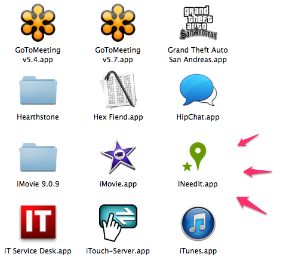
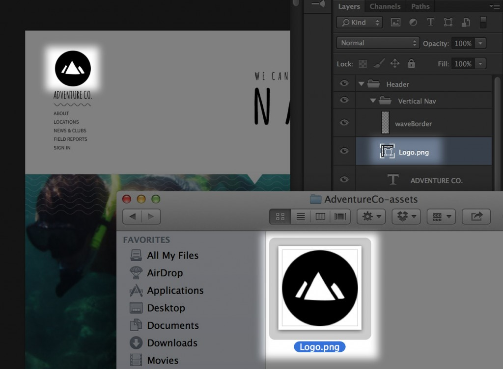

在看完了《[HTML 在瀏覽器之外的延伸應用 (上)](https://blog.mozilla.com.tw/posts/5612/)》說明有關行動裝置上的 HTML 延伸應用之後，你是否對 HTML 有更深一層的認識了呢？可別錯過 HTML 在桌機上的延伸應用，還有原生 App 擴充套件！

#### 桌機

當然，每天還是有人在使用個人電腦或筆記型電腦工作。雖然許多電腦版應用程式已由網頁所取代，但仍有許多功能是 Web App 所不可及，還是有很多時候需要用到桌面版 App。還好，現在有很多方式可透過 Web 標準開發 App。

說到這裡，你還記得我剛剛提到的範例程式碼？這個程式碼可讓 Firefox OS 使用者從網頁上安裝應用程式，也同樣能在桌機上運作無虞。雖然還在開發中 (因為 Geolocation 地理位置功能有臭蟲，所以應用程式還不能運作)，但最後不論是行動 Firefox OS 裝置的消費者，或是眾多的桌機使用者，都能使用你的 Web App。下圖是已經安裝在我自己應用程式資料夾中的 App。

像我剛剛說過的 ─ 這還是非常新的功能，還需要琢磨好一陣子才能真正派上用場。你現在馬上能用的是「[Node Webkit](https://github.com/rogerwang/node-webkit)」這個開放源碼專案，能讓你把 Node.js 包裝成桌機的應用程式，藉此針對 Windows、Mac、Linux 建構可執行檔。你不但擁有「真正」桌機應用程式的所有功能，還能兼顧簡單易用的Web 標準作為後盾。現在已經有[越來越多的實際 App](https://github.com/rogerwang/node-webkit/wiki/List-of-apps-and-companies-using-node-webkit) 正使用這個框架，某些我之前用過的 App，原來都是以 Node Webkit 為基礎。

你可以先看看《[A Wizard’s Lizard](https://www.wizardslizard.com/)》。這個隨機產生地城的遊戲就不錯玩。

#### 原生 App 擴充套件

前面我們談到以 Web 標準建構的應用程式。但現在也有許多原生 App 能透過 Web 標準而擴充。如果你是Web 開發者，應該已經很熟悉 Firefox 附加元件與 Chrome 擴充套件。瀏覽器擴充套件的豐富程度，幾乎能滿足你想像的任何需求。但我比較感興趣的，其實是未來將如何利用 Web 標準開啟其他產品的大門。

你知道連圖片編輯軟體《Photoshop》現在都能用 Node.js 進一步擴充了嗎？透過「Adobe Generator」這個擴充層 (Extensibility layer)，可為產品構築指令碼介面。其中一個例子，就是能依據簡單的命名方式，從圖層產生 Web 資源 (Asset)。如果你曾經透過 PSD 而手動建立 Web 資源並更新，你就會喜歡這個特性。但整個功能均是以 JavaScript 所撰寫而成，且完全利用公開的 API。[可到 GitHub 取得相關範例與程式碼](https://github.com/adobe-photoshop/generator-core)。

#### 下一步？

由於我已經在這個產業待了這麼久的一段時間，我很幸運的「生正逢時」，正好能目睹 Web 標準能對創新與創造力產生如此強大的推力。但是後續的進步與提升就絕不是單靠「幸運」兩字，而是有許多人、公司、組織 (像 Mozilla) 的努力成果，才造就出如此豐沃的土地。為了能持續推動 Web 發展，我們都應該積極參與並鼓勵更多人加入，一同打造出屬於所有人的 Web。

原文連結：[HTML out of the Browser](https://hacks.mozilla.org/2014/04/html-out-of-the-browser/)
