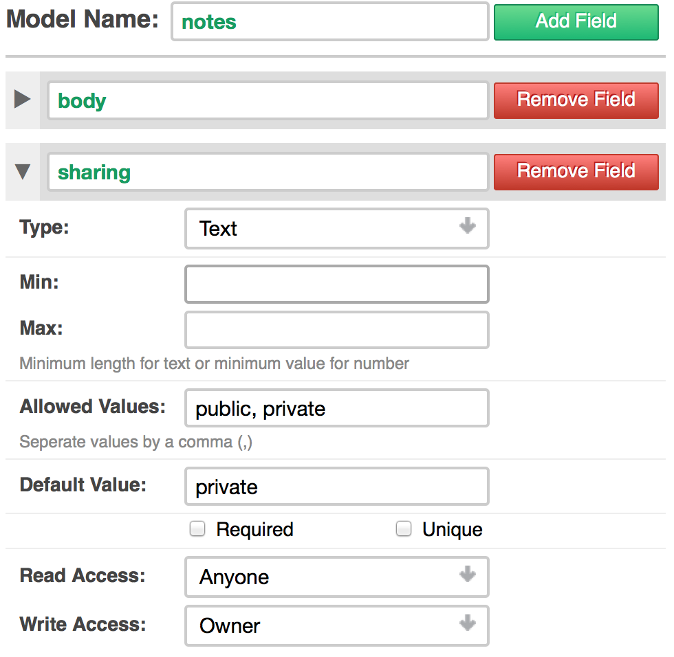
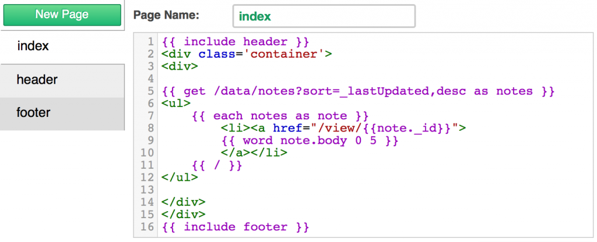
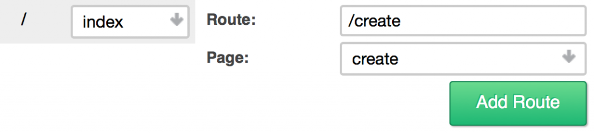
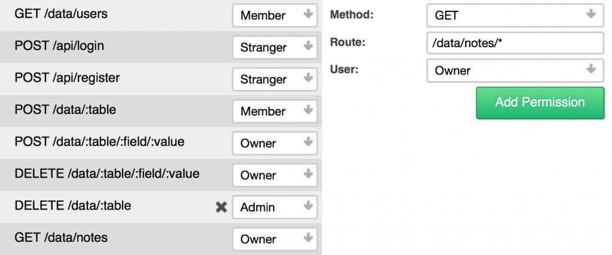
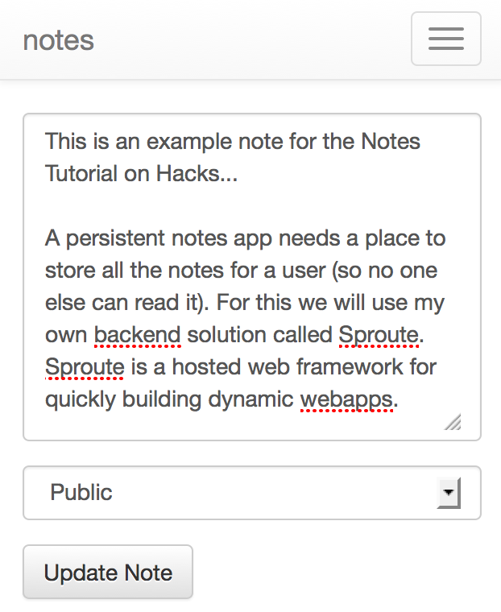

這篇文章將說明筆記 App (就像 Evernote) 從無到有的開發過程，並佈署到 Firefox OS！請先觀看[即時展示](https://notes.sproute.io/)。

筆記 App 應可讓使用者儲存個人擁有的筆記 (不能任由他人閱讀)。我自己是愛用《[Sproute](https://getsproute.com/)》後端解決方案。Sproute 屬於架設/托管式 (Hosted) 的 Web 框架，可迅速建立動態的 webapps。

首先要用專屬的子網域[建立帳號](https://getsproute.com/signup)，再從 [http://.sproute.io/admin](http://%3cmysubdomain%3e.sproute.io/admin) 進入「Dashboard」。往後使用註冊 Sprotue 時的相同資訊即可登入。

#### 模型

Sproute 即使用所謂「[模型 (Model)](https://getsproute.com/docs/models)」的概念。模型將定義 App 中的動態資料，並透過某些屬性設定來確保資料的完整性 (Data integrity)。這裡先建立新的模型並命名為「notes」，並有下列欄位與屬性：

- body ：文字、必填欄位、至少需為 1

- sharing ：文字，可為「 public 」與「 private 」；預設值為 private

為「notes」所填寫的模型表格

「body」欄位將儲存筆記內容。「sharing」欄位將指定該筆記是否可讓他人觀看 (將提供直接連結)，或僅限擁有者觀看。開發者只需要定義此項資料，其他都由[內建欄位](https://getsproute.com/docs/rest#built-in-fields)所代勞。

#### 列出筆記

接著要為使用者列出可閱讀的筆記。只要透過「頁面 (Page)」就能達到此目的。所謂的「頁面」都是 HTML 搭配嵌入式的[樣板標籤 (Template tag)](https://getsproute.com/docs/pages)，可檢索並處理資料。

開啟 index 頁面。這也是他人檢視你的空間時的首頁。我們會把筆記列於此處。接著添增下列：

		
		

{{ get /data/notes?sort=_lastUpdated,desc as notes }}
			
				
					
				
					1
				
						{{ get /data/notes?sort=_lastUpdated,desc as notes }}
					
				
			
		

這裡透過 [HTTP 介面](https://getsproute.com/docs/rest)檢索所有資料，因此 {{ get }} 標籤必須取得一組網址。上述請求將檢索記錄於使用者之中的所有筆記，另將結果儲存在「notes」變數之中。我們會透過查詢參數，將最後修改過的結果排序 (一組底線即代表一個內建的欄位)。

接著在清單中顯示各個筆記：

		
		

<ul>
    {{ each notes as note }}
        <li><a href="/view/{{note._id}}">
        {{ word note.body 0 5 }}
        </a></li>
    {{ / }}
</ul>
			
				
					
				
					1234567
				
						<ul>    {{ each notes as note }}        <li><a href="/view/{{note._id}}">        {{ word note.body 0 5 }}        </a></li>    {{ / }}</ul>
					
				
			
		

{{ word }} 這個樣板標籤，會擷取主要內容的前五個字出來。我們透過網址 /view/<id>. note 連上未完成的頁面。_id 則為內建的唯一識別碼 (Identifier)。

在「index」頁面中添加上述程式碼

#### 建立筆記

在針對筆記而建立 view 頁面之前，先做一個可建立筆記的新頁面。建立新的頁面並稱之為 create。新增下列 HTML：

		
		

<form action="/data/notes?goto=/" method="post">
    
<textarea name="body"></textarea>

    
<select name="sharing">
        <option value="private">Private</option>
        <option value="public">Public</option>
    </select>

    <button type="submit">Create Note</button>
</form>
			
				
					
				
					12345678
				
						<form action="/data/notes?goto=/" method="post">    
<textarea name="body"></textarea>
    
<select name="sharing">        <option value="private">Private</option>        <option value="public">Public</option>    </select>
    <button type="submit">Create Note</button></form>
					
				
			
		

真簡單！如上面說過的，現在可透過 HTTP 介面檢索並修改所有資料。也就是說，我們可透過簡單的 HTML 表單建立新的筆記。而 goto 這個查詢參數會把使用者重新導向到該網址。

因為這是新的頁面，所以我們應該建立新的路徑，讓使用者能順利存取此頁面。一組 [route](https://getsproute.com/docs/routes) 即屬於請求網址的一種格式 (pattern)，只要網址的格式符合就隨即描繪頁面。而 index 頁面早已有一組路徑。只要點擊 Routes 就可透過下列方式建立新的路徑：

Route: /create, Page: create.

前往「create」頁面的新路徑

#### 使用者登入與註冊

使用者帳戶均建構至 Sproute 內，但我們仍必須建立「Register and Login」的頁面。還好這裡同樣有簡單 HTML 表單可用，所以就建立一個 users 的新頁面，並新增以下：

		
		

<h2>Login</h2>
<form action="/api/login?goto=/" method="post">
    <label>
        
Username:

        <input type="text" name="name" />
    </label>
    <label>
        
Password:

        <input type="password" name="pass" />
    </label>
    <button type="submit">Login</button>
</form>
			
				
					
				
					123456789101112
				
						<h2>Login</h2><form action="/api/login?goto=/" method="post">    <label>        
Username:
        <input type="text" name="name" />    </label>    <label>        
Password:
        <input type="password" name="pass" />    </label>    <button type="submit">Login</button></form>
					
				
			
		

只要複製登入表單，並將「action」屬性取代為 /api/register，就能在相同頁面上添增註冊表單。另透過下列建立兩組新路徑：

- Route: /login , Page: users

- Route: /register , Page: users

#### 檢視並更新筆記

之前是建立一組連結，以利檢視某一筆記。接著要讓使用者修改筆記。先建立新頁面並稱之為 view，添增下列：

		
		

{{ get /data/notes/_id/:params.id?single=true admin as note }}
 
{{ if note.sharing eq private }}
    {{ if note._creator neq :session.user._id }}
        {{ error This note is private }}
    {{ / }}
{{ / }}
 
<form action="/data/notes/_id/{{params.id}}?goto=/" method="post">
    
<textarea name="body">{{note.body}}</textarea>

    
<select name="sharing">
       <option value="private" selected>Private</option>
       <option value="public">Public</option>
    </select>

    <button type="submit">Update Note</button>
</form>
			
				
					
				
					12345678910111213141516
				
						{{ get /data/notes/_id/:params.id?single=true admin as note }} {{ if note.sharing eq private }}    {{ if note._creator neq :session.user._id }}        {{ error This note is private }}    {{ / }}{{ / }} <form action="/data/notes/_id/{{params.id}}?goto=/" method="post">    
<textarea name="body">{{note.body}}</textarea>
    
<select name="sharing">       <option value="private" selected>Private</option>       <option value="public">Public</option>    </select>
    <button type="submit">Update Note</button></form>
					
				
			
		

針對已傳送進網址 (透過 params 物件) 的筆記，我們再透過請求而取得筆記資料。查詢參數 single=true 只會回傳單一物件，而非包含單一物件的集合。admin 另將根據特定的使用者類型而執行請求。接著要檢查此筆記是否為私人筆記。如果使用者並非建立者，就會丟出錯誤訊息。

更新表單可輕鬆建立表單。只要 _id 符合網址中的筆記，我們只需更改 action 以更新該筆記即可。

此頁面需要較複雜的路徑。我們應於路徑中使用替代字串 (placeholder)，讓 /view/anything 仍能符合 view 頁面的路徑格式，並將 anything 儲存於變數之中。

以下可建立路徑：

- Route: /view/:id , Page: view

現在你可知道 params.id 是從哪來的。param 物件將包含路徑中符合替代字串的所有匹配值。

#### 權限

Sproute 最後一個重要概念就是[權限 (Permission)](https://getsproute.com/docs/permissions)。權限就如同路徑，其中有請求的網誌必須符合格式；而並非指向網頁。權限將檢驗必要的[使用者類型](https://getsproute.com/docs/permissions#user-types)。

點擊權限並添增下列：

- Method: GET , Route: /data/notes , User: Owner

- Method: GET , Route: /data/notes *, User: Owner

如此可確保系統只會列出特定使用者 (如筆記擁有人) 所建立的筆記。基於第二權限，我們必須執行 {{ get }} 請求為 admin；否則即使是公開筆記，也會對所有人 (除了管理人員與筆記建立者) 丟出錯誤訊息。

新增權限以檢索筆記

#### Firefox OS 支援情形

Sproute 可於 Firefox OS 上輕鬆支援[架設/托管式 (Hosted) App](https://developer.mozilla.org/en-US/Marketplace/Publishing/Publish_options#Hosted_apps)。只要用 [manifest 檔案的 JSON 資料](https://developer.mozilla.org/zh-TW/Apps/Developing/Manifest/Manifest-840092-dup)建立頁面，並設定路徑為 /manifest.webapp 即可。

建立新頁面並稱之為 manifest：

		
		

{
    "name": "{{self.name}}",
    "description": "A persistent notes app",
    "launch_path": "/",
    "icons": {
        "128": "/absolute/path/to/icon"
    }
}
			
				
					
				
					12345678
				
						{    "name": "{{self.name}}",    "description": "A persistent notes app",    "launch_path": "/",    "icons": {        "128": "/absolute/path/to/icon"    }}
					
				
			
		

另以 /manifest.webapp 的格式建立路徑，以指向 manifest 頁面。

這樣就完成了！只要在[應用程式管理員 (App Manager)](https://developer.mozilla.org/zh-TW/Firefox_OS/Using_the_App_Manager) 中使用此 manifest 檔案的連結([http://notes.sproute.io/manifest.webapp](https://notes.sproute.io/manifest.webapp))，即可進行測試。[現已可於 GitHub 上找到開放源碼的《Sproute》](https://github.com/sproute/sproute)，並由 Mozilla Public License v2 授權使用。你可複製整個 repo 供私人架設。

註：你會在「應用程式管理員」看到「manifest」中文翻譯為「安裝資訊檔」。

因行動裝置寬度所呈現的筆記 App

原文連結：[Building a persistent Notes app for Firefox OS](https://hacks.mozilla.org/2014/03/building-a-persistent-notes-app-for-firefox-os/)
