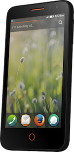

Mozilla 甫於二月底發表的搭載 Firefox OS 的參考平台手機 (Reference device) －「Flame」，[現已在 everbuying.com 展開限量預購](https://www.everbuying.com/product549652.html)，售價僅為 $170 美金，且免運費。

### [立刻訂購！](https://www.everbuying.com/product549652.html)

為了能逐漸標準化 Firefox OS 的設計、開發、測試等作業，Mozilla 與 T2Mobile 共同製作、配送、更新 Firefox OS 參考平台手機，並將該款手機取名為「Flame」。此為第一款 Firefox OS「參考平台手機」。

### 為中階手機定位

「Flame」具備中階手機的規格，為 Mozilla 與合作夥伴計劃於來年推出的手機。該手機主要針對開發者與貢獻者社群所設計，因此 Mozilla 與製造商 T2Mobile 合作，期望能儘量壓低售價。 Mozilla 很高興能以平實價格提供高品質的參考平台手機。

由於 Flame 硬體具備可調整的記憶體 (RAM)，可模擬今年稍晚即將推出的多款裝置，因此亦可作為第三方 Firefox OS App 開發者的絕佳開發與測試環境。

而合作夥伴 T2Mobile 將針對 Firefox OS 的後續新版本，提供 Flame 的更新檔。另有簡易機制可切換為不同的開發版本，每夜更新版 (Nightly) 可讓開發者隨時掌握最新 Firefox OS 的開發優勢。

如果開發者所在地區尚未發售 Firefox OS 手機，或是手機並無法滿足你的開發與測試需求，就請別錯過[限量預售的 Flame 參考平台手機](https://www.everbuying.com/product549652.html)。

### 「Flame 」 的規格

「Flame」並未鎖定任何電信營運商才能使用，亦未鎖定 Bootloader。

- 高通 (Qualcomm) MSM8210 Snapdragon，1.2GHz 雙核心處理器

- 4.5 吋螢幕 (FWVGA 854×480 像素)

- 相機 ─ 主鏡頭：5MP 自動對焦並搭載閃光燈＼前鏡頭：2MP

- 頻率：GSM 850/900/1800/1900MHz UMTS 850/900/1900/2100MHz

- 8GB 儲存記憶體、MicroSD 卡插槽

- 256MB – 1GB RAM (可由開發者自行調整)

- A-GPS、NFC

- 支援雙 SIM 卡

- 電池容量：1,800mAh

- WiFi: 802.11 b/g/n、Bluetooth 3.0、Micro USB

附註：除了日本以外，「Flame」到世界任一國家均為免運費。如果想訂購可於日本國內使用的「Flame」手機，請參閱：[http://www.mozilla.jp/firefox/os/devices/flame/](https://www.mozilla.jp/firefox/os/devices/flame/)

### 更多資訊：

[Mozilla 開發者社群網站 (MDN) 的《Flame 參考平台手機指南](https://developer.mozilla.org/en-US/Firefox_OS/Developer_phone_guide/Flame)》

原文連結：[Pre-orders start today for Flame, the Firefox OS developer phone](https://hacks.mozilla.org/2014/05/flame-firefox-os-developer-phone/)
