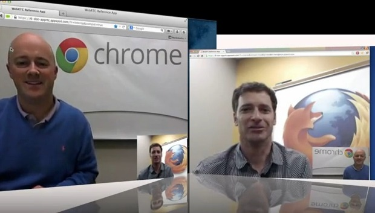

近幾年來，一直有標榜更快、更簡單的通訊服務不斷問世。每次只要有新的社交訊息服務上線，就更加深平台的分化 (Fragmentation) 情形，甚至讓眾多身處各地的親友更難保持聯絡。不斷轉用各種類似卻獨立的服務，只會加深使用者的不便與困擾。

所以 Mozilla 問自己：如果能打這破這些隔閡而整合相關服務呢？幾乎所有人都在使用的瀏覽器，如果本身就是開放又互動的通訊系統，又會有怎樣的結果呢？

你很快就能在 [Firefox 每夜更新版 (Nightly)](https://nightly.mozilla.org/) 上看到我們首次加入的 WebRTC 通訊功能。只要支援 WebRTC 的瀏覽器就能聯繫所有人。沒錯！不需其他外掛程式或下載作業，就能直接進行通訊。你只需要瀏覽器和一組耳麥，就能撥打音訊或視訊電話給另一款同樣支援 WebRTC 的瀏覽器。如此可跨所有裝置與作業系統進行通訊。Mozilla 未來將為 WebRTC 添增更多功能，再介紹給更多使用者享受。

從 Mozilla 於業界首創 [DataChannels](https://blog.mozilla.org/futurereleases/2012/11/30/webrtc-makes-social-api-even-more-social/)，直到在[兩大瀏覽器之間](https://hacks.mozilla.org/2013/02/hello-chrome-its-firefox-calling/)撥打第一次 WebRTC 電話以來，我們持續推動 WebRTC 並要為使用者與開發者創造更高價值，且將藉由這次實驗繼續深耕。但請各位先不要期待過高，目前 WebRTC 仍處於早期階段，我們才剛要開始逐步測試。

除了在 Firefox 中開發了此實驗功能之外，我們也很榮幸能獲得 [TokBox](https://www.tokbox.com/blog/mozilla-releases-experimental-webrtc-app-for-firefox-using-opentok/) 鼎力襄助，搭配其「OpenTok」影音串流雲端服務。有了該公司對 WebRTC 的早期支援與貢獻，將讓此蓬勃發展中的標準擁有更完整的立足點，並引起更多開發者的興趣。

Mozilla 很高興能透過 Nightly 版本開始測試此功能，並期望能在開發期間持續更新，以提供更完整的功能與服務。

─ Firefox 產品管理總監 Chad Weiner

原文連結：[Experimenting with WebRTC in Firefox Nightly](https://blog.mozilla.org/futurereleases/2014/05/29/experimenting-with-webrtc-in-firefox-nightly/)
