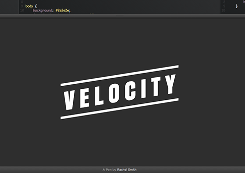

你是熱血的開發者嗎？應該已經在 GitHub 上為不少專案做出貢獻了吧？你是否曾自己寫過開放源碼專案，除了自己拿來用之外，也想讓自己的心血能幫到更多人呢？你之前可能只把自己侷限在「我只要會寫程式就好」的框框，但現在應該要學著更積極推銷自己的東西，讓更多人看到你的作品才對。來看看這篇文章想傳達給大家的新概念。

### 清楚自己的方向

我沒有貢獻過開放源碼，也沒有回報過 GitHub 的問題。我把自己視為是個剛好略懂技術的創業家。

然而，當發現我想要創作出一個全新的項目時，我就順著這個念頭並放下手邊的所有工作，花上三個月全力撰寫出我所要的東西。我知道其他開發者可能也會需要我正撰寫的專案，所以這也算是另一種開發動力。

我調整模式，整個人變身為不眠不休的瘋狂開發者。

結果是我完成了一個動畫引擎，能夠大幅的提升使用者介面 (UI) 的效能，也跨所有裝置強化了作業流程。你可參考 [VelocityJS.org](https://velocityjs.org/) 這個強大的 JavaScript 工具，甚至可媲美 CSS 的效能。你問我玩了什麼把戲？簡單的說它和 jQuery (於 2006 年發佈) 正好相反。我從無到有所打造的新引擎整合了 2014 年的最佳效能實例，完全沒有舊的軟體層也毫不龐雜。可不像瑞士刀東拼西湊了一堆功能；而是鋒利無比的純手術刀。

但在我悶著頭開發完畢之後，我才發現我的東西卻是完完全全只為了自己而作。

這時我終於了解到，即使在撰寫開放源碼專案之時，也不能完全跳脫創業家所注重的行銷思維。一般人不會身兼創業家與程式設計師的角色，而一旦進入不同的模式，也不應該完全忘卻另一個角色下的思維。

### 成功

我們先跳回三個月前發表《Velocity》的時候。如果覺得我在寫炫耀文的話還請各位見諒：

- 在三天之內，《Velocity》就四次榮登 Hacker News，以及 Reddits 的「programming」分類的熱門頭條

- 《Velocity》在九天內就有 [2400 人在 GitHub 上標記星號](https://github.com/julianshapiro/velocity)

- 《Velocity》在十四天內就有多組 Demo 誕生並登上 CodePen 首位，且均達到 10,000 觀看次數 (包含[codepen.io/rachsmith/pen/Fxuia](https://codepen.io/rachsmith/pen/Fxuia)、[codepen.io/okor/pen/fJIEF](https://codepen.io/okor/pen/fJIEF)、[codepen.io/sol0mka/full/kzyjJ](https://codepen.io/sol0mka/full/kzyjJ))

- 數不清的商業平台、前端平台、網路公司都轉用 Velocity (例如：[everlane.com](https://everlane.com/)、[discover.typography.com](https://discover.typography.com/)、[apartmentlist.com](https://apartmentlist.com/))

這是怎麼辦到的？就因為我就像在做自己的生意一樣對待 Velocity。開發活動佔了我 10% 的心血，剩下的 90% 都是行銷。

我在開發過程中轉變了既有觀念，像咒語一樣刻在我腦海裡：不論我花多久的時間開發，都必須下更多的功夫行銷。依我先前創業過程的時間規劃經驗。我想這個專案應該也不例外。拓展使用者 (User acquisition) 是少不了的。

最後，如果你本來就想自行創業，或開發開放源碼專案給公眾使用，但最後卻沒人要用。不論這個專案本身多有創意，也不管你解決了多少技術難題，沒別人用就算失敗的專案。

不幸但卻是事實的是，開放源碼軟體能否成長，確實必須考量特殊的現實情況：行銷往往牽涉了提案、暢談理念、四處交關、提高能見度等活動。如果把行銷活動擬人化，就產生「穿件廉價衣服或打條便宜領帶就開始招搖撞騙」的污名化刻版印象。如此往往毀了我們當初對開放源碼的理想 — 至少應該是「穿件廉價襯衫配條便宜領帶，至少也去剪了便宜髮型，最後勇往直前的程式碼戰士」。

我想引用 GitHub 元老級工程師 Zach Holman 說過的概念：「我們喜歡純粹、不摻雜其他概念的開放源碼。但如果你有『行銷開放源碼專案很傻』的想法，才真的很傻。」 - [ZachHolman.com](https://hacks.mozilla.org/2014/05/open-source-marketing-with-velocityjs/%C2%A0http:/zachholman.com/posts/open-source-marketing/)

坦白說，如果你希望自己的開放源碼專案確實產生影響，你就必須邁出自己熟悉的程式碼框框。只要你真寫出了酷炫的東西又能有效行銷，就等於是幫了大家的忙；而不會只幫到自己一個人而已。

而更棒的是，只要越多人知道你的作品，就會有越多人想接著貢獻，也能越快發現臭蟲並修正，進一步頻繁添增更多功能。

另外你也不用擔心。公開行銷自己的專案，並不會讓其他人把你當成傲慢或市儈的開發者，只會讓別人感受到你的熱情。如果你願意花點時間，就會發現有許多人因你的成果而受益，這也是能鼓勵自己繼續貢獻開放源碼的動力。最後你會發現，專案本身終將符合你原有的開發理念。

看到這裡，你自己是否對開放源碼專案有了新的體認呢？想知道該如何高效率行銷自己的心血嗎？請別錯過即將上刊的《把開放源碼當做自己創業 (下)》。

原文連結：[Treat Open Source Like a Startup](https://hacks.mozilla.org/2014/05/open-source-marketing-with-velocityjs/)
