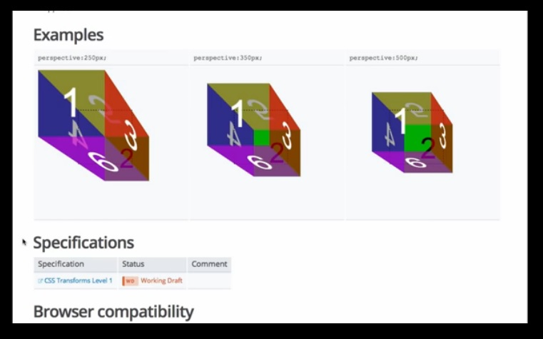

你是熱血的開發者嗎？在看完《[把開放源碼當做自己創業 (上)](https://blog.mozilla.com.tw/posts/5720/)》之後，你對開放源碼的想法是否改變，覺得自己也應該要看重作品的「行銷」活動了呢？快來繼續了解作者是如何推廣自己的作品吧！

### 開放源碼正不斷成長

如果你仔細了解目前開放源碼的狀況，會發現盤踞在 GitHub 前幾名的常客，都是已經有固定信眾的開發領頭羊，或是分享自己內部軟體元件的公司。

來看看 GitHub 這個月的趨勢圖，前幾名的非教育類專案 (連結蒐集、線上教學等等) 包含了：Pop (Facebook)、Atom (GitHub)、Quill (Salesforce)、Velocity (就是我的！)、Mail-in-a-Box (個人)、Famous (Famous)、syncthing (個人)、betty (個人)、Isomer (個人)、Bootstrap (Twitter)、Angular (Google)、PourOver (NY Times)。

雖然上述的個人專案也佔了一半，但傳統上仍是由公司主導了開放源碼的行銷活動。從現實面來看，這些公司所聘用的開發者不見得比你我強。在個人與大公司之間，專案能見度可說根本沒有所謂的「物競天擇」。

你可以奮力讓自己的專案脫穎而出，或只是眼巴巴看著大公司的行銷團隊壓低你的曝光機會。

目前的生態分析就閒聊到此。接著來進一步了解重要的細節吧。我到底是怎麼推銷自己的《Velocity》？

- 針對主要的 Web 開發部落格，我預先寫了發佈用的草稿。我會給網站編輯一篇不錯的介紹文 (不是簡介也不是大綱而已)，只要儘量減輕對方的工作量，他們就會爽快答應刊登文章。在撰文之前，我也確認已累積足夠的 GitHub 評分星星。而最重要的，就是我的文章各有完整主題。一篇有關效能，另一篇則敘述 UI 的工作流程。我儘量不提到 Velocity 而要讓讀者了解相關主題。板主不會想讓部落格文章成為變相的廣告，而是需要營養內容來提高網站的點閱率。

- 找出自己的強力使用者。「找到自己的一千名核心早期採用者」這句話已經在創業生態圈行之有年，在開放源碼界也同樣適用。有哪些人愛用高效能動畫引擎，還不用我主動推銷，就願意透過我的專案寫出酷炫玩意並向全世界展現自己的作品呢？這些人就是 Web 動畫的展景設計師 (Demo Scener)，或是不斷探究科技與設計交界處的核心開發者。這些人都喜歡到「[CodePen.io](https://codepen.io/)」亂逛。我在這個網站上碰到一些我很欽佩的開發者，所以我也提供了 Velocity的搶先試用版給他們使用。當然這些人最後也真的寫出一些有趣玩意再讓我分享出去。

- 任何行銷活動都會告一段落。為了讓新開發者能在我結束行銷之後也同樣接觸到 Velocity.js，我把 Velocity 嵌入我能找到的所有高人氣 Web 開發者資源中。我曾對《[BentoBox.io](https://bentobox.io/)》與高人氣[《front end bookmarks》的 GitHub repo](https://github.com/dypsilon/frontend-dev-bookmarks) 發過 Pull Request。我也發文給 Treehouse 的[影音部落格](https://www.youtube.com/watch?v=ONi6xhy2KTQ)。但這些都不過算是起頭而已。我另外還拍攝了 Velocity 作業流程的影片，提供相關機構播放給學生觀賞。簡單的說，我想讓所有接觸 Web 動畫的開發者都能知道 Velocity 這項資源。

- 最重要的，就是我寫了完整的說明文件。再度引述 Zach Holman 說過的話：「說明文件就是行銷手段。而且說明文件還能提供連結、可輕鬆檢索、可貼上社交網站。如果你能用一頁篇幅完整概述自己的專案，就能吸引許多人立刻使用。」 另延伸 Zach 的想法，我認為開放源碼專案的書面文件，就如同創業時吸引客戶的著陸頁(Landing page) 一樣重要。但可別搞錯了。你還是得撰文推銷，而不是只提供 API 的書面說明而已。開發者閱讀說明文件的方法和其他人沒什麼不同，但是他們很忙。你必須以有限篇幅說服他們採用你的專案。

在你寫完詳細的書面說明之後，可貼進 Reddit 與 Hacker News 等著發酵就可以了。開發者彼此知道最需要的東西，所以很快會口耳相傳出去。

另外，你知道開放源碼行銷最大的祕密是什麼嗎？就是比創業行銷簡單上一百倍！開放源碼行銷不用耗太多功夫，就能獲得更多的肯定。原因為何？就是因為和一般 Web 使用者相比，開發者更願意聆聽、更願意推文，也比較不會質疑你的行銷訴求與口號。而且絕大多數的 Web 使用者已經厭倦了老套的社交媒體產品，但是開發者卻一直在尋找更好的工具。同樣與主流的科技媒體相比，Web 開發媒體也更容易產生回應。主流科技媒體都在找好內容要和讀者分享；Web 開發媒體則是淹沒在茫茫的專案汪洋裡，而且有一半專案都還處於早期的概念發表階段。

就因為我對 Velocity 付出的行銷心血，也因為該專案算是成功，讓我更有動力能繼續努力提供開放源碼專案。

我們打算改變軟體的視覺互動方式，而《Velocity》只是預計三部曲的第一部曲而已。如果你想隨時掌握我的UI 最新開發現況，就到 Twitter 上的 @[Shapiro](https://twitter.com/shapiro) 打個招呼吧。

原文連結：[Treat Open Source Like a Startup](https://hacks.mozilla.org/2014/05/open-source-marketing-with-velocityjs/)
