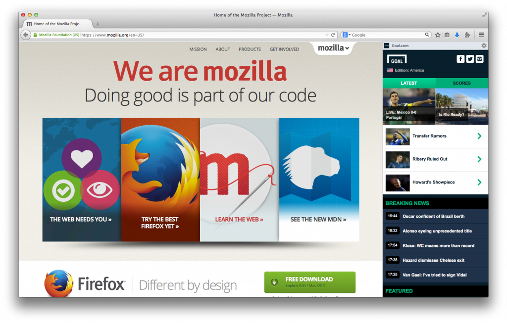

Firefox 讓你能掌握自己的 Web 經驗，並能輕鬆自訂 Web 的使用方式。透過強大的自訂選單，即可打造自己專屬的 Firefox。使用者可在選單中新增或移除任何的功能、附加元件、社交媒體服務，也能選用數千種佈景主題轉換自己的瀏覽情境。

Firefox 也是搶先為使用者整合 Facebook、Delicious、Weibo 等服務的第一款瀏覽器。如 Firefox 側邊欄、社交分享選單、工具列通知按鈕，均讓你能透過自己最愛的社交網路而隨時聯繫親友。現在你也能把新的側邊欄按鈕添增到自訂選單中，輕鬆存取書籤、社交活動、歷史紀錄等側邊欄。

#### Goal.com 將在 Firefox 上為你開拓世界盃樂趣

在 Windows、Mac、Linux 版 Firefox 中的 Goal.com 側邊欄

Mozilla 今天很高興能介紹順暢又具備豐富資訊的[《Goal.com》側邊欄](https://activations.cdn.mozilla.net/en-US/goal.html)，將透過 Firefox 帶給你即時的巴西世界盃足球戰況。你能在 Firefox 中直接啟動 Goal.com 側邊欄，就能一手掌握即時新聞、獨家消息、現場比分等世界盃的資訊。

Goal.com 側邊欄也將隨時提供各個分組的階段淘汰情形。你可追蹤所有的當天比賽結果，且只要選擇自己感興趣的國別組合，就能接收所有任何賽況不致遺漏。此外，只要點擊特定賽程，就會在新分頁中開啟「Goal.com Match Centre」，讓你觀看戰況預測、球員數據、相關評比、即時評論。

如果對目前的比賽沒興趣，你也能輕鬆隱藏或關閉側邊欄。即使本屆世界盃賽程結束，你還是能取得全球主要職業聯盟的最新足球消息。

由全球超過五百名記者所提供的新聞內容，你想隨時取得相關資訊簡直易如反掌。屆時 Goal.com 將有超過十二種語言的版本，並可支援 Firefox、Firefox for Android 等版本。而且你很快就能在 Firefox Marketplace 中找到 Firefox OS 版的「Goal.com」。立刻設定自己的 Firefox 並準時在禮拜四開始享受球賽樂趣！

#### 更多相關資訊

- [Windows、Mac、Linux 版的 Firefox 版本說明](https://www-dev.allizom.org/en-US/firefox/30.0/releasenotes/)

- [下載 Firefox](https://mozilla.com.tw/firefox/new/)

- [Firefox for Android 版本說明](https://www-dev.allizom.org/en-US/mobile/30.0/releasenotes/)

- [下載 Firefox for Android](https://www.mozilla.org/fr/mobile/)

- [在 Firefox 上啟動 Goal.com](https://activations.cdn.mozilla.net/en-US/goal.html)

- [在 Firefox for Android 上啟動 Goal.com](https://addons.mozilla.org/android/addon/goalcom-feed/)

附註：「Goal.com」並非國際足球總會 (FIFA) 官方或授權的產品。而 Firefox 或 Mozilla 亦未對今年的巴西世界盃提供任何贊助。

原文連結：[Stay Connected to the Things you Love with Firefox](https://blog.mozilla.org/blog/2014/06/10/stay-connected-to-the-things-you-love-with-firefox/)
