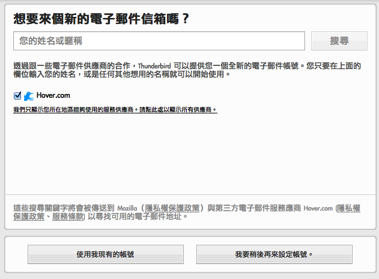
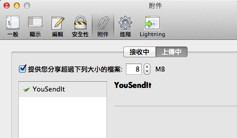

除了剛發表的新版 Firefox 之外，Thunderbird 郵件軟體也帶著能讓電子郵件更加方便的新功能上場。不但在穩定性及安全性上的功能都有所加強，新版 Thunderbird 更能協助你申請個人化電子郵件地址，以及使用「雲端解決傳送大檔案的問題。

### 個人化電子郵件地址

或許你想要有個類似「james@jamesbond.me」、「dad@thepongfamily.com」這樣可以十足展現個人風格的地址，Thunderbird 新增「取得全新電子郵件地址」功能，與服務商 Hover 及 Gandi 合作，先幫你搜尋與自己名字相關、還沒有人註冊的地址，並且在 Thunderbird 介面中就可開始申請帳號。申請完畢時，Thunderbird 甚至可以自動幫你搞定各項設定。只要短短時間，你就可以開始使用新的個人化郵件地址！

### 雲端檔案鏈結

另一個重頭戲是「雲端檔案鏈結」 – 現在 Thunderbird 可以在你附加大檔案時，先自動幫你將檔案傳上個人的雲端空間，並於信件中自動放入該檔案的分享連結。這麼一來，信件寄送將更為迅速，你也不必擔心因為檔案太大而被主機退信了！目前此機制與知名的線上檔案分享服務商 YouSendIt 合作，未來也將加入其他服務，幫你更輕鬆地寄送附件。

全新的 Thunderbird 中文版已經放上網站，[歡迎下載使用](https://mozilla.org/thunderbird)。另外提醒您：Thunderbird 3.1.x 跟 Firefox 3.6.x 系列一樣，都已經停止安全更新，建議您立即升級到最新版，以確保資訊安全。
