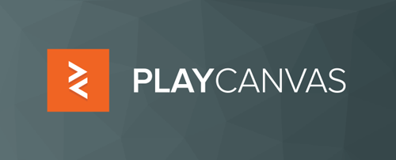
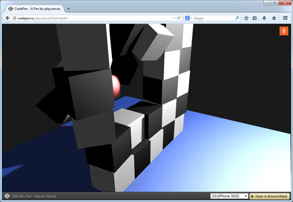

你是遊戲開發者，心中早有一堆酷炫的遊戲點子等著發揮嗎？是不是遇上開發瓶頸，受限於自己使用的遊戲引擎呢？快來看看「PlayCanvas」這個已經開放源碼的強大引擎！而且看完你會發現原來 PlayCanvas 竟然跟全球玩家所熟知的兩大重量級遊戲有關呢！想知道是哪兩款遊戲就趕快看下去吧！

在 2011 年 3 月 22 日，Mozilla 發表的 Firefox 4.0 已預設啟動 [WebGL](https://developer.mozilla.org/en/WebGL)。過了一個月後，我們更開始以 PlayCanvas 專案建構出不同於以往的遊戲引擎。時間向前快轉三年，WebGL 現已深入每個角落。而蘋果公司 (Apple) 最近也宣布旗下的 OS X 與 iOS 8 均將支援 WebGL。我們還要再加上一個好消息：

[PlayCanvas](https://playcanvas.com/) 引擎現在也開放原始碼了！

#### PlayCanvas 引擎簡介

PlayCanvas 引擎是專為遊戲開發所打造的 JavaScript 函式庫，其內主要元件均是撰寫高品質遊戲所必備：

- 圖形部分：Shadow mapping、模型讀取 (Model loading)、逐一像素打光 (Per-pixel lighting)、後製特效 (Post effects)

- 物理部分：Trigger volumes、剛體模擬 (Rigid body simulation)、光束投射 (Ray casting)、關節(Joints)、載具 (Vehicles)

- 動畫部分：關鍵幀像 (Keyframing)、骨骼動畫 (Skeletal blending)、皮膚構成 (Skinning)

- 音訊引擎部分：2D 與 3D 音源

- 輸入裝置部分：支援滑鼠、鍵盤、觸控板、遊戲搖桿

- Entity-component system：高階遊戲物件管理

當初設計此遊戲引擎時，我們就希望能達到：

- 可供輕鬆使用

- 可達極高的執行速度

#### 簡單卻強大

開發者都想要完整的說明文件與妥善架構的 API。即使發生錯誤，也會想了解內部運作與除錯的方式。因此開發者需要毫不偷工減料，且全手工謹慎打造的開放源碼程式庫。

此外，開發者還需要絕佳的圖形、物理、音訊引擎。而 PlayCanvas 引擎除了上述要件之外，更是具備實體組件的遊戲框架，可讓開發者用類似樂高 (Lego) 積木的方式，建構出遊戲中的物件。那到底是什麼樣子呢？先來看看 CodePen 的簡易範例：[用球擊碎牆](https://codepen.io/playcanvas/pen/ctxoD)

如同你在該網頁看到的，「JS」面板中不過 100 多行程式碼而已。你當然也能建立、強調、模擬、檢視有趣的 3D 場景；同時可試著「Fork」整個 CodePen 然後更改自己想要的數值。

#### 極速狂飆

為了確保能獲得極佳效能，我們讓 PlayCanvas 混合了手工撰寫的 JavaScript 與機器產生的 [asm.js](https://asmjs.org/)。對效能最為關鍵的部分，就是程式碼的物理引擎。這裡我們以手工打造出輕量的軟體層，並於其中封裝了 Ammo.js。而 Ammo.js 即是以「Bullet」這個開放源碼的物理引擎為基礎，透過 Emscripten 移植產生的 JavaScript 檔案。如果你以前沒聽過「Bullet」，那講到《碧血狂殺 (Red Dead Redemption)》和《俠盜獵車手 5 (Grand Theft Auto V)》這兩款「AAA」級遊戲，你應該就知道了。多虧有 Mozilla 率先開發的 Emscripten 與 asm.js，都讓 PlayCanvas 引擎獲益良多且更為強大。在 Firefox 最近的版本中，Ammo.js 與[原生程式碼的效能，已拉近只剩 1.5 倍慢](https://blog.mozilla.com.tw/posts/5519)了。如果你現在還以為 JavaScript辦不到複雜的物理模擬功能，該是讓自己改觀的時候了。

那整個 Codebase 非關 asm.js 的部份呢？效能仍甚為關鍵，且對圖形引擎尤為如此。繪圖器(Renderer) 已確實完成最佳化，進而根據材質而排序 Draw call，並將多餘的 WebGL call 減到最少。另繪圖器亦謹慎撰寫過，避免因動態分配 (Dynamic allocation) 造成垃圾蒐集 (Garbage collection)，進而拖慢整個程式的速度。如此程式碼才能順暢執行，又同時保持本身輕量化與可讀性。

看完 PlayCanvas 的遊戲引擎介紹，你總算知道其中 Ammo.js 竟然是以《碧血狂殺》和《俠盜獵車手》所用的「Bullet」移植而得了吧？ 是不是感覺熱血沸騰了呢？可別錯過《[PlayCanvas 也加入開放源碼 (下)](https://blog.mozilla.com.tw/posts/5777/)》！

原文連結：[PlayCanvas Goes Open Source](https://hacks.mozilla.org/2014/06/playcanvas-goes-open-source/)
