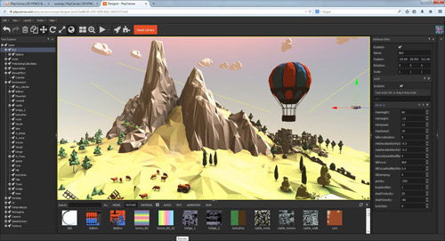
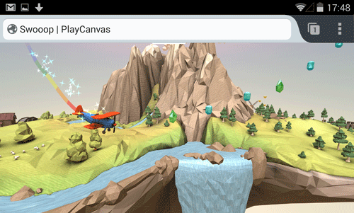

在看完了《[PlayCanvas 也加入開放源碼 (上)](https://blog.mozilla.com.tw/posts/5773/)》並知道「PlayCanvas」有關的兩大重量級遊戲巨作之後，你是不是已經摩拳擦掌，想用 PlayCanvas 大展身手了呢？當然要先看完《下》篇文章，並體驗其他現成的遊戲 Demo！

#### 強化絕妙專案

PlayCanvas 引擎現在已進入某些絕佳專案。而目前最大型的專案就是 PlayCanvas 網站，為全球第一個雲端的遊戲開發平台。

因現有遊戲引擎本身的限制，我們這幾年來也遭遇過不小的挫敗。因此在著手開發 PlayCanvas 引擎之後，我們認為全新的遊戲開發環境應該具備以下特性：

- 易於存取 ─ 任何裝置只要安裝網路瀏覽器，應在輸入網址之後就能立刻存取簡易、直覺、強大的工具。

- 可協作 ─ 可即時觀看團隊成員目前的工作，亦可坐著欣賞整個遊戲的建構情形。

- 社交功能 ─ 透過他人的協助，讓遊戲製作更簡單。快讓自己加入開發者的線上社群吧。

PlayCanvas 努力讓這些構圖要素更漂亮。只顧著看這篇文章怎會過癮？快直接到[https://playcanvas.com](https://playcanvas.com/) 體驗並找出更好的遊戲開發方式。

網站裡面有我們用許多工具所打造的《SWOOOP》遊戲：

[快來玩！](https://swooop.playcanvas.com/)

這個遊戲確實呈現出 [HTML5](https://developer.mozilla.org/en/html/html5) 與 WebGL 目前所達到的效能，也在行動版與桌機版瀏覽器上均能順利運作。開發者更能將自己的 PlayCanvas 遊戲免費發佈到 App 商店中。另針對 Google Play 與 iOS App Store，也有封裝技術可產生遊戲的原生 App。相關範例就是 Ludei 提供的《CocoonJS》，以及《Ejecta》開放源碼專案。Firefox OS 本身就是以 HTML5 App 為基礎，因此相關程序也特別簡單。以 PlayCanvas 開發的遊戲都是即時可玩的遊戲。

#### 徵求！

如果你對上面講到的 PlayCanvas 感興趣，該從哪裡下手呢？ [快到 GitHub 上取得遊戲引擎的原始碼](https://github.com/playcanvas/engine)：

[https://github.com/playcanvas/engine](https://github.com/playcanvas/engine)

趁熱快來複製原始碼，或為自己標記星號吧！

#### 隨時留意最新消息

最後要提供一些有用的連結，讓你能隨時獲得最新資訊或相關協助：

- 在 Twitter 上的 [@playcanvas](https://twitter.com/playcanvas) 將提供 PlayCanvas 的重要技術更新

- 到 [PlayCanvas 的 Facebook 粉絲專頁](https://www.facebook.com/playcanvas)按讚，隨時了解我們稀奇古怪的遊戲開發概念。

- 加入並參與 [PlayCanvas 討論區](https://forum.playcanvas.com/)

- 任何問題可到 [PlayCanvas Answers](https://answers.playcanvas.com/) 取得專業答覆

我們很期待看到開放源碼社群能用 PlayCanvas 引擎端出什麼樣的菜。請發揮自己的創意，讓我們知道你的專案想法！

原文連結：[PlayCanvas Goes Open Source](https://hacks.mozilla.org/2014/06/playcanvas-goes-open-source/)
