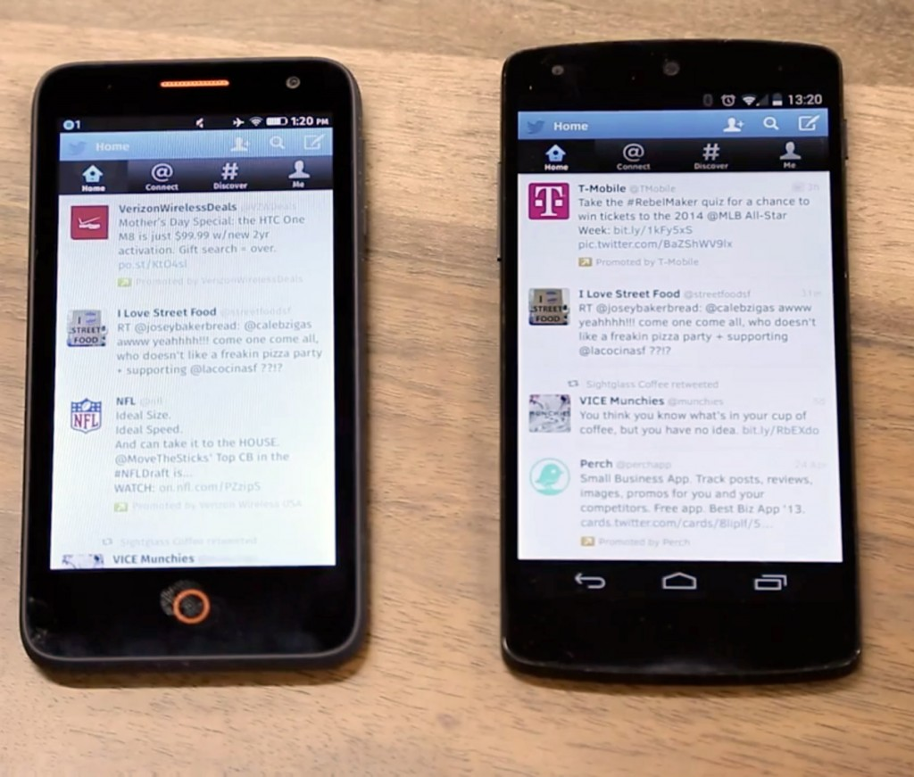
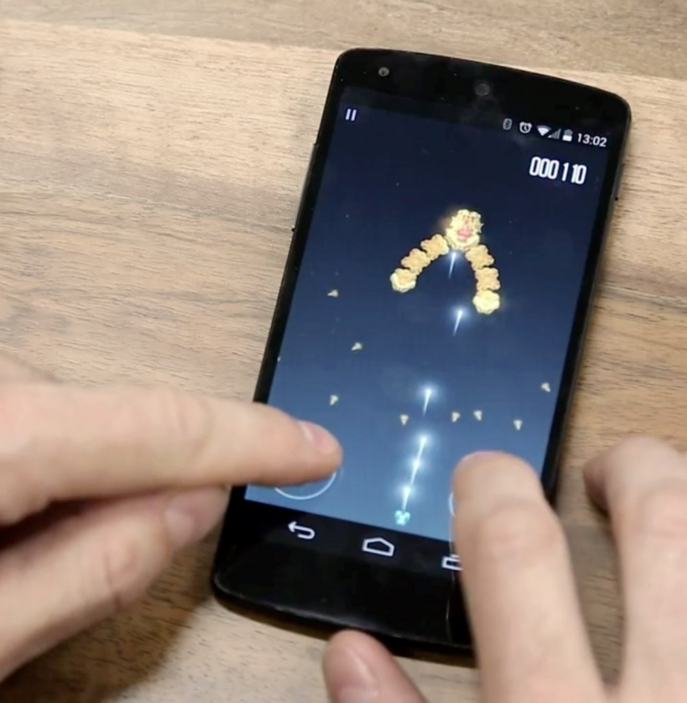

Mozilla 相信「App」與「網頁瀏覽」彼此應該共生且相輔相成。我們正透過許多開發者已熟悉的 Web 技術而建構 App 生態系統，藉以強化此兩者之間的關係。

Mozilla 將 Firefox OS 定位為行動作業系統，並讓 Web 與 Open Web App 成為行動經驗的核心。我們努力拉近 Web 與原生 App 之間的效能差異，[後續效應正不斷發酵](https://blog.mozilla.com.tw/posts/5519/)，另透過 [WebAPI](https://developer.mozilla.org/en-US/docs/WebAPI) 期望 Web 也能妥善利用裝置功能，更讓 Web 首次能替代原生平台而成為 App 開發平台。

### 撰寫 Open Web App 並直接在 Android 上執行

Mozilla 現已透過 Firefox for Android 29，將開放的 Open Web App 生態系統延伸至 Android 之上。過去幾個月以來，我們努力為 Open Web App 開發[「原生經驗」](https://hacks.mozilla.org/2014/03/better-integration-for-open-web-apps-on-android/)。使用者現在可透過自己熟悉的原生 App 方式，同樣管理自己的 Web App。只要安裝/更新/移除 App，該 App 都會出現在「App 選單 (App Drawer)」與「近期 App (Recent Apps)」清單中。

如果你是開發者，現在就能針對 Firefox OS 裝置[寫出自己的 Open Web App](https://developer.mozilla.org/zh-TW/Apps)，而且不需改動任何一行程式碼，就能讓數百萬名的 Firefox for Android 使用者看到你的 App。

觀看影片以了解 Open Web App 在 Android 裝置上運作的方式：

當然，如果你安裝了 [Firefox for Android](https://play.google.com/store/apps/details?id=org.mozilla.firefox) 並實際測試 App 就更好了，也可[打造 App](https://developer.mozilla.org/zh-TW/Apps) 並提交到 [Marketplace](https://marketplace.firefox.com/) 之上。

我們另外建議大家可參閱《[Testing Your Native Android App](https://hacks.mozilla.org/2014/06/testing-your-native-android-app/)》一文。

原文連結：[Firefox OS Apps run on Android](https://hacks.mozilla.org/2014/06/firefox-os-apps-run-on-android/)
