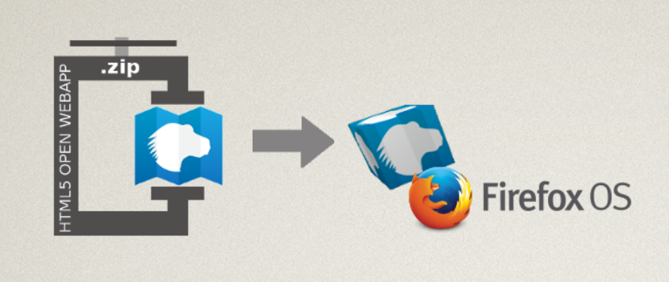
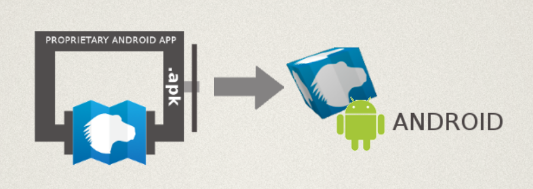
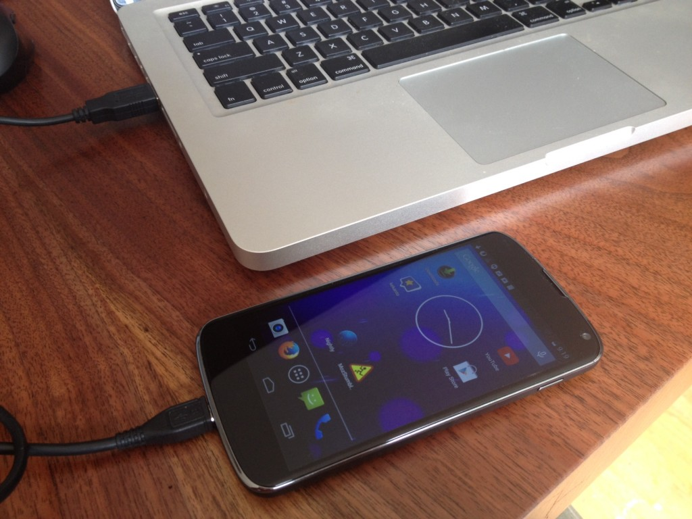

當個 Web 開發者真是有趣！

App 已佔據網路多年，而我們發現目前 Web 也逐漸蠶食著作業系統 (OS)。Mozilla 正推動大家撰寫標準架構下的 [Open Web App](https://developer.mozilla.org/zh-TW/Apps)。不論是哪種平台，Open Web App 均可如原生 App 一樣安裝且運作無虞。

而透過新的 [Firefox for Android](https://play.google.com/store/apps/details?id=org.mozilla.firefox)，我們能自動將 Open Web App 轉換成原生的 Android App。

但在提交 App 到 [Marketplace](https://marketplace.firefox.com/) 之前，又該如何於 Android 上測試自己的 App 呢？

現在有新的工具讓你使用！

### 介紹 mozilla-apk-cli

如果你早已安裝了 [NodeJS](https://nodejs.org/) 與 [zip/unzip](https://info-zip.org/)，就能使用新的命令列工具建構出 .apk 安裝程式(Installer) 並供測試。

mozilla-apk-cli 即屬於命令列工具，因此可透過命令提示字元應用程式執行下列命令。

設定很簡單：

npm install mozilla-apk-cli

					1

						npm install mozilla-apk-cli

接著就能在 /node_modules/.bin/ 中找到新的 mozilla-apk-cli 程式。

你也能透過以下指令進行全域安裝：

npm install -g mozilla-apk-cli

					1

						npm install -g mozilla-apk-cli

我先假設你已將 ./node_modules/.bin 加入路徑，或已完成全域安裝。

Open Web App 可分為三種，且均能透過 CLI 建構：

- 架設/托管式 (Hosted) App

- 封裝式 (Packaged) App 的 zip 檔案

- 來自於原始碼目錄的封裝式 App

先假設你正撰寫[封裝式 App](https://developer.mozilla.org/zh-TW/Apps/Developing/Packaged_apps/Packaged_apps)，而且目錄結構如下：

www/
   index.html
   manifest.webapp
   css/
       style.css
   i/
     icon-256.png
     icon-128.png
     icon-60.png
   js/
      main.js

					1234567891011

						www/   index.html   manifest.webapp   css/       style.css   i/     icon-256.png     icon-128.png     icon-60.png   js/      main.js

用下列命令即可建構 Android App 並測試：

mozilla-apk-cli ./www my_test_app.apk

					1

						mozilla-apk-cli ./www my_test_app.apk

如此即可產生 my_test_app.apk，並以下列兩種方式載入 (Side loading) 到你的手機上：

- 將 App 放到網路上，再透過自己 Android 裝置的瀏覽器下載/安裝之

- 以 adb 安裝 App

adb install my_test_app.apk

					1

						adb install my_test_app.apk

本篇文章就先不說明 adb 的設定過程了。但你可參閱 [Android SDK 網站](https://developer.android.com/sdk/index.html)上的 [adb 相關資訊](https://developer.android.com/tools/help/adb.html)。

### 發佈

千萬不要發佈此測試用的 .apk 檔案！

如果你變更了自己的 App，重新打包 APK 並寄送給使用者，將無法安裝該更新檔案。每當你的 App 推出新版本，則請於安裝第二版本之前，先使用 Android 的「App Manager」移除測試用 App。

mozilla-apk-cli 僅能於本端測試你的新 Android App 並進行除錯。在你開心完成自己的 App 之後，應透過 [Marketplace](https://marketplace.firefox.com/) 或[自己網站的安裝頁面](https://developer.mozilla.org/zh-TW/docs/Mozilla/Marketplace/Publishing/Publish_options)發佈此 Open Web App。

你不用直接管理 .apk 檔案。就像是你也不需管理自己專為 Mac OS X、Windows、Linux 所打造的 Open Web App。

我們其實早已為 Firefox for Android 建構原生的 Android 支援功能。當要安裝 Open Web App 時，就會透過正式的 APK Factory Service，根據使用者的選擇來合成原生 App。不論你是透過網站或 Marketplace 安裝 Open Web App，都能正確運作。

### CLI 如何運作？

先回來講講新的測試工具。此工具將從前端呼叫 [APK Factory Service](https://wiki.mozilla.org/Mobile/Projects/APK_Factory)。該工具會取得你的程式碼並傳送到 [APK Factory Service](https://wiki.mozilla.org/Mobile/Projects/APK_Factory) 的「審查環境 (Reviewer Instance)」。此「審查環境」即相對於「正式環境 (Production release)」。

這項服務將合成原生的 Android App、透過 Android SDK 建構該 App，最後以開發認證完成簽署。如上面所提到的，此合成的 APK 亦可進行除錯但請不要發佈。

這項服務的好處在於：開發者自己的本端電腦不需安裝 Java、ant、Android SDK，或其他Android 開發工具。你可專注於 Web 並測試手邊的任何裝置。

### 架設/托管式與封裝式的 zip 檔案

剛剛只提到該如何測試封裝式 App (本身就是原始碼的目錄)。接著說說其他兩種類型的檔案。如果你已經將封裝式 App 轉為 .zip 檔案，可使用：

mozilla-apk-cli ./my_app.zip my_test_app.apk

					1

						mozilla-apk-cli ./my_app.zip my_test_app.apk

如果你寫的是架設/托管式 App，則使用：

mozilla-apk-cli http://localhost:8080/ my_test_app.apk

					1

						mozilla-apk-cli http://localhost:8080/ my_test_app.apk

### 你沒有 Android 裝置？也沒問題！

你可能會說：「前面看下來都很不錯。但我根本沒有 Android 裝置。又該怎麼測試呢？」

好問題。我們現正打算能自動啟用此功能。

一方面來說，你根本不用擔心。我們在[第一次開發行動裝置](https://www.abookapart.com/products/mobile-first)時就了解到：現已有太多裝置與平台，讓你測都測不完。所以 Web 透過開放標準與逐步的擴增，將能簡化相關的開發作業。

你的 Web App 才剛開始進化得比原生 Android App 更好一點，卻已能更貼近 OS 並符合使用者的期待。

Web App 不會使用原生的 UI widgets 或其他類似的東西，所以也不需要更多、更冗長的測試。而繪圖引擎就是已經安裝在 Firefox for Android 之中的 gecko。

另一方面來說，開放的標準與相容性當然很好。但我們身為 Web 開發者，早知道許多東西會在特定平台上產生臭蟲。我建議能針對各種平台訂出支援功能的優先順序。如果你認為Android 算是頗重要的平台，最好能實際弄一台裝置並安裝 Firefox for Android，有利於測試自己的 App。

隨著我們跨平台 (Android、Mac OS X 等等) 達到近似原生 App 的使用經驗之後，仍歡迎大家隨時提供寶貴意見。

### mozilla-apk-cli 相關資源

[現已可到 GitHub 取得 CLI 工具的原始碼](https://github.com/mozilla/apk-cli)。如果你需要簡易的封裝式 App，[則這裡提供 Demo版本](https://github.com/ozten/packaged-app/)。[GitHub 現亦提供 APK Factory Service 原始碼](https://github.com/mozilla/apk-factory-service)。

歡迎[提出任何想法、意見、問題](ircs://irc.mozilla.org:6697/apkfactory)，並請透過 [Marketplace Integration](https://bugzilla.mozilla.org/enter_bug.cgi?product=Marketplace&component=Integration) 回報錯誤。

原文連結：[Testing Your Native Android App](https://hacks.mozilla.org/2014/06/testing-your-native-android-app/)
