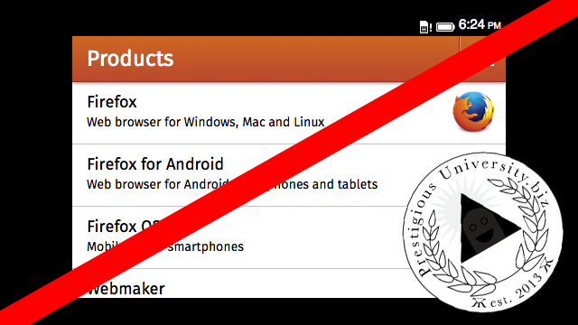
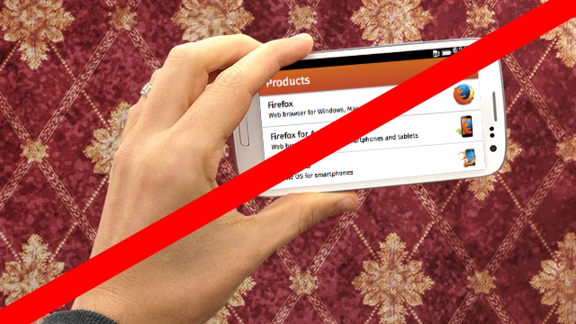
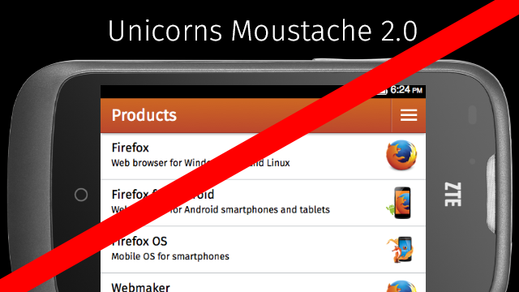

你是熱血的 Firefox OS 開發者，而且早已寫好許多 App 準備大展身手嗎？如果想讓自己的 App 透過 Firefox Marketplace 發佈給眾多使用者，你當然就必須遵守某些特定規則，才能讓自己的心血順利上架。先來看看該如何為自己的 App 擷取出符合 Marketplace 規範的圖片吧！

在將 App 提交至 Firefox Marketplace 時，開發者必須提供 1 幅或更多截圖以供使用。Marketplace 另提供此類截圖的非硬性規範，可作為開發者截圖時的準則。如果 App 截圖均未能符合本篇文章所載明的規範，則 Marketplace 可能會要求開發者提交新的截圖。

### 截圖概述

- 開發者所上傳的截圖會出現在 各個 App 的頁面

- 如果 App 榮獲編輯或館長推薦，也會出現在「精選 App」的類似區塊中

- Marketplace 中的多樣選單或動態播放區

- Marketplace 接受 3 種不同規格，共 1 ~ 6 組截圖： 手機 (直幅或橫幅)

- 平板電腦

- 桌上型電腦 (一般應達 1024×768 或以上)

- 根據 App 所支援裝置的規格，至少各需提供 1 組截圖。

### 截圖重點

- 應要儘量呈現自己的 App 特色與功能

- 可能的話，應移除狀態列 (一般均位於手機畫面最上方，顯示時間、電池電量、電信營運商名稱等硬體資訊)

- 儘量以實體裝置取得截圖，較模擬器取得的截圖為佳

- 避免將 App 放入裝置或桌機的圖片中 若將 App 放入裝置或桌機的圖片中，就必須縮小 App 的介面而看不清楚

- 你所呈現的裝置或桌機介面，極可能與消費者本身所使用的介面有所不同

- 避免「手拿」手機、螢幕、平板電腦的照片

- Marketplace 中的 App 不會用於瀏覽器中，所以避免呈現出瀏覽器的介面 (工具列、網址列、上/下一頁等)

- 儘量以最少的文字解釋該介面，而不要淪為打廣告

- 避免使用與 App 本身無關的圖素

- 避免出現邊框

- 截圖將依照上傳的順序來呈現。開發者應先上傳最漂亮的截圖

總而言之，截圖應該以 App 為重點，而不是 App 周圍的情境。

### 尺寸與格式

截圖可為 JPG 與 PNG 格式。若是較能保有原來解析度的 PNG-24 最好。如果是 JPG 格式，則應儘量使用最小幅度的壓縮並設定為最高圖像品質。

#### 建議尺寸

裝置規格
建議的解析度

手機
320×480 的倍數、720×1280 的倍數；或 480×320 的倍數、1280×720 的倍數

平板電腦
1024×768 的倍數、1280×800 的倍數

桌上型電腦
1280×800 的倍數、1440×900 的倍數

### 範例

不要出現與 App 無關的圖素，如廣告或商標。

不要提供「手拿著裝置」的照片，或將截圖編輯到實體裝置之上。

截圖不需使用/添加裝置的邊框、不必要的文字、其他不必要的特色。

Mozilla 開發者社群網站 (MDN) 原文連結：[Marketplace screenshot criteria](https://developer.mozilla.org/en-US/Marketplace/Publishing/Marketplace_screenshot_criteria)

你也可參閱中文版《[Marketplace 截圖準則](https://developer.mozilla.org/zh-TW/docs/Mozilla/Marketplace/Publishing/Marketplace_screenshot_criteria)》；並參閱 MDN 上的更多 Firefox OS 或 Marketplace 相關文章。
