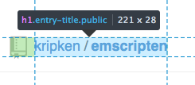
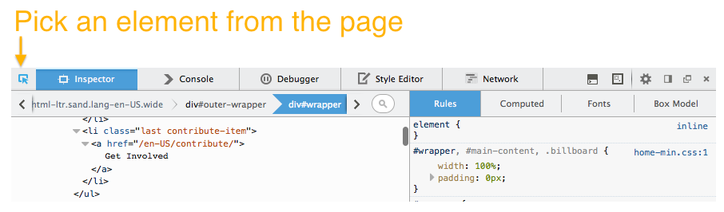
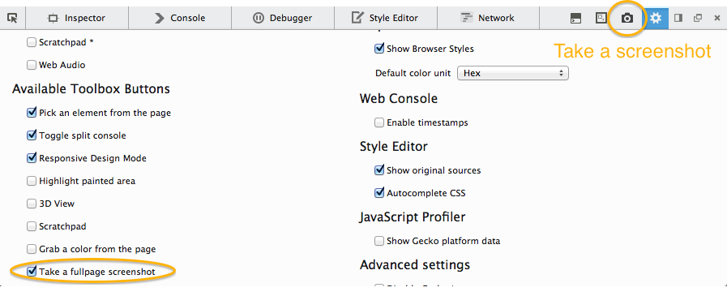
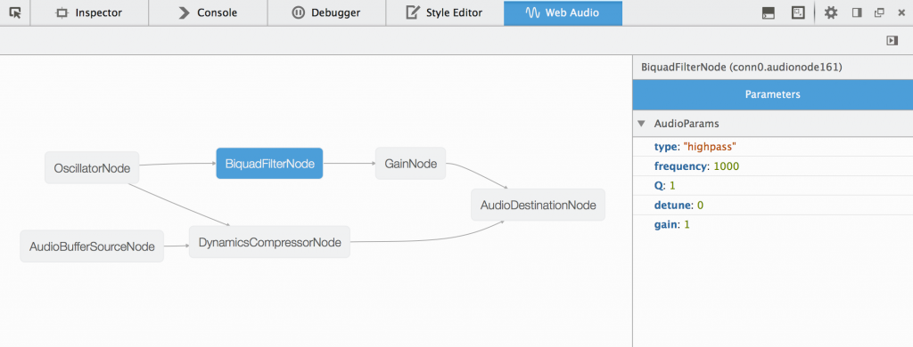
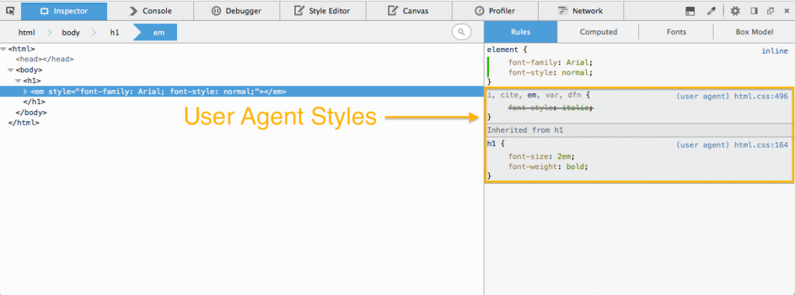
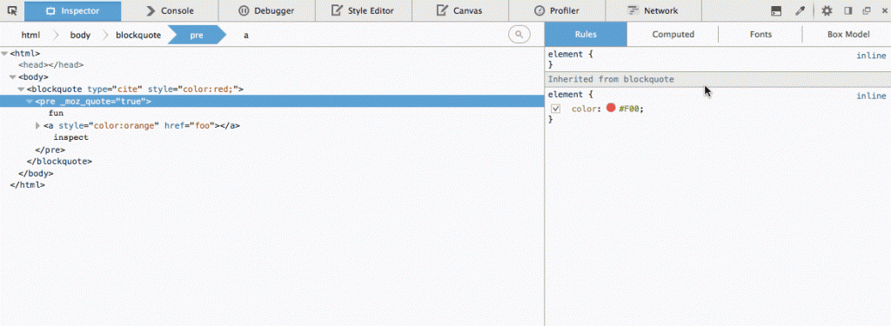
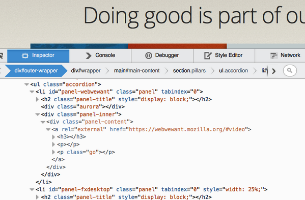
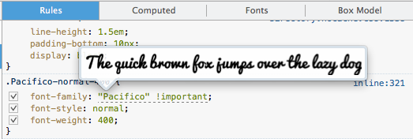
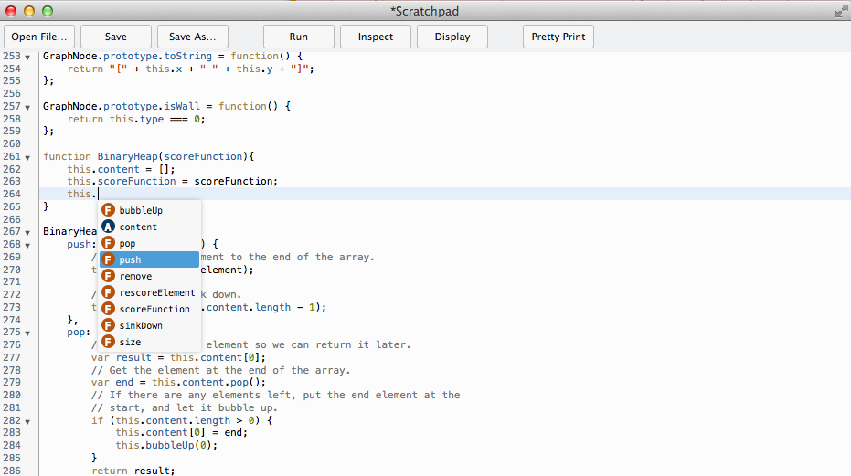
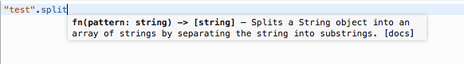

### 強化工具箱、檢測器、程式碼速記本

Firefox 32 現已進入[曙光版 (Aurora) 釋放頻道](https://www.mozilla.org/en-US/firefox/aurora/)，先看看此版本的開發者工具發生哪些重要變動。

首先必須感謝此版本開發者工具的 41 位貢獻者。另可參閱 Firefox 32 開發者工具的[錯誤修正清單](https://mzl.la/1kFlu0C)。

#### 工具箱 (Toolbox)

我們先從目前[處於測試階段](https://hacks.mozilla.org/2014/05/launching-feedback-channels-let-us-know-your-ideas-for-firefox-developer-tools/)的「[UserVoice feedback channel](https://mzl.la/devtools)」新平台，其上所提及的數項功能開始。

Box model 的資訊列現可一併顯示節點尺寸。就如同其他工具所帶來的方便性，現在開發者能直接從資訊列上輕鬆得知該節點的尺寸。(可參閱[開發討論記錄](https://bugzilla.mozilla.org/show_bug.cgi?id=718250)與[他人在 UserVoice 上提出的需求](https://ffdevtools.uservoice.com/forums/246087-firefox-developer-tools-ideas/suggestions/5894689-show-dimensions-when-hovering-over-an-element-in-i))

「挑選頁面中的元素 (Pick an element from the page)」按鈕現在更靠近檢測器 (Inspector) 分頁，能更快切換此兩項功能。而且現在也能透過「Ctrl+Shift+C」或「Cmd+Opt+C」[快捷鍵](https://developer.mozilla.org/en-US/docs/Tools/Keyboard_shortcuts)達到相同效果。(可參閱[開發討論記錄](https://bugzilla.mozilla.org/show_bug.cgi?id=991810)與[他人在 UserVoice 上提出的需求](https://ffdevtools.uservoice.com/forums/246087-firefox-developer-tools-ideas/suggestions/5714267-inspector-icon-on-the-left))

現在提供「完整頁面擷圖 (Full page screenshot)」[按鈕](https://developer.mozilla.org/en-US/docs/Tools/Tools_Toolbox#Extra_tools)。在啟用並按下此按鈕之後，就會將擷圖傳送到你設定的下載資料夾中。(可參閱[開發討論記錄](https://bugzilla.mozilla.org/show_bug.cgi?id=991045))

下方 gif 動畫即展現該擷圖功能：

開發者工具的使用者介面 (UI) 現已套用新的圖像，可支援高像素螢幕的顯示功能 (HiDPI)，讓 UI 能在這些裝置上更清晰。特別感謝 Tim Nguyen 的努力成果！(可參閱[開發討論記錄](https://bugzilla.mozilla.org/show_bug.cgi?id=837188))

#### Web Audio 編輯器 (Editor)

除了「著色器編輯器 (Shader Editor)」與「Canvas 除錯器 (Canvas Debugger)」之外，新的媒體工具「Web Audio 編輯器 (Web Audio Editor)」也從 Firefox 32 開始加入強大的工具行列了。在選項面板中啟動此功能之後，即可檢測 AudioContext 圖形並修改 AudioNodes 的屬性。另可參閱[本篇 Hacks 文章](https://hacks.mozilla.org/2014/06/introducing-the-web-audio-editor-in-firefox-developer-tools/)以進一步了解。

#### 檢測器 (Inspector)

檢測器現可顯示瀏覽器預設樣式 (User agent style)。由於這些預設樣式均可能影響你的網頁樣式，因此能方便開發者進行檢視。同樣可透過選項面板啟動此功能，另可參閱[MDN 上的說明文件](https://developer.mozilla.org/en-US/docs/Tools/Page_Inspector#Rules_view)以進一步了解。(可參閱[開發討論記錄](https://bugzilla.mozilla.org/show_bug.cgi?id=935803)與[他人在 UserVoice 上提出的需求](https://ffdevtools.uservoice.com/forums/246087-firefox-developer-tools-ideas/suggestions/5908197-show-user-agent-css-as-in-firebug))

針對隱藏節點與可見節點，標記檢視 (Markup view) 模式的顯示方式將有所區別。(可參閱[開發討論記錄](https://bugzilla.mozilla.org/show_bug.cgi?id=911209)與[他人在 UserVoice 上提出的需求](https://ffdevtools.uservoice.com/forums/246087-firefox-developer-tools-ideas/suggestions/5871316-show-nodes-that-are-display-none-differently))

字型檢測器中的提示文字，現可供預覽網路字型。只要將滑鼠游標停在字型堆疊之上，即可在提示文字中看到目前套用的字型 (包含任何網路字型)。(可參閱[開發討論記錄](https://bugzilla.mozilla.org/show_bug.cgi?id=987797))

標記檢視模式現另針對節點，在右鍵選單中提供「貼上外部 HTML (Paste Outer HTML)」選項。(可參閱[開發討論記錄](https://bugzilla.mozilla.org/show_bug.cgi?id=993416)與[他人在 UserVoice 上提出的需求](https://ffdevtools.uservoice.com/forums/246087-firefox-developer-tools-ideas/suggestions/5871356-context-menu-to-paste-html-in-a-node))

#### 程式碼速記本 (Scratchpad)

[程式碼速記本](https://developer.mozilla.org/en-US/docs/Tools/Scratchpad)現針對 JavaScript，提供型別推斷 (Type-inference) 架構的程式碼自動補完 (Code completion) 功能。按下「Ctrl+Space」即可在目前的游標位置上開啟建議清單，另按下「Shift+Space」就會出現目前的型別資訊。我們目前透過[「Tern」程式碼分析引擎](https://ternjs.net/)提供此功能。(可參閱[開發討論記錄](https://bugzilla.mozilla.org/show_bug.cgi?id=968896))

你有任何問題或意見、想提報錯誤，或想建議任何功能嗎？同樣可[到 UserVoice 提出自己的想法或投票選擇](https://mzl.la/devtools)，亦可透過 Twitter 上的[@FirefoxDevTools](https://twitter.com/FirefoxDevTools)聯絡我們。

原文連結：[Toolbox, Inspector & Scratchpad improvements – Firefox Developer Tools Episode 32](https://hacks.mozilla.org/2014/06/toolbox-inspector-scratchpad-improvements-firefox-developer-tools-episode-32/)
