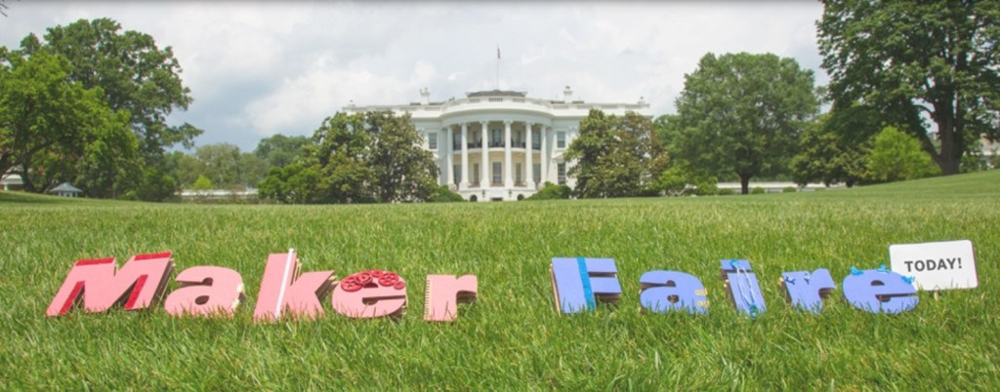

美國總統歐巴馬 (Obama) 已於 [First-ever White House Maker Faire](https://www.whitehouse.gov/the-press-office/2014/06/18/fact-sheet-president-obama-host-first-ever-white-house-maker-faire) 上宣佈 6 月18 日為全國創客日 (National Day of Making)。對將想法帶進實際生活的許多自造者、創新者、思想家、教育家、企業家等，總統致上敬意並將協助傳播「自造者 (Maker)」的全球思潮。

本著努力不懈的精神，歐巴馬總統也同時宣佈 Maker Party 2014 正式開始。這個由 Mozilla 舉辦的 [Webmaker](https://webmaker.org/) 活動，致力於全球發起能實際操作的學習與自造活動，且今年一樣有許多重要夥伴加入我們的行列。

歐巴馬總統去年也為 Mozilla 鳴槍開跑 Maker Party，並由志工在全球 331 個城市主辦將近 1,700 場活動。Maker Party 2014 將從 7 月 15 日直到 9 月 15 日結束，期間由教師與自造者在學校、圖書館、博物館、社區中心等場所主持「學習派對」，讓大家都能親身體驗並實際自造。不論任何年齡的學員，只要有興趣設計遊戲、撰寫程式碼、數位說故事、拍攝定格動畫、製造穿戴式設備、混搭重組網頁，甚至其他更多主題，都歡迎參加 Maker Party 的活動。與會者除了將習得珍貴的 Web 撰寫技術之外，還能了解 Web 的基本文化與機制，並晉身為真正的網路公民。

#### 2014 年的關鍵夥伴

Mozilla 很高興能宣佈今年新加入的夥伴，將協助我們向更多年輕人展現 Maker Party 的相關經驗。

- 美國博物館與圖書館服務研究局 (Institute of Museum and Library Services，IMLS) 將分享 Maker Party 的細節，並鼓勵所有公立圖書館與博物館在既有的能力範圍內盡力參與

- 美國四健理事會 (National 4-H Council) 將強化與全國五十萬名參與四健方案的志工、主導人、年輕人及其雙親之間的交流

- 科學中心協會 (Association of Science and Technology Centers) 將針對超過 390 處相關科學與技術中心，進一步強化之間的聯繫

- C.S. Mott Foundation 將透過 National Network of Statewide Afterschool Networks，支援多個州之間的 Maker Party 活動

目前已有超過 100 家組織加入成為 Maker Party 夥伴，並將透過學習與撰寫活動，重點提升大家對 Web 的熟悉度與讀寫能力。如果你想加入我們的行列，請前往 [Maker Party 夥伴頁面](https://party.webmaker.org/partners)。

#### 如何加入：

- 加入活動。 請到 [party.webmaker.org](https://www.party.webmaker.org/) 註冊、自造出某個玩意、在網路上分享、教導他人你自己所了解的細節。

- 立刻觀看 Maker Faire 現場直播。 White House Maker Faire [全天現場直播](https://www.whitehouse.gov/maker-faire)。

- 自己主辦或加入 Maker Party 。將自己的活動加入 [webmaker.org/events](https://events.webmaker.org/#%21/)，或[找到附近的活動參加](https://events.webmaker.org/#%21/)。

- 大聲傳遞消息。 加入有關製作與學習的對話群組。你可盡情使用 [#nationofmakers](https://twitter.com/hashtag/NationOfMakers?src=hash) 與 [#makerparty](https://twitter.com/hashtag/makerparty?src=hash)！

Maker Party 其實就是《[Webmaker](https://webmaker.org/)》的一環，由致力於教育數位技巧和網路素養的全球社群，透過一起探索、修補、創作，打造開放且全體共同經營的 Web。

Mozilla 的 Maker Party 亦屬於 [John D. and Catherine T. MacArthur Foundation’s Summer to Make, Play & Connect](https://www.makesummer.org/?ref=ei) 的一部分。

原文連結：[President Obama Announces Mozilla’s Maker Party 2014 at First-Ever White House Maker Faire](https://blog.mozilla.org/blog/2014/06/18/president-obama-announces-mozillas-maker-party-2014-at-first-ever-white-house-maker-faire/)
