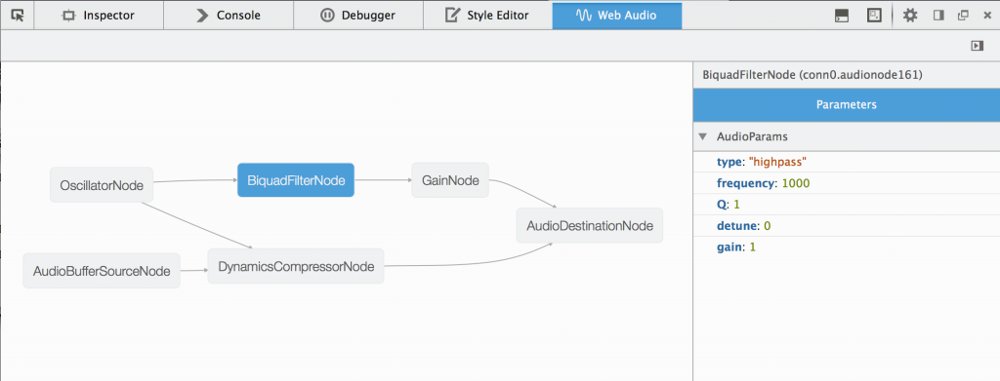
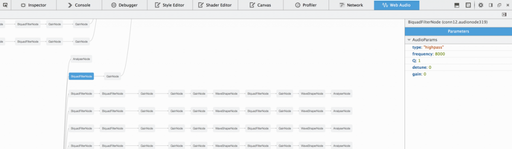
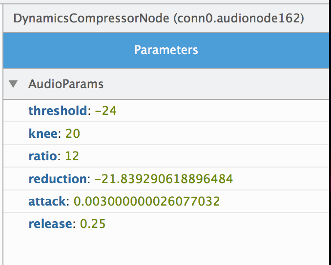

除了「著色器編輯器 (Shader Editor)」與「Canvas 除錯器 (Canvas Debugger)」之外，從 Firefox 32 開始，更有「Web Audio 編輯器 (Web Audio Editor)」可針對網頁的多媒體內容進行除錯。若是使用 Web Audio API 開發 [HTML5](https://developer.mozilla.org/en/html/html5) 遊戲或有趣的合成器 (Synthesizer)，就能讓 Web Audio 編輯器透過 [Web Audio AudioContext](https://developer.mozilla.org/en-US/docs/Web/API/AudioContext)，呈現並修改所有的音訊節點。

#### 將 Audio Context 視覺化

當以 [Web Audio API](https://webaudio.github.io/web-audio-api/) 的模組化路由 (Modular routing) 進行開發時，光是聆聽音訊輸出很難解析音訊節點的連結方式。此外，只是聆聽輸出，或觀看音訊節點的程式碼，也難以對 AudioContext 進行除錯。但 Web Audio 編輯器可透過有向圖 (Directed graph) 描繪所有 [AudioNodes](https://developer.mozilla.org/en-US/docs/Web/API/AudioNode)，並展示所有音訊節點的階層與連結。讓開發者能確認所有節點均照著自己期望的方式完成連結。如果遇到複雜網頁 (例如用一個節點網路專門操作音訊，又用另一個節點網路分析資料) 時，這個功能就特別有用。我們已經看過能構成這些圖像的 [Web Audio 酷炫應用](https://webaudiodemos.appspot.com/Vocoder/)！

如果要啟動 Web Audio 編輯器，可開啟開發者工具中的「工具箱選項」(即齒輪圖示) 並勾選「Web Audio Editor」。在啟動編輯器之後，就會開啟工具並重新載入頁 面，由工具監控所有的 Web Audio activity。只要建立新的音訊節點，或節點之間發生連線/中斷，圖表也將更新為最新內容。

#### 修改 AudioNode 屬性

在描繪圖表之後，即可分別檢測音訊節點。只要點擊圖表上的 AudioNode 隨即開啟 AudioNode 檢測器，即可檢視並修改節點上的 [AudioParam](https://developer.mozilla.org/en-US/docs/Web/API/AudioParam) 與特定屬性。

#### 未來開發重點

這是 Web Audio 編輯器首次現身，我們將為音訊開發者繼續強化此工具。

- 顯示節點的視覺反饋效果，並可呈現時域/頻域

- 可透過編輯器進一步建立、連接、中斷音訊節點

- 可用於 [onaudioprocess](https://developer.mozilla.org/en-US/docs/Web/API/ScriptProcessorNode#Event_handlers) 活動與音訊突波 (glitch) 的除錯 工具

- 顯示額外的 AudioContext 資訊，可支援多個 AudioContext

- 將來不僅能修改節點檢測器中的參數 (Primitive)，例如亦可新增 AudioBuffer

我們還規劃了許多[絕佳功能](https://gist.github.com/jsantell/ee1be41bc87968d7b170)， 你可檢視 Web Audio 編輯器[所開放的錯誤](https://bugzilla.mozilla.org/buglist.cgi?component=Developer%20Tools%3A%20Web%20Audio%20Editor&product=Firefox&bug_status=__open__&list_id=10101182)， 或[提報新的錯誤](https://bugzilla.mozilla.org/enter_bug.cgi?product=Firefox&component=Developer%20Tools%3A%20Web%20Audio%20Editor)。另請參閱 Web Audio 編輯器的 [MDN 說明文件](https://developer.mozilla.org/en-US/docs/Tools/Web_Audio_Editor)；我們也歡迎 [UserVoice feedback channel 上提出任何意見與想法](https://mzl.la/devtools)，你當然 也能使用 [Twitter @firefoxdevtools](https://twitter.com/firefoxdevtools)。

原文連結：[Introducing the Web Audio Editor in Firefox Developer Tools](https://hacks.mozilla.org/2014/06/introducing-the-web-audio-editor-in-firefox-developer-tools/)
