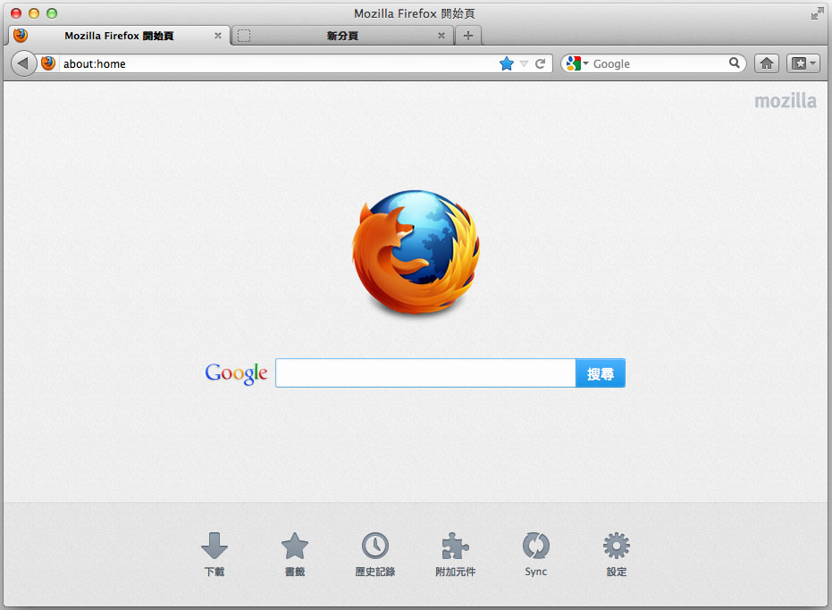
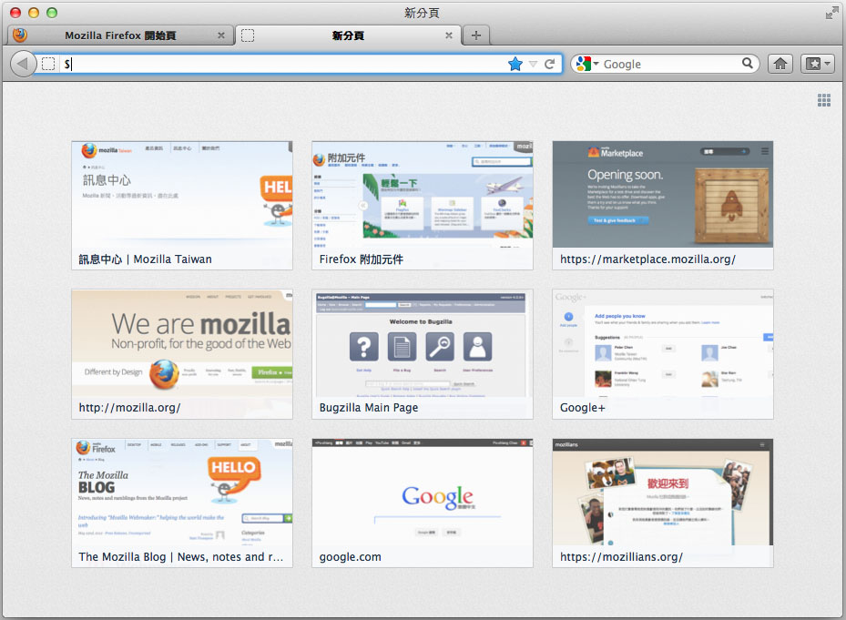

【美商謀智訊息】以推動網路平等、自由、開放為宗旨的全球非營利組織－Mozilla 基金會，旗下著名之瀏覽器Firefox 於美西時間5日釋出全新Windows、Mac和Linux 版本。此版本旨在提升更便利的網路搜尋體驗！版本加入全新設計之主頁面和分頁功能，主頁面下方新增書籤、瀏覽歷史、設定、附加元件、下載和同步等喜好選項，使用者只需透過捷徑即可馬上使用。當使用者開啓新分頁時，您將看到最近及最常造訪頁面的縮圖，使用者可根據個人喜好加入或移除頁面。此外，新版 Firefox 在恢復上回瀏覽狀態時將更為迅速，當開啓Firefox 後，將先開啓您先前最後瀏覽的頁面，在點選其他分頁時才會讀取該分頁內容。不只更節省記憶體空間，也具備更快的啓動速度。這只是多項更新中的一項優化，請[點選這裡](https://hacks.mozilla.org/2012/05/getting-snappy-performance-optimisations-in-firefox-13/)讀取更多。

同時，Firefox 為網站設計師新增了支援 SPDY 的功能。SPDY是一個傳輸協議，作為 HTTP 的承接者，透過壓縮網頁標頭來減少網頁下載時間，同時減輕伺服器的工作量。對使用者而言，除了擁有更安全的體驗，瀏覽支援 SPDY 傳輸協議的網站（如 Google 等）時，也能有更快的頁面下載速度。

Firefox 繼支援全球超過85種語言之後，現再推出柬埔寨語系「高棉語」版本，可讓全球一千五百萬的高棉語使用者更無拘束的使用Firefox。[欲知支援語系請點選這裡](https://www.mozilla.org/firefox/all.html)。

更多訊息：

- [Download Firefox for Windows, Mac and Linux](https://www.mozilla.org/firefox/new/)

- [Firefox for Windows, Mac and Linux detailed release notes](https://www.mozilla.org/firefox/13.0/releasenotes/)

- 影片介紹：[http://www.youtube.com/watch?v=HRp4a_24cp8](https://www.youtube.com/watch?v=HRp4a_24cp8)
