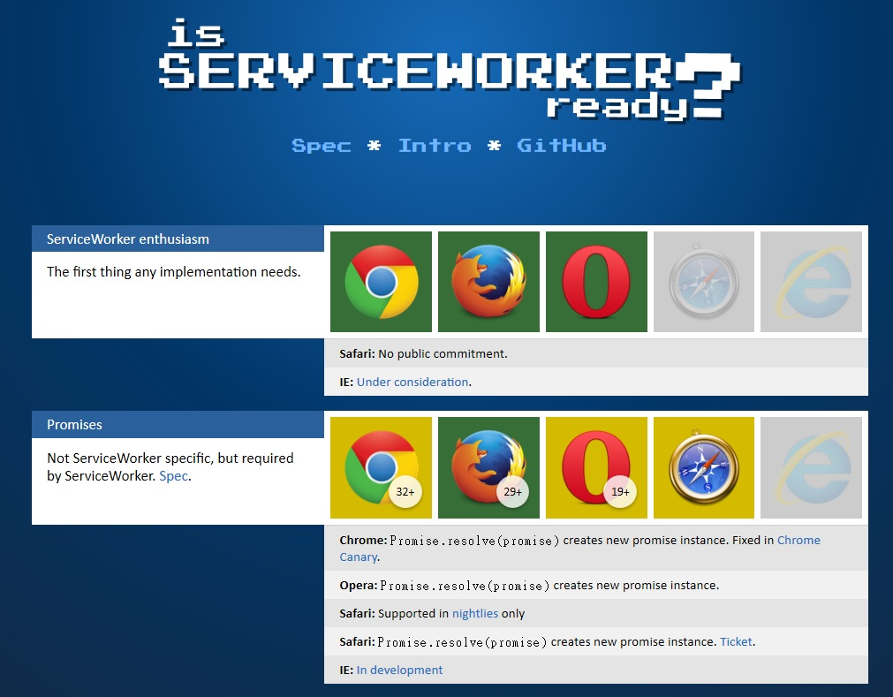

從 2013 上半年開始，Mozillians 就開始參與 [Service Worker](https://github.com/slightlyoff/ServiceWorker/) 的設計過程。感謝 Google、Mozilla、三星 (Samsung)，以及其他廠商的努力，讓此屬於 Web 平台的絕佳新功能不斷演化，現已建構到不同的瀏覽器引擎之中。

#### 什麼是 Service Workers？

簡單來說，Service Workers 指令碼可針對網頁，於用戶端提供近似代理伺服器的功能。JavaScript 程式碼可攔截網路請求、傳送 (位於快取中) 現成的回應資料，並根據 App 的特殊需求而進行分層快取 (Granular caching，也是之前 Web 平台所缺乏的功能)。此強大功能現已可讓 Web 開發者啟用之，以提供完整的離線功能。可參閱 Jake Archibald 在[本篇部落格文章](https://jakearchibald.com/2014/service-worker-first-draft/)所摘要的數項功能

由於 Service Workers 是在「背景」中執行，因此之前僅限原生平台才能進行的某些作業，現在 Web 也同樣能執行。除了基本的網路功能之外，Service Workers 將來也能搭配 [Push API](https://dvcs.w3.org/hg/push/raw-file/tip/index.html) 與 [Background Sync API](https://github.com/slightlyoff/BackgroundSync/blob/master/explainer.md)，從瀏覽器傳遞訊息到 Web App。

#### Firefox 中的 Service Workers

有許多 Mozillians 努力建構 Gecko 中的 Service Workers，而 Anne van Kesteren 與 Jonas Sicking 現正協助相關的設計與規格。[Necko](https://developer.mozilla.org/en-US/docs/Necko) 團隊成員與其他人則提供網路連線與相關概念。Nikhil Marathe 最近發表 [Service Workers 目前在 Gecko 中的狀態](https://blog.nikhilism.com/2014/05/serviceworker-implementation-status-in-firefox.html)。

Service Worker 的各個部份均將通過檢查，逐一納入 Gecko 之內。隨著整個規格漸趨穩定，且其他瀏覽器引擎的實作 (尤其是 Blink) 亦快速發展，上述所有功能均可於 Gecko中透過 dom.serviceWorkers.enabled 設定而啟用。而 dom.serviceWorkers.enabled 本身預設為「false」，可另外透過 about:config 將之修改。

我們規劃讓 Web 開發者短時間內就能在 [Firefox Nightly](https://www.mozilla.org/firefox/nightly) 上執行 Service Worker 的大部分功能，且只要將上述設定改為「true」即可。如果一切順利，我們希望能在 2014 年 9月底就真正上線。

#### Service Worker 建置現狀

Jake Archibald 特別提供可輕鬆了解 [Service Worker 建置現狀](https://jakearchibald.github.io/isserviceworkerready/)的工具。另可透過 [meta bug](https://bugzilla.mozilla.org/show_bug.cgi?id=903441)知道 gecko 的建置情形。

原文連結：[ServiceWorkers and Firefox](https://hacks.mozilla.org/2014/06/serviceworkers-and-firefox/)
