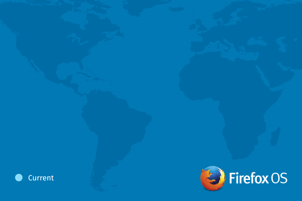

## 將跨新的裝置、市場、範疇而持續拓展

Firefox OS 活化了行動生態系統，迅速登上多樣的裝置與產品類型，並擴展到歐洲、亞太、拉丁美洲等多個市場。在初次發佈之後的 1 年內，Firefox OS 已經於 [15 個國家中現身](https://blog.mozilla.com.tw/posts/5923/)，並由五大電信營運商搭配 [7 款手機販售](https://www.mozilla.org/en-US/firefox/os/devices/)。在在顯示整個生態系統的強大動力，亦將於業界風行並普遍受到採用。在今年內，Firefox OS 今年內將陸續現身於拉丁美洲全境，並新增克羅埃西亞 (Croatia) 在內等 4 個歐洲國家巿場，同時也即將進軍亞洲地區。

### 新的市場、機會、合作夥伴

Firefox OS 即是以 Web 為其平台，達到更靈活、更強大的自訂功能，進而擺脫專利行動作業系統的限制。Firefox OS 的成功與成長經驗，更促使全球性與地區性營運商將陸續於自身市場支援此平台。

市場研究機構 Strategy Analytics 的全球無線實務 (Global Wireless Practice，GWP) 執行總監 Neil Mawston 表示：「對全球的智慧型手機產業來說，Firefox OS 正以『另類』頂尖平台之一的角色蓬勃發展。而主要營運商與硬體製造商所展現出的濃厚興趣，足以讓 Firefox OS 在關鍵地區中全力衝刺，並進一步挑戰現有軟體操控者的地位。」

#### 歐洲市場的拓展

- 德意志電信 (Deutsche Telekom) 營運商將首賣 ALCATEL ONETOUCH 的新款 Fire E 手機，即由 congstar 於本週在德國境內銷售。接下來幾個月內，德意志電信亦將接著於克羅埃西亞 (Croatia)、捷克 (Czech Republic)、馬其頓 (Macedonia)、蒙特內哥羅 (Montenegro) 共 4 個新市場中發售 Firefox OS 裝置。

- Telefónica [甫宣佈](https://www.telefonica.de/press/press-releases/news/5541/video-test-and-pre-sale-at-o2-alcatel-onetouch-fire-e-with-firefox-os.html)德國成為該公司銷售 Firefox OS 手機的第九個國家，緊接著 O2 亦將開始 ALCATEL ONETOUCH 的新款 Fire E 手機預售。

- ZTE 本月底開始於法國首次銷售 Open C。

#### Firefox OS 年底前將現身於拉丁美洲全境

- 今年年底，Telefonica 將於其拉丁美洲的所有市場販售 Firefox OS 手機。接下來數月內將擴展到中美洲地區，緊接著就是阿根廷 (Argentina) 與厄瓜多 (Ecuador)。Telefonica 現亦正擴充其 Firefox OS 產品組合，除了最近發售的 ZTE Open C 與 Open II 之外，同樣很快就會供應 Alcatel ONETOUCH Fire C 手機，且均將搭載最新版的 Firefox OS。

- 今年夏天，América Móvil 甫於墨西哥 (Mexico) 發售了 Firefox OS 手機，更將於今年年底擴大其於拉丁美洲的販售規模。

#### Firefox OS 即將進入亞太地區

- Spice 與 Intex 隨即將於印度 (India) 發售首款超低價位的 Firefox OS 裝置。

- Telenor 確定年底將於亞洲發售 Firefox OS 手機。

- 台灣最大的電信營運商 ─ 中華電信 (Chunghwa Telecom)，亦宣佈即將於市場上提供 Firefox OS 裝置。目前已超過 20 家營運商提供 Firefox OS 裝置，而中華電信將進一步壯大現有規模。

### 展望未來

隨著 Firefox OS 將跨足新的市場與裝置，Mozilla 現正與諸多夥伴密切合作，要將 Firefox OS 帶入更高階、更多規格的裝置之中，進而證明高靈活度的 Web 絕對可成為最佳開發平台。

為了加速 Firefox OS 的設計、開發、測試等流程，Mozilla 已與 Thundersoft 合作製造並配送 Firefox OS 參考平台手機 (Reference phone) ─「Flame」，且[現已開始供貨](https://www.everbuying.com/product549652.html)。展望 Mozilla 與夥伴正為來年開發的中階硬體手機，現可將 Flame 視為代表機型。

Mozilla 將持續提升 Firefox OS 並加入如近場通訊 (NFC) 與強化過的藍牙 (Bluetooth) 連線功能，可輕鬆分享如聯絡人、影片、圖片等內容；LTE 可提供更高速的行動經驗。且若要將 Firefox 隨處帶著走，Firefox Accounts 將是最安全、最簡單易用的方式，並可同時享受 Firefox Marketplace、Firefox Sync、裝置備份、雲端儲存等服務。即使裝置遺失或遭竊，亦能協助定位、傳訊，甚至清除整支手機的資料。

Mozilla 現正與松下電器 (Panasonic) 合作，開發新一代的 Firefox OS 智慧電視 (SmartTV)。Abitcool 另將於後半年發表 HDMI 串流裝置，讓使用者能透過相容的行動裝置或 Web App，將內容傳送至 HDTV。

Mozilla 技術長 Andreas Gal 表示：「從 Firefox OS 展現出驚人成長與絕佳機會已 1 年。此唯一且真正的開放源碼平台，讓使用者、開發者、產業廠商，均得以擺脫行動市場的封閉系統與受限制的內容。現在我們將跨新的地區與手持裝置而進一步拓展，很快就會以新規格進入使用者生活的其他範疇，並逐漸體現具體成果。」

### 合作夥伴證言：

阿爾卡特 ONE TOUCH 行銷長 Dan Dery 指出：「說到我們是如何讓所有人都能接觸行動網路的創新方式，「FIRE」系列絕對是最佳範例。而透過 Mozilla 的 Firefox OS，我們更能推出平價且多功能的裝置，讓客戶能獲得物超所值的體驗。ALCATEL ONETOUCH 將繼續和 Mozilla 合作，讓本身產品能滿足全球不同市場區隔的各種需求。」

América Móvil 附加價值服務總監 Marco Quatorze 表示：「América Móvil 一直走在行動技術的前端，也因此我們很高興能宣佈 América Móvil 將繼續販售 Firefox OS 手機，並將於年底擴大拉丁美洲的銷售規模。有了 Firefox OS，客戶均能享受絕佳行動裝置所搭配的創新作業系統。」

德意志電信 (Deutsche Telekom) 產品與創新長 Thomas Kiessling 說：「我們在歐洲市場持續發表的 Firefox OS 產品，即證明了我們與 Mozilla 的密切合作，要讓所有客戶享受開放作業系統的決心。Deutsche Telekom 現在已是 Firefox OS 在歐洲的最大營運商。我們接下來幾個月內即將發表新款 Firefox OS 手機，更深入克羅埃西亞、捷克、馬其頓、蒙特內哥羅共 4 國。」

松下電器家電公司 (Appliances Company of Panasonic) 的家庭娛樂事業部總監 Yuki Kusumi 說：「在 2014 消費電子展 (CES 2014) 發表聯合聲明之後，我們將與 Mozilla 合作開發新一代的 Firefox OS 智慧電視。我們很高興看到 Firefox OS 在第一年就結出甜美的果實，且在拓展生態系統或搭配不同規格的裝置之上，均有豐富的斬獲。進入 Firefox OS 的第二年，我們將充分利用 Mozilla 的 Open Web 技術與合作優勢，進一步創新智慧電視的技術與產品，帶給消費者更高階的使用經驗。」

Telefónica 裝置團隊總監 Francisco Montalvo 說：「我們很高興能看到客戶對國內Firefox OS 裝置的支持度頗高，而且整體的滲透情形還不錯。Telefónica 已決定要將內容、隱私、自由度的控制權交還到客戶手上，而 Firefox OS 就是達到此目標的最佳生態系統。」

中興通訊 (ZTE) 行動裝置部門執行長曾學忠 (Adam Zeng) 表示：「Mozilla 是 ZTE 的關鍵合作夥伴，並共同努力為全球消費者帶來最尖端的行動網路技術。ZTE 已認同 Firefox OS 作為關鍵平台的潛力，並將展現其特有的行動價值。我們仍會持續投資直到合作關係成功為止。」

原文連結：[Firefox OS Ecosystem Shows Strong Momentum and Expands Across New Devices, Markets and Categories](https://blog.mozilla.org/blog/2014/07/17/firefox-os-ecosystem-shows-strong-momentum-and-expands-across-new-devices-markets-and-categories/)
