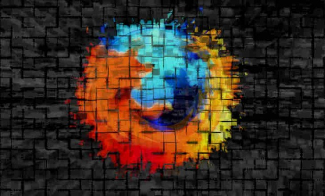

編按：Mozilla 首席技術長 Andreas Gal 同樣在[自己的部落格](https://andreasgal.com/2014/07/15/improving-jpeg-image-encoding/)上發表本篇文章，說明 Mozilla與甫發表的 mozjpeg 2.0，以及 Facebook 支援的 JPEG 編碼器。

在瀏覽網站時，圖片往往佔了瀏覽器載入資料的絕大部分，所以圖片壓縮技術越好，就能越快顯示網站的內容。過去幾年來，不斷有人在討論是否該開發新的圖像格式，以取代目前普及的 JPEG 而達到更好的圖像資料壓縮效果。

圖片來源：hdwallsource.com

在[去年的一篇報告](https://blog.mozilla.org/research/2013/10/17/studying-lossy-image-compression-efficiency/)中，我們比較了 JPEG 與多種新的圖像格式 (包含 WebP)。且從那時開始，我們也不斷擴充並更新這篇研究。而與 JEPG 相較，WebP 或其他免費使用的格式並沒有顯著的提升。且一旦將新的圖像格式加入 Web，也代表著更高的維護成本。

因此我們研究團隊最近開始改良最新的 JPEG 編碼器，並發佈了強化過的 [《mozjpeg》─ JPEG 編碼器 2.0 版](https://github.com/mozilla/mozjpeg/releases/tag/v2.0)。針對基本 (Baseline) 或漸進式 (Progressive) 壓縮模式 JPEG 檔案，mozjpeg 平均可再縮減 5% 的檔案容量，而且許多圖像可達更高的壓縮幅度。

Facebook 亦宣佈現正測試 mozjpeg 2.0 用於 [facebook.com](https://facebook.com/) 圖像時的壓縮效能。且 Facebook 同時資助了六萬美金，以協助開發下一版的 mozjpeg 3.0。

Facebook 軟體工程經理 Stacy Kerkela 說：「Facebook 支持 Mozilla 目前對 JPEG 編碼器的努力，在達到更小 JPEG 檔案的同時，也能兼顧圖片的品質。我們寄望 mozjpeg 2.0 的潛在優勢，讓大家透過 Facebook 分享並聯繫彼此的同時，能享有最佳化的圖片與更優質的使用經驗。」

mozjpeg 除了提升圖像編碼功能之外，也能完全相容現有的 JPEG 解碼器。任何瀏覽器都能立刻享受強化之後的優點，而不需採用如 WebP 的新格式。

原文連結：[Improving JPEG Image Encoding](https://blog.mozilla.org/blog/2014/07/15/improving-jpeg-image-encoding/)
