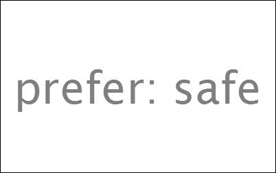

Mozilla [相信](https://mzl.la/V8O1SM)，使用者應有權利塑造自己想要的網路與相關使用經驗。但許多人想打造的不僅是個人網路經驗，也期望能兼顧家中年輕成員的瀏覽品質，因此信任與安全程度又有所差異。為了滿足這一點，使用者必須找到不同的設定、啟用「家長監護 (Parental Controls)」功能、調整瀏覽器、修改如搜尋引擎等服務的預設值。

圖片來源：http://browsernative.com/

Mozilla 很高興能為這類使用者提供「Prefer:Safe」智慧功能，用以簡化並加強線上的信任與安全模式。此功能是與多家領導業界的技術業者合作，可銜接 Mac OS 與 Windows 上所啟動的家長監護功能，及其瀏覽器所連上的網站。

運作方式：

- 使用者在 Mac OS 與 Windows 上啟動「家長監護」功能。

- Firefox 將偵測作業系統當下是否執行家長監護模式。若為執行中，就會寄送 HTTP 標頭 —「Prefer:Safe」，至使用者線上瀏覽的所有網站與服務。

- 只要是檢查此 HTTP 標頭的任何網站或服務，均可自動套用更高的安全控制層級，如根據標頭所送出的內容或功能限制。

- 使用者在 Firefox 中找不到任何可啟用/停用 Prefer:Safe 的介面，因此可避免孩童停用此控制功能。

Prefer:Safe 展現了 HTTP 標頭的效果，讓使用者能對網站與線上服務溝通自己的偏好；這也是Mozilla 之所以努力推廣「[不要追蹤我 (Do Not Track，DNT)](https://www.w3.org/2011/tracking-protection/)」的原因之一。目前正在 W3C 開發中的「DNT」，就是以 HTTP 標頭作為隱私權訊號，揭露第三方的追蹤行為。在這種情況下，瀏覽器或搜尋引擎端都不需要其他設定，就能讓此使用者的偏好設定在整個 Web 上生效，進而確保線上經驗更切合使用者的期待。

除了 Firefox 之外，Mozilla 很高興 [Internet Explorer (IE)](https://blogs.msdn.com/b/ie/archive/2014/07/20/internet-explorer-ietf-90.aspx) 亦同樣建構了此功能，也代表 Prefer:Safe 確實有其重要性。我們希望該功能未來將更普及，受到更廣泛的採用。

若要進一步了解 Prefer:Safe，可參閱目前已提交到 Internet Engineering Task Force (IETF) 的[草擬規格](https://tools.ietf.org/html/draft-nottingham-safe-hint)。如果想加入討論，我也已經將[此討論串](https://groups.google.com/forum/?fromgroups=#%21topic/mozilla.dev.privacy/1-kDWOtmvLY)加入 Mozilla 的 Dev.Privacy 群組。

─ Mozilla 隱私長 [Alex Fowler](https://wiki.mozilla.org/privacy)

原文連結：[Prefer:Safe — Making Online Safety Simpler in Firefox](https://blog.mozilla.org/privacy/2014/07/22/prefersafe-making-online-safety-simpler-in-firefox/)
