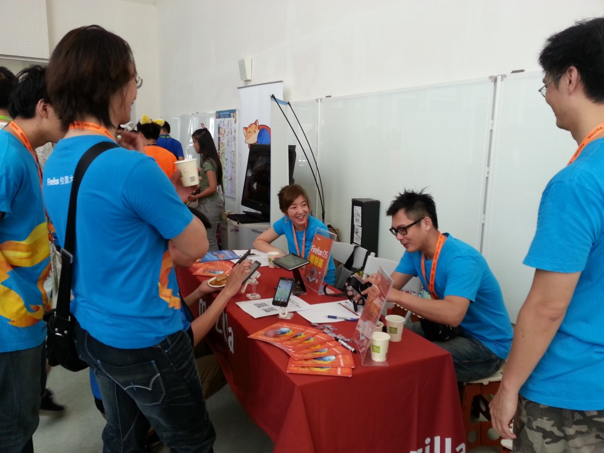
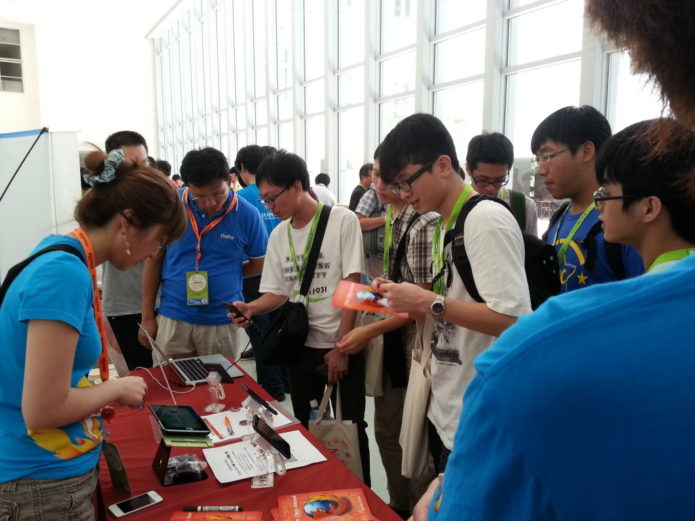
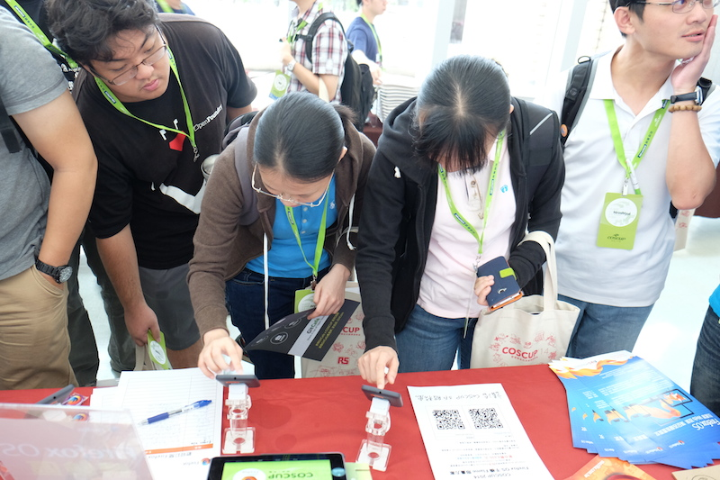
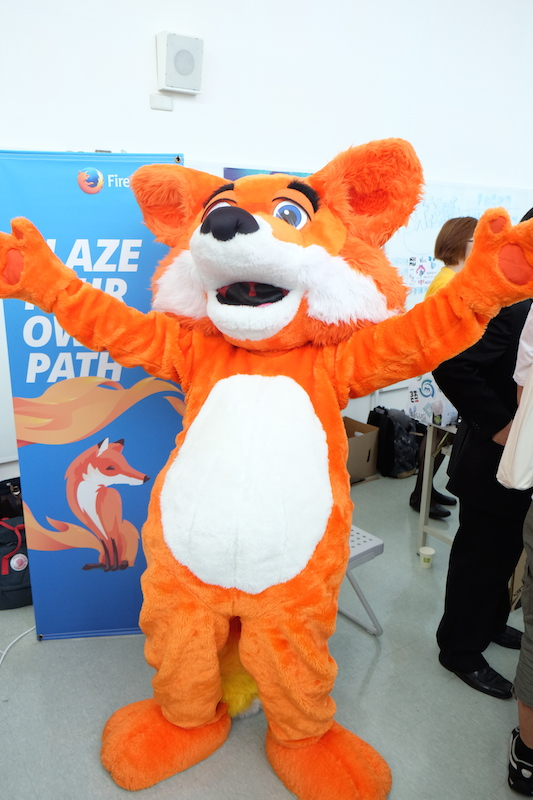
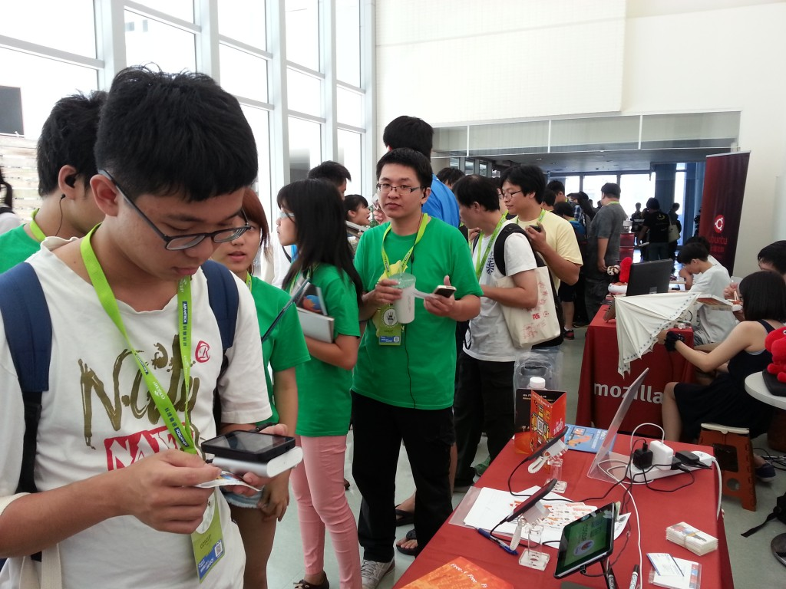
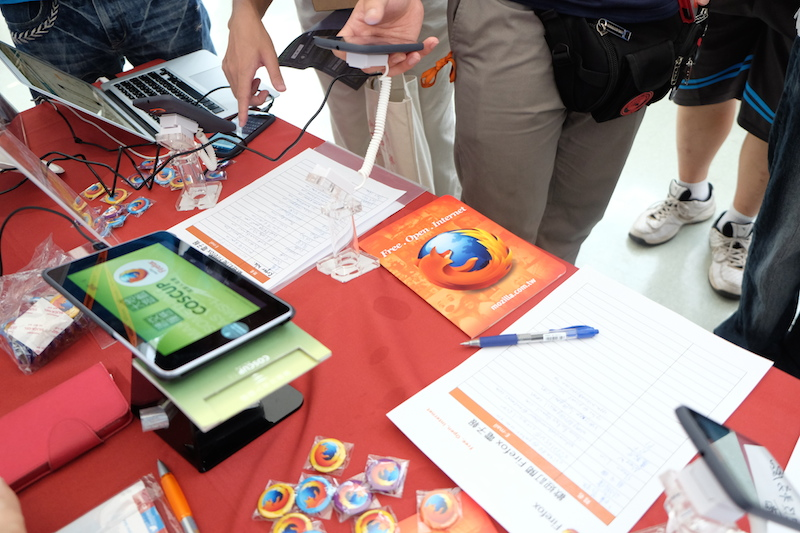
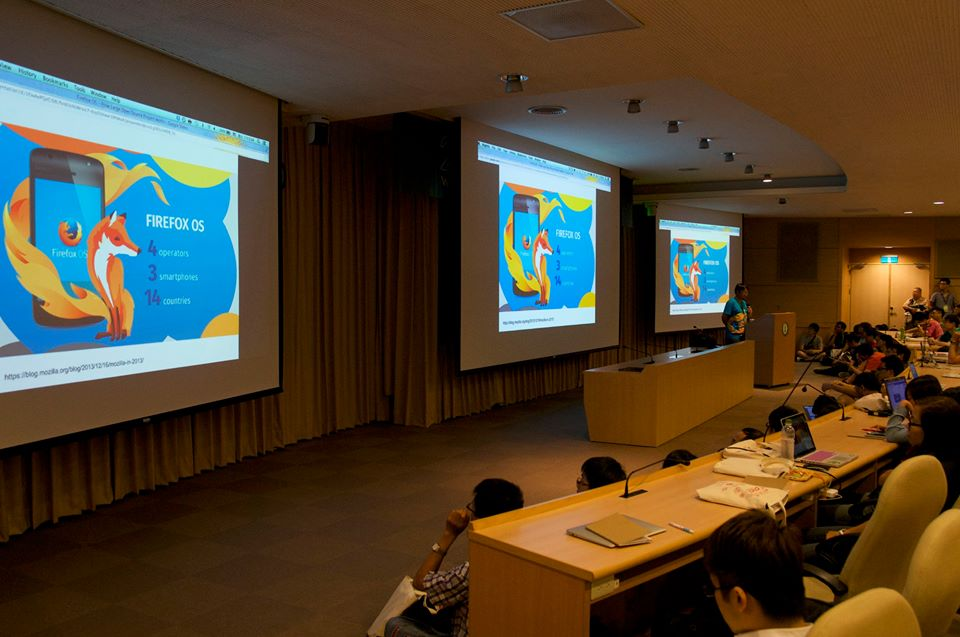

如同以往，Mozilla 很榮幸於今年再次參與了開源人的盛會 COSCUP 2014！今年我們除了有火紅的[謀智台客](https://tech.mozilla.com.tw/)編輯 [gasolin](https://tech.mozilla.com.tw/posts/author/gasolinmozilla-com) 參與議程分享 “[Firefox OS – 大型開放原始碼專案是怎麼煉成的](https://www.slideshare.net/gasolin/firefox-os-how-large-open-source-project-works)” 帶來熱烈回響以外，Mozilla 攤位也是人潮滾滾。攤位展示內容主打熱門的 Firefox OS 手機，另外也舉辦兩次人氣超高的 “打卡送悠遊卡” [Mozilla Taiwan](https://www.facebook.com/MozillaTaiwan) 粉絲團打卡活動，現場更不時有神秘嘉賓火狐驚喜現身與大家親密互動，熱絡的氣氛陪伴開源人度過了兩天豐富愉快的年度盛會。現在就讓我們一睹活動現場的盛況！

COSCUP 2014 7/19 一大早攤位佈置完成！

馬上即有熱情的開源人參觀攤位，了解 Firefox OS 手機與 Mozilla

Firefox OS 手機吸引大量參觀人潮，大家輪流體驗使用！

神秘嘉賓火狐現身會場！

“打卡送悠遊卡” 活動受到會眾熱烈支持，活動開始前已見排隊人潮

攤位現場也有超過百位的朋友訂閱 Firefox 電子報

由講師 gasolin 帶來的議程 “[Firefox OS – 大型開放原始碼專案是怎麼煉成的](https://www.slideshare.net/gasolin/firefox-os-how-large-open-source-project-works)” 座無虛席

一年一度的開源人年會就在愉快熱絡的氣氛中圓滿結束！相信大家對於 Mozilla 及相關產品都有了更進一步的了解。想知道 Mozilla 下一步最新動態? 歡迎加入 [Mozilla Taiwan 粉絲團](https://www.facebook.com/MozillaTaiwan)，也期待再次與大家相見！
