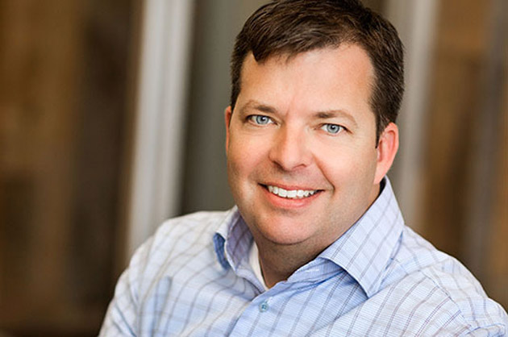

Mozilla 今日正式宣佈由 Chris Beard 接任 Mozilla 公司執行長。Chris 上任之後，將持續領導公司拓展 Mozilla 的影響力，讓 Firefox 從桌面更進一步深入行動裝置與服務的世界。

在 2004 年發表 Firefox 1.0 之前，Chris 就已是 Mozilla 的一份子，並且一直深入參與 Mozilla 的各項事務。在他任職期間，就曾負責如產品、行銷、創新、溝通、社群、使用者交流等等的多項業務專案。

在今年四月接任代理執行長之前，Chris 擔任 Greylock Partners 創投公司的管理營運顧問　(Executive-in-Residence) 將近一年的時間，更深入體會創新與企業家精神。即使在他於 Greylock 任職期間，仍同時擔任 Mozilla 基金會主席的顧問。

過去幾年，Chris 曾領導 Mozilla 多項創新專案。而 Mozilla 同時也依賴他的判斷與建議將近 10 年。對於 Mozilla 未來該如何實踐使命，並將之轉化為足以改變業界的產品與想法，Chris 絕對具備了清晰的願景與理念。

從 Chris 於四月回到 Mozilla 以來，就一直馬不停蹄的進行：

- [發佈 Firefox 的重大更新](https://blog.mozilla.com.tw/posts/5491/)，包含全新設計、易用的自訂模式、如 Firefox Accounts 的多項新服務。

- Firefox OS 再度搭配新電信營運商 (包含 [América Móvil](https://blog.mozilla.org/blog/2014/05/13/america-movil-launches-firefox-os-smartphones/)) 與新裝置 (如 ZTE Open C、Open II、Alcatel ONETOUCH Fire C、[Flame](https://hacks.mozilla.org/2014/05/flame-firefox-os-developer-phone/) ─ 也是 Mozilla 的參考平台手機)，進軍巿場。

- Mozilla 宣佈在年底之前，[Firefox OS 生態系統仍將配合新夥伴而持續擴大](https://blog.mozilla.com.tw/posts/5923/)至新的市場。

- 我們透過[對美國聯邦通信委員會 (FCC) 的訴求](https://blog.mozilla.org/netpolicy/2014/05/05/protecting-net-neutrality-and-the-open-internet/)，呼籲公眾必須正視網路中立的新思考方向並展開討論。

- [Mozilla 在六月啟動了年度的 Maker Party](https://blog.mozilla.org/blog/2014/06/18/president-obama-announces-mozillas-maker-party-2014-at-first-ever-white-house-maker-faire/)，將透過全球社群舉辦數千場活動，向大家宣導 Web 的文化、機制、公民權等概念。而美國總統歐巴馬 (President Obama) 也在首次舉辦的 White House Maker Faire 上公布相關訊息。

時至今日，線上生活包含了桌機、行動裝置、連線裝置、雲端服務、巨量資料、社交互動等諸多要素。而 Mozilla 則透過所謂的「Web」開放系統連接所有要素。之所以定義為開放系統，即代表 Web 會將控制權交付在個人手中，且除了提供自由與靈活性之外，亦確保其內容值得信賴又不失樂趣。

Mozilla 所建構的產品與社群，就是要打破封閉系統而取得更多選擇與機會。由於人們的數位生活愈趨集中於少數大公司之手，因此今天必須投入更多心血才能達成此一目標。Mozilla 總是將使用者擺在第一位，並兼顧開放、創新、機會而打造心目中的產品。

Chris 熟知 Mozilla 的最初理想以及最終理念，也不斷深入接觸 Mozilla 產品的擁護者 (包含消費者、合作夥伴、社群成員)。要領導公司並拓展 Mozilla 的影響力，讓桌面版 Firefox 能更進一步深入行動裝置與服務的世界，Chris 可說是不二人選。

─ Mozilla 基金會主席 Mitchell Baker

Mozilla 董事會成員同時也對此一任命給予支持。董事會成員之一的新聞網站 Spiegel 執行長 Katharina Borchert 表示：「Chris 與 Mozilla 有著極深的淵源，也不斷吸收近年最新的觀念與理想。他絕對了解 Mozilla 社群的重要性，也具備全面的產品願景。我相信他絕對是領導 Mozilla 的正確人選，也將協助我們在此變化多端的產業中達成使命。」

LinkedIn 執行總裁 Reid Hoffman 也強調：「我與 Chris 共事將近十年。對自由且開放的 Web 來說，他的領導能力將可激勵並統整社群、產品、技術等多個方向。而對 Mozilla 此開放技術的組織、社群、活動龍頭來說，Chris 當然是 Mozilla 執行長的不二人選。」

原文連結：[Chris Beard Named CEO of Mozilla](https://blog.mozilla.org/blog/2014/07/28/chris-beard-named-ceo-of-mozilla/)
