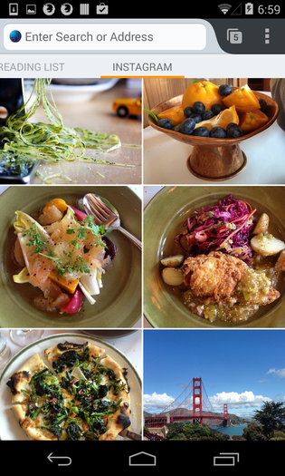
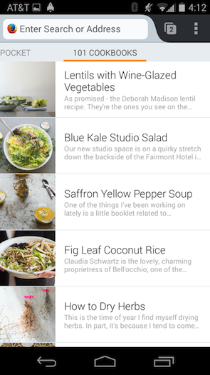

Firefox for Android 首頁一般均供使用者找到自己最常用的網站、書籤、瀏覽記錄等，而附加元件可透過 Firefox Hub API 在 Firefox for Android 首頁上新增面板。這些 API 已於 Firefox 30 中登場，更在 Firefox 31 與 32 時添增了更多功能並修復錯誤。現可至 [addons.mozilla.org 找到其中幾款附加元件](https://addons.mozilla.org/en-US/firefox/collections/leibovic/home-panels/)，另可透過 [github 上的範例程式碼](https://github.com/leibovic/hub-boilerplate)協助自己入門。

#### 概述

Firefox Hub 附加元件的開發作業主要可分為 1). 建構首頁面板，以及 2). 儲存資料以顯示於面板上。首頁面板是由不同的視圖 (View) 所組成，而各視圖呈現的資料均取自於已儲存的資料集。

#### 建立新的首頁面板

要建立首頁面板，必須先透過 [Home.panels API](https://developer.mozilla.org/en-US/Add-ons/Firefox_for_Android/API/Home.jsm/panels) 註冊面板。這裡需要一組面板識別碼，以及一組用以回傳設定值的回呼函式 (Options callback) 作為註冊 API 的參數。不論是安裝或更新面板，都將呼叫此回呼函式並動態產生一組設定值物件，如此即可支援動態切換語系。

		
		

function optionsCallback() {
  return {
    title: "My Panel",
    views: [{
      type: Home.panels.View.LIST,
      dataset: "my.dataset@mydomain.org"
    }]
  };
}
 
Home.panels.register("my.panel@mydomain.org", optionsCallback);
			
				
					
				
					1234567891011
				
						function optionsCallback() {  return {    title: "My Panel",    views: [{      type: Home.panels.View.LIST,      dataset: "my.dataset@mydomain.org"    }]  };} Home.panels.register("my.panel@mydomain.org", optionsCallback);
					
				
			
		

任何起始頁上的現有面板都需要註冊。若是第一次要讓面板實際出現在使用者的首頁上 (例如剛安裝了附加元件時)，還必須明確呼叫安裝函式，以順利安裝面板。

		
		

Home.panels.install("my.panel@mydomain.org");
			
				
					
				
					1
				
						Home.panels.install("my.panel@mydomain.org");
					
				
			
		

另可修改上述的回呼函式，以自訂面板顯示資料的方式。舉例來說，你可選擇要以網格或清單的方式顯示資料；在無資料時，可自訂所要顯示的視圖；在使用者點選項目之一時，可啟動「intent (於 Android 內使用，可呼叫不同 App 的協定)」。

#### 儲存面板的資料

若要在新的首頁面板顯示圖像，就必須透過 [HomeProvider API](https://developer.mozilla.org/en-US/Add-ons/Firefox_for_Android/API/HomeProvider.jsm) 儲存資料。此 API 可非同步儲存或刪除資料；亦可註冊回呼，以利瀏覽器定期同步你的資料。

HomeProvider API 亦可讓開發者存取 [HomeStorage](https://developer.mozilla.org/en-US/Add-ons/Firefox_for_Android/API/HomeProvider.jsm/HomeStorage) 物件，以從既有的資料集內儲存或刪除資料。這些函式均是為了搭配 [Task.jsm](https://developer.mozilla.org/en-US/docs/Mozilla/JavaScript_code_modules/Task.jsm) 所設計，可於工作 (Task) 中執行非同步交易 (Asynchronous transaction)。

		
		

let storage = HomeProvider.getStorage("my.dataset@mydomain.org");
Task.spawn(function() {
  yield storage.save(items);
}).then(null, Cu.reportError);
			
				
					
				
					1234
				
						let storage = HomeProvider.getStorage("my.dataset@mydomain.org");Task.spawn(function() {  yield storage.save(items);}).then(null, Cu.reportError);
					
				
			
		

Firefox 31 則擴充了儲存 API，可支援現有資料的取代作業，以定期重新整理開發者的資料集。

		
		

function refreshDataset() {
  let items = fetchItems();
  Task.spawn(function() {
        yield storage.save(items, { replace: true });
  }).then(null, Cu.reportError);
}
 
HomeProvider.addPeriodicSync("my.dataset@mydomain.org", 3600, 
refreshDataset);
			
				
					
				
					123456789
				
						function refreshDataset() {  let items = fetchItems();  Task.spawn(function() {        yield storage.save(items, { replace: true });  }).then(null, Cu.reportError);} HomeProvider.addPeriodicSync("my.dataset@mydomain.org", 3600, refreshDataset);
					
				
			
		

此程式碼片段可確實每隔 3600 秒 (亦即 1 小時) 重新整理資料集一次。

#### Firefox 32 測試版 (Beta) 的新功能

Firefox 32 除了修復錯誤之外，另針對 Firefox Hub API 集合而新增多項功能。

#### Refresh 處理器

除了可定期更新資料之外，現亦新支援「下拉以重新整理資料 (Pull to refresh)」，讓使用者能手動更新面板資料。只要將 onrefresh 屬性加到視圖的定義 (Declaration) 之中，即可使用此功能。

		
		

function optionsCallback() {
  return {
    title: "My Panel",
    views: [{
      type: Home.panels.View.LIST,
      dataset: "my.dataset@mydomain.org",
      onrefresh: refreshDataset
    }]
  };
}
			
				
					
				
					12345678910
				
						function optionsCallback() {  return {    title: "My Panel",    views: [{      type: Home.panels.View.LIST,      dataset: "my.dataset@mydomain.org",      onrefresh: refreshDataset    }]  };}
					
				
			
		

在添增這行程式碼之後，只要下拉面板就會觸發更新指示器 (Refresh indicator) 並呼叫 refreshDataset 函式。在針對該資料集做出 save 呼叫之後，更新指示器隨即消失。

#### 認證視圖

Mozilla 另新支援了認證 (Authentication) 視圖，讓附加元件能更輕鬆使用需認證的資料。此視圖另為文字與圖像保留了空間，並有按鈕可觸發認證流程。只要將 auth 屬性添增到面板的定義之中，即可使用此功能。

		
		

function optionsCallback() {
  return {
    title: "My Panel",
    views: [{
      type: Home.panels.View.LIST,
      dataset: "my.dataset@mydomain.org"
    }],
    auth: {
     authenticate: function authenticate() {
        // … do some stuff to authenticate the user …
       Home.panels.setAuthenticated("my.panel@mydomain.org", true);
     },
     messageText: "Please log in to see your data",
     buttonText: "Log in"
   }
  };
}
			
				
					
				
					1234567891011121314151617
				
						function optionsCallback() {  return {    title: "My Panel",    views: [{      type: Home.panels.View.LIST,      dataset: "my.dataset@mydomain.org"    }],    auth: {     authenticate: function authenticate() {        // … do some stuff to authenticate the user …       Home.panels.setAuthenticated("my.panel@mydomain.org", true);     },     messageText: "Please log in to see your data",     buttonText: "Log in"   }  };}
					
				
			
		

依預設值，只要首次安裝面板之後，隨即就會出現認證視圖。且只要使用者按下視圖中的按鈕，就會呼叫認證函式。你可決定在使用者成功完成認證流程之後，呼叫 setAuthenticated(true)；或在使用者變成未認證的狀態 (如登出) 時，呼叫 setAuthenticated(false)。在 App 執行期間，此認證狀態均將保持不變。開發者另可依自己需要而重設該狀態。

#### 未來規劃

我們已經在規劃擴充這些 API，也希望能得到大家的想法與意見！我們也在尋找能新加入Firefox for Android 的貢獻者，能[從撰寫修正檔入門](https://wiki.mozilla.org/Mobile/Get_Involved)最好！

原文連結：[Building Firefox Hub Add-ons for Firefox for Android](https://hacks.mozilla.org/2014/07/building-firefox-hub-add-ons-for-firefox-for-android/)
