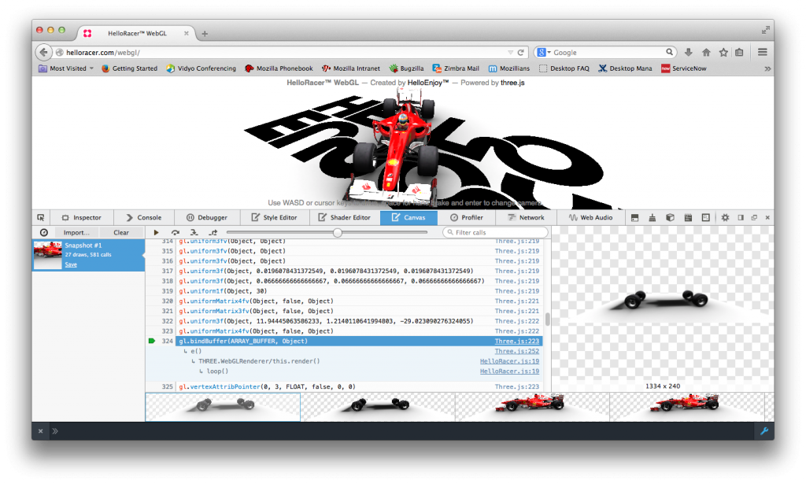
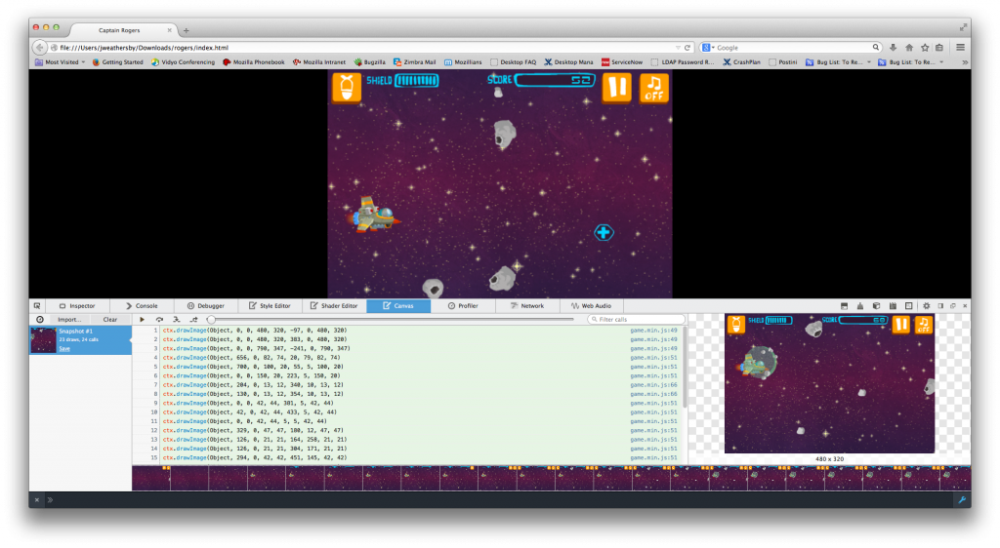
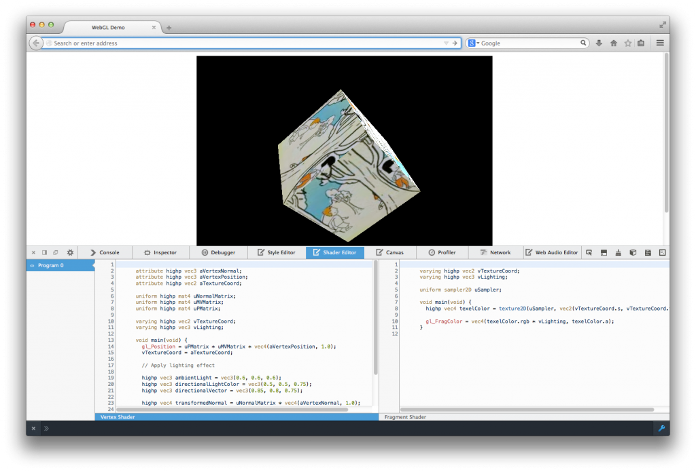
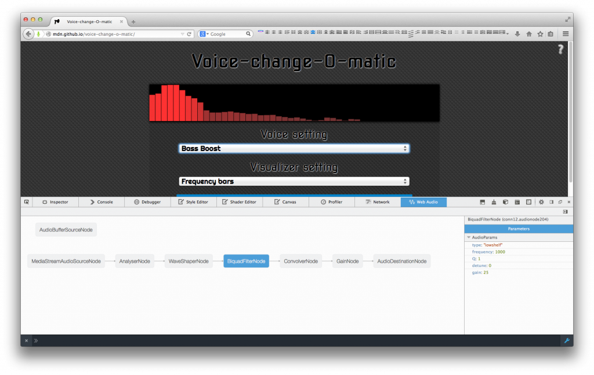

已釋出的 Firefox 31 具備多項新功能，可協助 [HTML5](https://developer.mozilla.org/en/html/html5) 遊戲開發者進行編碼與除錯。此外，Mozilla率先開發之 asm.js 技術，亦[首次應用於 Web 商業遊戲](https://blog.mozilla.org/blog/2014/07/22/first-commercial-web-games-launch-leveraging-mozilla-pioneered-technology/) ─《地城守護者 (Dungeon Defenders)》與《雲端入侵者(Cloud Raiders)》。此兩款遊戲都是透過 Emscripten 編譯器而跨平台編譯為 JavaScript。這類遊戲都足以證明 HTML5 可作為強大的遊戲平台。

如果你對 Emscripten 感興趣，可至 [Emscripten wiki](https://github.com/kripken/emscripten/wiki) 取得相關資訊，或到 [github 頁面](https://github.com/kripken/emscripten)取得程式碼，也能在 MDN 上找到 [Emscripten 線上教學](https://developer.mozilla.org/en-US/docs/Mozilla/Projects/Emscripten/Introducing#Getting_started_tutorials)以利自己入門。如果你還是對 asm.js 的效能存疑，則可參閱《[最新版 Firefox 提升的 asm.js 效能讓遊戲飛也似的執行！](https://blog.mozilla.com.tw/posts/5519)》以進一步了解。

本篇文章提到的資源均是由 Mozillian 所開發，讓你能順利撰寫 HTML5 遊戲並除錯。以下所列工具尚有缺漏。歡迎各位向我們建議任何有效資源，讓大家能更順利的開發遊戲。敬請直接於下方留言告訴我們。

### 該從何開始

在開發 HTML5 架構的遊戲時，開發者必須先決定要使用哪種編輯器；根據遊戲所使用的繪圖框架與遊戲引擎，也可能使用 Canvas 2d、[WebGL](https://developer.mozilla.org/en/WebGL)、SVG，甚或 CSS。而這些大多數都取決於開發者本身的經驗，以及遊戲所將發行的平台。沒有其他文章會回答這些問題，讓我們先透過本文協助你入門。

遊戲開發者可找到的重要資源之一，就是在 MDN 上的 [Games Zone](https://developer.mozilla.org/en-US/docs/Games)。本專區提供一般遊戲的開發文章、展示程式、外部資源、範例等等。開發者在建構 HTML5 遊戲所應注意的某些 API，專區亦提供詳細解說。如音效管理、網路連線、儲存作業、圖形繪製作業。我們目前正努力豐富相關內容並升級整個專區。將來希望能納入最常見的遊戲場景、框架、系列工具等的內容與範例。

目前已有數篇部落格文章與 MDN 技術文件，可協助遊戲開發者入門。

### 工具

HTML5 開發者手邊絕對不會短缺工具。Mozilla 社群一直努力擴充 Firefox 開發者工具的功能，包含 [JavaScript 除錯器 (JavaScript Debugger)](https://developer.mozilla.org/en-US/docs/Tools/Debugger)、[樣式編輯器 (Style Editor)](https://developer.mozilla.org/en-US/docs/Tools/Style_Editor)、[頁面檢測器 (Page Inspector)](https://developer.mozilla.org/en-US/docs/Tools/Page_Inspector)、[程式碼速記本 (Scratchpad)](https://developer.mozilla.org/en-US/docs/Tools/Scratchpad)、[效能分析器 (Profiler)](https://developer.mozilla.org/en-US/docs/Tools/Profiler)、[網路監測器 (Network Monitor)](https://developer.mozilla.org/en-US/docs/Tools/Network_Monitor)、[網頁主控台 (Web Console)](https://developer.mozilla.org/en-US/docs/Tools/Web_Console)。

除了上述這些工具之外，近期也才更新或介紹了某些強大工具，能協助開發者進行得更順利。

### Canvas 除錯器 (Canvas Debugger)

Firefox 現有版本已經具備了 Canvas 除錯器功能。

用以產生幀像的所有 Canvas API，均可透過Canvas 除錯器進行追蹤。針對如繪畫元素或特殊著色器程式的特定呼叫，都會另外將之上色以清楚呈現。Canvas 除錯器不僅可用於 WebGL 架構的遊戲，也能用於 Canvas 2D 遊戲的除錯作業。在下圖中，你可看到繪至 Canvas 的每一幅圖像而構成動畫。你可點擊任何一行，直接找到負責該動作的 JavaScript。

若要進一步了解 Canvas 除錯器，可參閱 [Introducing the Canvas Debugger in Firefox Developer Tools](https://hacks.mozilla.org/2014/03/introducing-the-canvas-debugger-in-firefox-developer-tools/)。

### 著色器編輯器 (Shader Editor)

在開發 WebGL 遊戲時，最好能趁應用程式執行期間，測試並修改著色器程式。而開發者工具中的著色器編輯器就能達到此要求。不需重新載入頁面，即可修改 Vertex Shader 與 Fragment Shader 程式；或可載入任一效果而直接觀察圖像輸出的效果。

若要進一步了解著色器編輯器，可參閱《[Live editing WebGL shaders with Firefox Developer Tools](https://hacks.mozilla.org/2013/11/live-editing-webgl-shaders-with-firefox-developer-tools/)》一文；另外本篇 [MDN 文章](https://developer.mozilla.org/en-US/docs/Tools/Shader_Editor)內含多支即時編輯影片。

### Web Audio 編輯器 (Web Audio Editor)

目前 Firefox 曙光版 (Aurora，即未來的 32 版本) 即提供 Web Audio 編輯器。此編輯器將以圖像呈現所有的音訊節點，以及在目前 AudioContext 中的連結。你可再檢視各個節點的特定屬性。

與 HTML5 的 [Audio 標籤](https://developer.mozilla.org/en-US/docs/Web/Guide/HTML/Using_HTML5_audio_and_video)相較，[Web Audio API](https://developer.mozilla.org/en-US/docs/Web/API/Web_Audio_API) 可提供更完整、更複雜的音訊建立、操控、處理功能。若要使用 Web Audio API，請先參閱《[Writing Web Audio API code that works in every browser](https://developer.mozilla.org/en-US/Apps/Build/Manipulating_media/Web_Audio_API_cross_browser)》，內含不同音訊節點的支援資訊。

若要進一步了解 Web Audio 編輯器，則請參閱本篇 [Hacks 部落格文章](https://hacks.mozilla.org/2014/06/introducing-the-web-audio-editor-in-firefox-developer-tools/)與 [MDN 文章](https://developer.mozilla.org/en-US/docs/Tools/Web_Audio_Editor)。

看到這裡，你是不是已經對 HTML5 的遊戲開發躍躍欲試了呢？我們在《(上)》篇介紹了有關圖像與音訊的開發工具，你當然要繼續看過《[HTML5 遊戲開發資源 (下)](https://blog.mozilla.com.tw/posts/6039/http://)》介紹的 Firefox 開發者工具。

原文連結：[Resources for HTML5 game developers](https://hacks.mozilla.org/2014/07/resources-for-html5-game-developers/)
