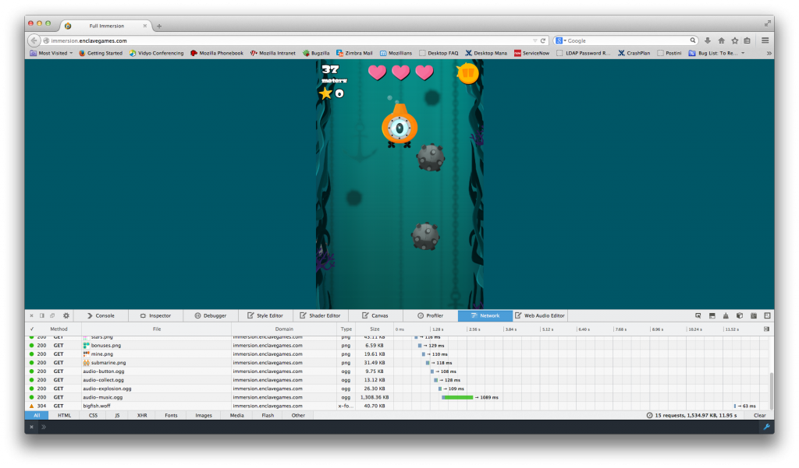
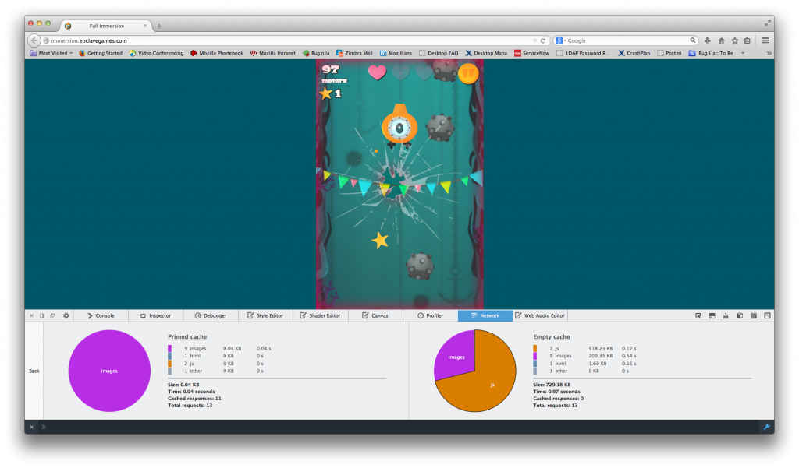
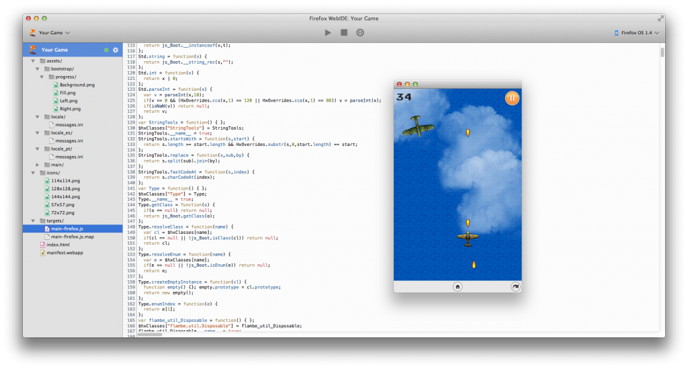
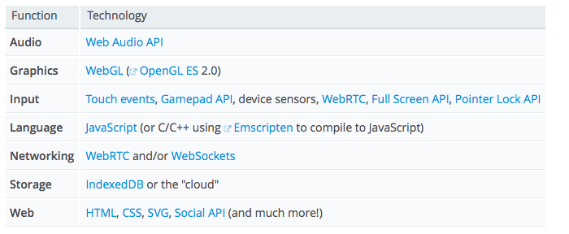

在看完《[HTML5 遊戲開發資源 (上)](https://blog.mozilla.com.tw/posts/6031/)》所介紹 HTML5 遊戲開發可用的圖像與音訊工具之後，快來看看 Firefox 所提供的其他開發者工具吧！

### 網路監測器 (Network Monitor)

在開發 HTML5 遊戲時，網路速度往往影響甚鉅；若要針對行動裝置開發，其對開發成本的影響更是明顯。網路監測器則可視覺化所有的網路請求，如定位、操作所花的時間、檔案的類型與大小。

除此之外，如果你想分析 App 在快取與未快取情況之下的效能，亦可透過網路監測器呈現相關結果。

可參閱網路監測器的 [MDN 文章](https://developer.mozilla.org/en-US/docs/Tools/Network_Monitor)。

### WebIDE

在著手開發遊戲時的諸多選擇之一，就是必須先選出要用的編輯器 (如Sublime、Eclipse、Dreamweaver、vi 等)。在大多數情況下，開發者往往已經有自己最愛用的編輯器了。如果你想在瀏覽器中開發遊戲，請參考最近發佈於 Firefox 每夜更新版 (Nightly) 中的 WebIDE。

WebIDE 專案不僅將提供全功能的編輯器，亦可作為多款本端/遠端平台的發佈媒介、除錯器、範本框架、應用管理器等。除此之外，此專案的框架所提供的 API，亦可讓其他編輯器使用該工具的功能。可參閱[本篇部落格文章](https://hacks.mozilla.org/2014/06/webide-lands-in-nightly/)以進一步了解。

如果要隨時獲得 Firefox 開發者工具的最新資訊，請注意「Hacks」部落格的[系列文章](https://hacks.mozilla.org/2014/06/toolbox-inspector-scratchpad-improvements-firefox-developer-tools-episode-32/)。另外可在 [MDN](https://developer.mozilla.org/en-US/docs/Tools)上找到開發者工具的相關說明文件。

### API

MDN 的 Games Zone 列出豐富的 API 與[文章](https://developer.mozilla.org/en-US/docs/Games/Introduction)，可協助開發者入門。

除了這些資源以外，當然還有許多文章有利於你的開發作業。

如果你想透過 WebRTC 或 WebSockets，讓遊戲支援多重玩家的功能，就應該先了解 Together.js 是如何提供 Web App 的協作 (Collaborative) 功能。可參閱《[TogetherJS 介紹 (上)](https://blog.mozilla.com.tw/posts/4025)》與《[(下)](https://blog.mozilla.com.tw/posts/4036/)》。

許多遊戲也需要儲存功能，而可透過 [IndexedDB](https://developer.mozilla.org/en-US/docs/Web/API/IndexedDB_API) 處理這些需要。可參閱《[Breaking the Borders of IndexedDB](https://hacks.mozilla.org/2014/06/breaking-the-borders-of-indexeddb/)》進一步了解 [IndexedDB](https://developer.mozilla.org/en/IndexedDB) 的延伸功能。另外，[localForage](https://github.com/mozilla/localForage) 可跨瀏覽器支援簡易的儲存功能。參閱《[localForage: Offline Storage, Improved](https://hacks.mozilla.org/2014/02/localforage-offline-storage-improved/)》進一步了解。

### 遊戲最佳化

現今 HTML5 遊戲已能為開發者提供許多強大功能。許多目前在行動裝置上執行的遊戲，將來勢必能追趕上桌機版遊戲的效能。如果你規劃讓自己的遊戲未來能成功跨平台，就必須最佳化自己的程式碼。這篇《[Optimizing your JavaScript Game for Firefox OS](https://hacks.mozilla.org/2013/05/optimizing-your-javascript-game-for-firefox-os/)》則提及了許多技巧，能協助你撰寫的遊戲能在初階行動裝置上順利運行。

### 本地化

為了讓自己的遊戲能觸及更多消費者，你應該試著讓遊戲也擁有不同的語言，因此可將本地化的功能帶入遊戲之中。Mozilla 現正努力招聘譯者，要協助大家翻譯自己的遊戲。可參閱[本篇文章](https://hacks.mozilla.org/2014/05/introducing-translationtester-and-localization-support-for-open-web-apps/)以進一步了解。

### 要聽見你的聲音

Mozilla 本身就是開發者與使用者所組成的社群，同時需要大家的協助與意見。如果你想為產品建議特殊功能，歡迎透過 [irc.mozilla.org](https://wiki.mozilla.org/IRC) 或[郵件群組](https://lists.mozilla.org/listinfo/)和大家討論；也可以到 [bugzilla.mozilla.org](https://bugzilla.mozilla.org/) 提交問題。另外還有 [DevTools](https://ffdevtools.uservoice.com/forums/246087-firefox-developer-tools-ideas) 與 [Open Web Apps](https://openwebapps.uservoice.com/forums/258478-open-web-apps) 意見反應管道。

原文連結：[Resources for HTML5 game developers](https://hacks.mozilla.org/2014/07/resources-for-html5-game-developers/)
